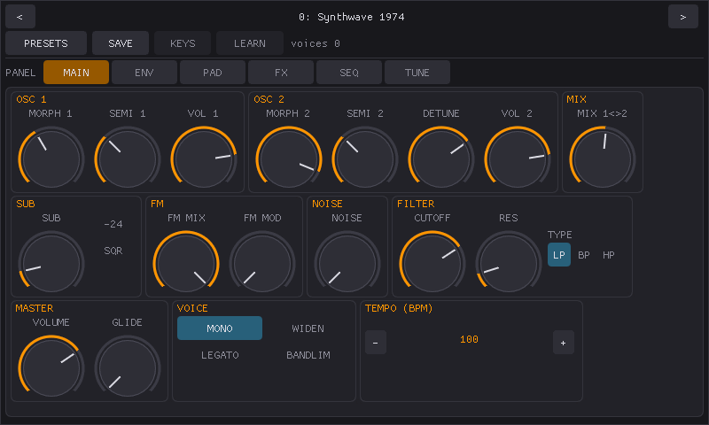
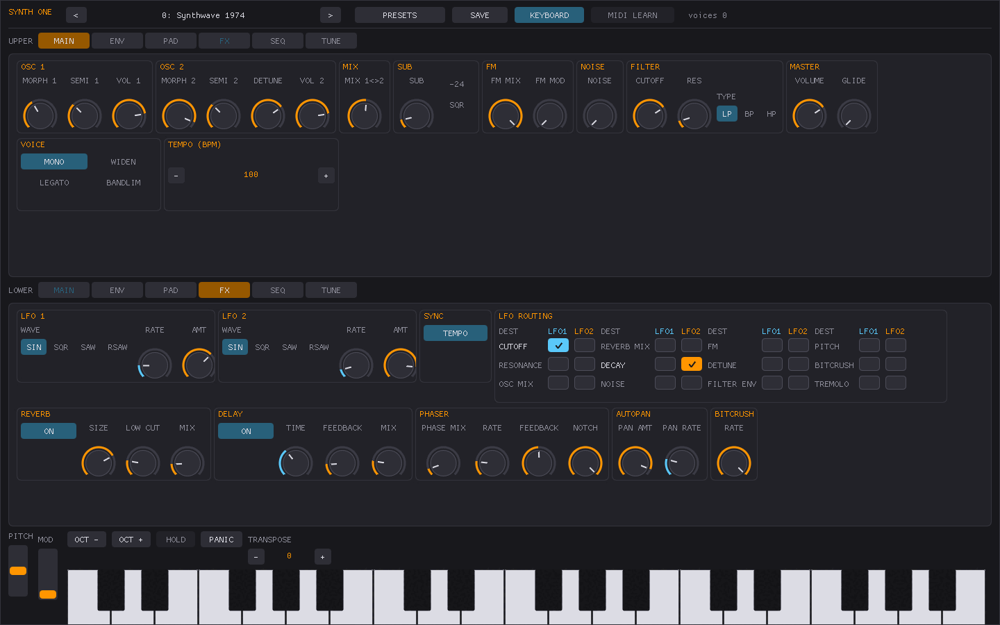

# AudioKit Synth One

[](https://travis-ci.org/AudioKit/AudioKitSynthOne)
[](https://github.com/AudioKit/AudioKitSynthOne/blob/master/LICENSE)
[](https://crowdin.com/project/audiokit-synth-one)
[](http://twitter.com/AudioKitPro)

---

## About this fork: a Linux / Raspberry Pi / Windows port

This fork adds native **Linux and Windows** builds of Synth One under
[`linux/`](linux/). The original app is iOS-only and needs macOS and Xcode to
compile; this port compiles the original C++/Objective-C++ DSP sources in place
against a compatibility layer that stands in for AudioKit, CoreAudio and
TheAmazingAudioEngine. The synthesis engine is the real thing — the same
kernel, note state and preset banks — not a reimplementation, and it renders
bit-identical audio on both platforms.

| | audio out | MIDI in |
| --- | --- | --- |
| Linux (x86_64, aarch64) | JACK and/or PortAudio | ALSA sequencer |
| Windows (x86_64) | PortAudio (WASAPI/DirectSound/MME/WDMKS) | WinMM |

**The port was written with [Claude](https://claude.ai), using Anthropic's
Claude Code.** That includes the compatibility layer, the JACK/PortAudio/ALSA
and PortAudio/WinMM hosts, the Dear ImGui front end, and the build and
cross-compile tooling.

### Downloads

Built archives for all three targets are on the
[releases page](https://github.com/caseypaite/AudioKitSynthOne/releases): Linux
x86_64, Linux aarch64, and Windows x86_64. The Linux archives install with
`./install.sh` and need alsa-lib, glfw, libGL, jack/pipewire-jack, portaudio and
libX11 present; the Windows archive is self-contained — unzip it and run
`synthone-gui.exe`.

### Why: a standalone Raspberry Pi synth

The end goal is a self-contained hardware synthesizer — a Raspberry Pi with a
7-inch touch display that boots straight into Synth One. No desktop, no window
manager, no launcher: the app comes up on startup and owns the screen, so all
the Pi's modest CPU and memory go to audio rather than to a desktop environment.
That is what the deliberately lightweight stack is for.

### How it is built

Day-to-day development happens on an **x86_64** workstation, where the build is
fast and JACK, ALSA and a normal display are available. ARM64 binaries for the
Pi are produced from that same machine by
[`linux/build-arm64.sh`](linux/build-arm64.sh), which builds inside an `arm64`
container under qemu emulation and can package the result:

```bash
cd linux
cmake -S . -B build -G Ninja && cmake --build build   # native x86_64
./build-arm64.sh --package                            # aarch64 build + dist/ zip
./build-windows.sh --package                          # Windows build + dist/ zip
```

Windows binaries are cross-compiled from the same Linux workstation with
MinGW-w64 — there is no MSVC project and nothing in the build runs on Windows.
Everything third-party is linked statically, so the result imports nothing but
Windows' own DLLs and needs no redistributable. See
[`linux/README.md`](linux/README.md#windows-x86_64) for the details.

Three binaries come out: `synthone-gui` (touch-friendly Dear ImGui front end),
`synthone` (headless, MIDI-driven), and `synthone-offline` (renders a WAV with
no audio hardware at all, handy for testing).

The GUI is a **rebuild, not a port** — Dear ImGui rather than the original
PaintCode vector artwork — so it covers all six panels but does not look like
the iOS app. It lays itself out for the target display: the official Pi 7"
panel is 800x480, and below 1000x620 the GUI switches to a two-row header, one
panel at a time, a hidden on-screen keyboard, and tighter padding. On a desktop
it shows two panels stacked instead. The display picks which you start in, and
a **PI VIEW** button in the header switches between them — mostly so the Pi's
layout can be checked on a workstation without a Pi to hand.

Compact sizes then scale with the panel, so a roomier small display spends its
extra pixels on bigger controls rather than on empty space: 800x480 is the
baseline, and a Waveshare 7" (C) at 1024x600 gets knobs and panel tabs a
quarter larger again. Both are tested on a Pi 4 running Bookworm.

### The six panels at 800x480



**Every panel fits the 7" display without scrolling**, which is the constraint
the whole layout is built around.

Controls are grouped into blocks — a row of knobs, a stack of toggles, a
stepper — that pack left to right and wrap onto a new shelf when the next one
will not fit. A panel therefore fills both dimensions instead of leaving the
same ragged edge on every full-width row, and the packing follows the window:
the FX panel above takes four shelves at 800x480 and two on a desktop.

Knob faces are then sized per panel against what is left over — on the 7" panel
that runs from 72px on MAIN and ENV down to 32px on FX, which carries
thirty-odd controls and is the one panel with nothing to spare. Padding and
spacing give up pixels; buttons and scrollbars get *larger*, on the principle
that a control you cannot hit with a fingertip is worse than one you have to
scroll to.

[`linux/README.md`](linux/README.md#blocks-not-rows) has the details, including
the per-panel sizes and why each is what it is.

### The same panels on a desktop



A desktop gets two panels at once, UPPER and LOWER, each with its own tab row.
Mostly nothing is rearranged by hand for it — the blocks pack into wider,
shorter shelves, so MAIN takes two here against three on the 7" panel — and the
knob faces grow to suit, up to 80px on MAIN. The exception is SEQ, which puts
its arp controls in a column on the left and gives the whole right of the pane
to the sixteen step sliders. Three frames cover all six panels.

Both sets are captured with
[`linux/tools/screenshots.sh`](linux/tools/screenshots.sh) (`--desktop` for the
second) on a virtual X server at exactly the target resolution. The individual
stills are gitignored; only the slideshows are tracked.

### Booting into it

`sudo ./install.sh --kiosk` installs a systemd service that brings up a bare X
server on tty1 with the synth as its only client, configured through
`/etc/synthone/kiosk.conf`.

See [`linux/README.md`](linux/README.md) for the full design, dependencies and
current status.

### On the state of upstream

This port exists partly because upstream development appears to have stopped.
The last commit to AudioKit/AudioKitSynthOne landed in **March 2022**, and only
two commits landed that year — substantive work wound down in 2019. The app is
still excellent and the code is still a pleasure to read; it has simply been
sitting still for over four years. Bringing it to Linux and to inexpensive
hardware seemed a better fate than letting it bit-rot behind an aging iOS
toolchain.

None of this is affiliated with or endorsed by AudioKit or AudioKit Pro, LLC.
The original README follows.

---

We've open-sourced the code for this synthesizer so that everyone is able to make changes to the code,
introduce new features, fix bugs, improve efficiency, and keep the synthesizer up-to-date with all
new capabilities of the base operating system. Synth One is now Universal for iPhone/iPad!  
 


**“AudioKit Synth One is a wonderful example of how iPad can change the way music is made.”**  
– Apple, App Store Editorial Team

If you're new to [AudioKit](https://audiokitpro.com/), you can learn more: [here](https://audiokitpro.com/audiokit/). This code and app is made possible by all the contributors to AudioKit. Many of the features of Synth One are available as modules in AudioKit, allowing you easy access to oscillators, filters, reverbs, effects, and other DSP processing: [code here](https://github.com/AudioKit/AudioKit). 

## Features & App Store Location

- Learn more about this project: [AudioKit Synth One Features](https://audiokitpro.com/synth)  
- Get app: [Download in App Store](https://itunes.apple.com/us/app/audiokit-synth-one-synthesizer/id1371050497?ls=1&mt=8)

## Master and Develop Branches

The two primary branches of this repository are intended to be used as follows:

* Master branch will work with the current release version of AudioKit - ie. AudioKit's "master" branch. Changes should not be made on this branch so that it can be kept as stable as possible.
* Develop branch is intended to be built with code from Develop branch of AudioKit.  Pull requests should be made to this branch.

## Installation

You must install the pods that we depend on before you can compile the project. To do so, run the following at the root of the project:

* `pod repo update`
* `pod install`

You may uncomment the line in `Podfile` to switch to our cutting-edge staging (unstable) releases of AudioKit, as opposed to the stable releases in the mainstream CocoaPods specs.

## Link Installation

The repository builds and runs without modification, but the Link functionality will be missing.

Because of the way Ableton distributes their Link SDK, we can not simply include the Link files here.  Instead, we include our Link wrapping files and expect you to do two things to get Link working on your machine:

* Change `ABLETON_ENABLED` from 0 to 1 in the Build Settings
* [Sign up for the Ableton Link SDK](https://www.ableton.com/en/link/sdk/license-request/) and download the prebuilt binary LinkKit.zip.  Uncompress it and find the include and lib directories and place the folders under our "Link" directory.  There should be three files in include and one in lib.


## Requirements

- Mac or computer running Xcode ([Free Download](https://itunes.apple.com/us/app/xcode/id497799835?mt=12))
- Knowledge of programming, specifically Swift, AudioKit, C/C++, & the iOS SDK

If you are new to iOS development, we recommend the [Ray Wenderlich](https://www.raywenderlich.com/) videos. There is also a great tutorial on basic synthesis with AudioKit [here](https://www.raywenderlich.com/145770/audiokit-tutorial-getting-started).  

Beginner? We have two additional code examples. There is a simple [Swift Synth](https://github.com/AudioKit/AnalogSynthX) and a [Sample Player](https://github.com/AudioKit/ROMPlayer). A fun exercise might be replacing the [sample player](https://github.com/AudioKit/ROMPlayer) code engine with synthesis. 

### Ableton Link Support

We now include optional support for the [Ableton Link](https://www.ableton.com/en/link/) SDK. Because files from this private SDK are required to compile this code,
it is turned off by default.

You may enable this code by copying the SDK to your copy of Synth One and setting the `ABLETON_ENABLED` user setting to 1 in the project settings in Xcode.

## Documentation

We intend to have every major section of the code placed within its own folder, with an included
README.md file, like this one. This file should explain the contents of the folder and give developers
any hints about what could be improved.

### This folder's contents

* `AudioKitSynthOne/` - This folder contains most of the source code
* `linux/` - The Linux / Raspberry Pi / Windows port: compatibility layer, JACK/PortAudio/WinMM hosts, Dear ImGui front end, and build and cross-compile tooling (see [its README](linux/README.md))
* `AudioKitSynthOne.xcodeproj` - This file is a part of the workspace, which you should open instead
* `AudioKitSynthOne.xcworkspace` - This is the file you should open with Xcode, it contains reference to both the project files for the synth code and associated Pods
* `OneSignalNotificationServiceExtension/` - code for a third party extension we use
* `Podfile` and `Podfile.lock` - Cocoapods configuration files
* `.swiftlint.yml` - Swiftlint configuration

### Localizations 
* See [our localization docs](AudioKitSynthOne/Translations/README.md) for more information.

## Opportunities for Contributing

Here's a few ideas for you to contribute to this historic project:

* Ability to search presets
* Midi Learn Matrix. Create a view that will allow users to easily change the MIDI Learn assignments.
* Make TouchPads assignable 
* Add an EQ Panel (8-band/16-band/etc)
* Add the ability for Sequencer to modulate more parameters
* Filter key tracking options & settings
* Filter velocity settings
* MIDI out
* Sample & Hold

✓ DONE: Create an iPhone/Universal version. Thanks to [Matthew Fecher](http://twitter.com/analogmatthew) for his contributions in creating the universal/iPhone version.  

✓ DONE: Add accessibility functionality to AudioKit Synth One. Thanks to Stanley Rosenbaum for making Synth One accessible to all musicians. 


If you have audio development experience and want to be involved with contributing to the app store version of Synth One, please email [hello@audiokitpro.com](mailto:hello@audiokitpro.com)

There are a few major updates we intend for this synth:  

* AUV3 Plugin support
* MPE

## Code Usage

You are free to:

(1) Use this code as a learning tool.  
(2) Change the graphics, and include this as part of a bigger app you are building.  
(3) Re-skin this app (change all the UI graphics/controls), and upload to the app store.   
(4) Contribute code back to this project and improve the code for other people

If you use any code, it would be great if you gave this project some credit or a mention. The more love this code receives, the better we can make it for everyone. And, always give AudioKit a shout-out when you can! :) 

If you make an app with this code, please let us know! We think you're awesome, and would love to hear from you and/or feature your app.

We have most of the cool stuff (Filters, Oscillators, Effects, etc) abstracted out into the main [AudioKit](https://audiokitpro.com/audiokit/) library. Use those building blocks to create your own app!  

*SUPER IMPORTANT:* You must change the Graphics & UI if you upload this to the app store. Apple has a rule (4.1) about copycat apps in the app store. One developer has had his Developer account banned by Apple for taking advantage of this code (copying & pasting to make a Synth One clone). Don't let it happen to you. Synth One is a really popular app in the app store, and Apple has featured it in Retail Stores across the United States. If you have questions, feel free to email us at hello@audiokitpro.com, and we can give everyone a heads up that your app is okay (if it follows the rules). We don't want anyone to lose their developer account over this code. 🙏

*IMPORTANT:* You must fill in your own private API keys for AudioBus and others in the Private.swift file to match your own project. The default placeholder values are not suitable for distribution.

## Contributors

Thanks to the countless sound designers and other volunteers. Plus, the developers listed below:

<a href="https://github.com/AudioKit/AudioKit/graphs/contributors"></a>

## Legal Notices

This is an open-source project intended to bring joy and music to people, and enlighten people on how to build custom instruments and iOS apps. All product names and images, trademarks and artists names are the property of their respective owners, which are in no way associated or affiliated with the creators of this app, including AudioKit, AudioKit Pro, LLC, and the other contributors. Product names and images are used solely for the purpose of identifying the specific products related to synthesizers, iOS Music, sampling, sound design, and music making. 
