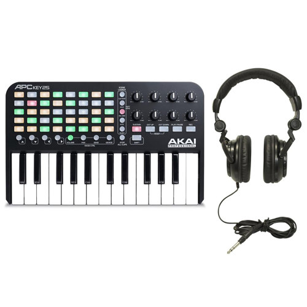

# Akai APC Key 25 (original)



*Photo: Akai Professional / retailer product listing. Used here to help you
find your way around the control surface; not affiliated with or endorsed by
Akai. The original (non-mk2) APC Key 25 is discontinued, so no current
manufacturer product page exists for it -- this photo comes from a retailer
listing instead.*

25 keys, an 8x5 clip-launch pad grid, 8 knobs, and dedicated transport
buttons. This driver uses the same fixed knob CCs and transport-button notes
as the [APC Key 25 mk2](akai-apc-key25-mk2.md) -- Akai kept the protocol
identical between the two hardware revisions, so both are covered by one
driver and this manual applies to either.

## Quick start

```sh
./build/synthone-gui               # or: ./build/synthone --midi all
```

Plug the APC Key 25 in **before** launching (no hotplug). Look for:

```
  [ctrl]    akai-apc-key25 <- APC Key 25 / MIDI 1
```

No SysEx query, no device-side mode to select -- everything below is bound
the instant the driver loads.

## What's mapped

| Control | Maps to |
| --- | --- |
| The 8 knobs above the keybed | Cutoff, resonance, attack, release, LFO 1 rate, reverb mix, delay mix, master volume |
| STOP ALL CLIPS | Panic |
| PLAY | Arp/Seq on-off |
| RECORD | Switch between Arp mode and Sequencer mode |

The keybed and the 40-pad clip-launch grid below it play as plain notes --
Synth One has no clip-launch concept for those pads to control. The 5 soft
keys under the grid, the 8 track-select buttons above the knobs, and SHIFT
are likewise left alone; bind any of them yourself with MIDI Learn if you
want to use them for something.

## Where this shows up in the app

Cutoff and resonance land on **MAIN**, master volume also on **MAIN**;
attack/release on **ENV**; LFO 1 rate/reverb mix/delay mix on **FX**:


STOP ALL CLIPS/PLAY/RECORD are global transport actions, not tied to a
panel -- Panic mirrors the PANIC button visible in the lower-left of every
screenshot above; the Arp/Seq toggle lives on the **SEQ** panel:


## Troubleshooting

**Nothing responds at all.** Check `--controller-driver` isn't `off`, and
that the device shows up in `--list-midi` as `APC Key 25` (or close to it).

**The 8 knobs don't respond.** This driver binds them unconditionally from a
fixed table -- no query to fail here. If they truly do nothing, your unit is
likely sending different CCs than the confirmed reference this driver was
built from; MIDI-Learn them yourself as a fallback.

**STOP ALL CLIPS/PLAY/RECORD don't do anything.** These report as MIDI CC
presses rather than Notes -- see the developer guide's "CC transport"
section for the confirmed CC numbers this driver expects, and check your
unit isn't sending them on an unexpected channel.

## See also

- [Akai APC Key 25 mk2](akai-apc-key25-mk2.md) -- the newer hardware
  revision; identical mapping.
- [MIDI controller drivers -- user guide](../midi-controller-user-guide.md)
- [Developer guide](../midi-controller-developer-guide.md)
