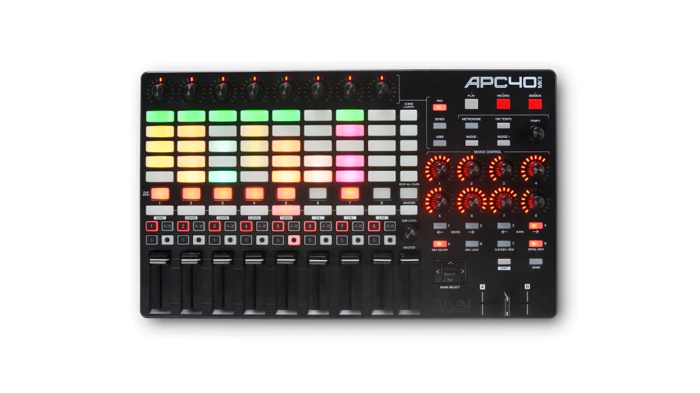
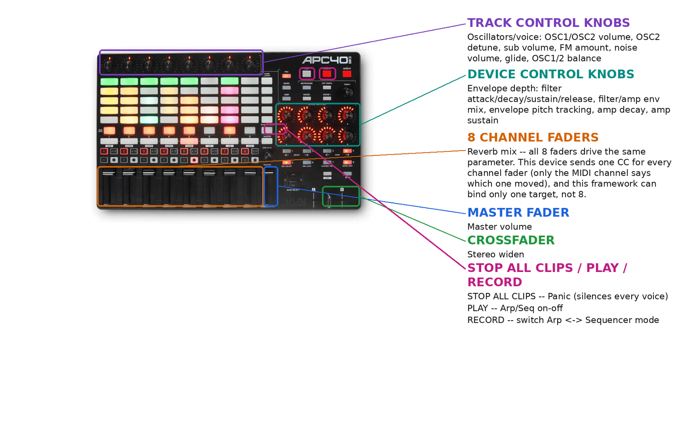
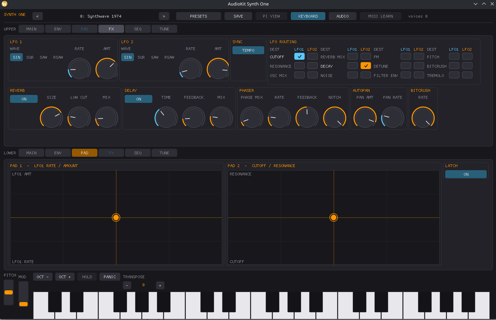

# Akai APC40 mk2



*Photo: Akai Professional. Used here to help you find your way around the
control surface; not affiliated with or endorsed by Akai.*

Akai's full-size Ableton Live controller: an 8x5 RGB clip-launch grid, 8
"Device Control" knobs, 8 "Track Control" knobs, 8 channel faders, a
crossfader, a master fader, and per-track buttons. No keybed. Everything
below is bound the instant the driver loads -- no SysEx, no modes.

## Quick start

```sh
./build/synthone-gui               # or: ./build/synthone --midi all
```

Plug the APC40 mk2 in **before** launching (no hotplug). Look for:

```
  [ctrl]    akai-apc40-mk2 <- APC40 mk2 / MIDI 1
```

## What's mapped

| Control | Maps to |
| --- | --- |
| The 8 "Device Control" knobs | Filter attack/decay/sustain/release, filter/amp env mix, envelope pitch tracking, amp decay, amp sustain |
| The 8 "Track Control" knobs | OSC1/OSC2 volume, OSC2 detune, sub volume, FM amount, noise volume, glide, OSC1/2 balance |
| Master fader | Master volume |
| Crossfader | Stereo widen |
| The 8 channel faders | Reverb mix -- **all 8 faders drive the same parameter.** This device sends the same CC number for every channel fader (only the MIDI channel says which one moved), and this driver framework doesn't distinguish MIDI channel for that purpose, so it can bind one target, not 8. |
| STOP ALL CLIPS | Panic |
| PLAY | Arp/Seq on-off |
| RECORD | Switch between Arp mode and Sequencer mode |

The Tempo knob and Cue Level knob are **not** mapped -- both report relative
turns (or, for Cue Level, an ambiguous mix of relative and absolute
depending on the source), which can't be translated into a parameter
position safely. Bind them yourself with MIDI Learn if you want them used
for something. The 40-pad clip-launch grid, the 5 per-track buttons (Record
Arm/Solo/Activator/Track Selection/Track Stop), and everything else not
listed above play as plain notes.



## Where this shows up in the app

Device Control knobs (filter/amp envelope) land on **ENV**; Track Control
knobs (oscillators/voice) and the crossfader (stereo widen) land on **MAIN**:


The 8 channel faders (reverb mix, all bound to the same target) land on
**FX**:



STOP ALL CLIPS/PLAY/RECORD are global transport actions -- Panic mirrors the
PANIC button visible in the lower-left of every screenshot above; the
Arp/Seq toggle lives on **SEQ**.

## Troubleshooting

**Nothing responds at all.** Check `--controller-driver` isn't `off`, and
that the device shows up in `--list-midi` as `APC40 mk2` (or close to it).

**Only one channel fader seems to work, or moving different faders all
change the same thing.** That's expected, not a bug -- see the note in the
mapping table above: this device sends an identical CC for all 8 channel
faders, distinguished only by MIDI channel, which this driver framework
doesn't use to disambiguate. Pick whichever physical fader you prefer as
"the" reverb-mix fader and ignore the rest, or MIDI-Learn a different
control if you need independent access to more than one parameter.

**Tempo or Cue Level knob does nothing.** Expected -- see above, both report
values this driver can't safely translate into a parameter position.
MIDI-Learn them yourself if you want to use them.

**STOP ALL CLIPS/PLAY/RECORD don't do anything.** These report as MIDI CC
presses rather than Notes -- check the developer guide's "CC transport"
section for the confirmed CCs/channel this driver expects.

## See also

- [MIDI controller drivers -- user guide](../midi-controller-user-guide.md)
- [Developer guide](../midi-controller-developer-guide.md)
