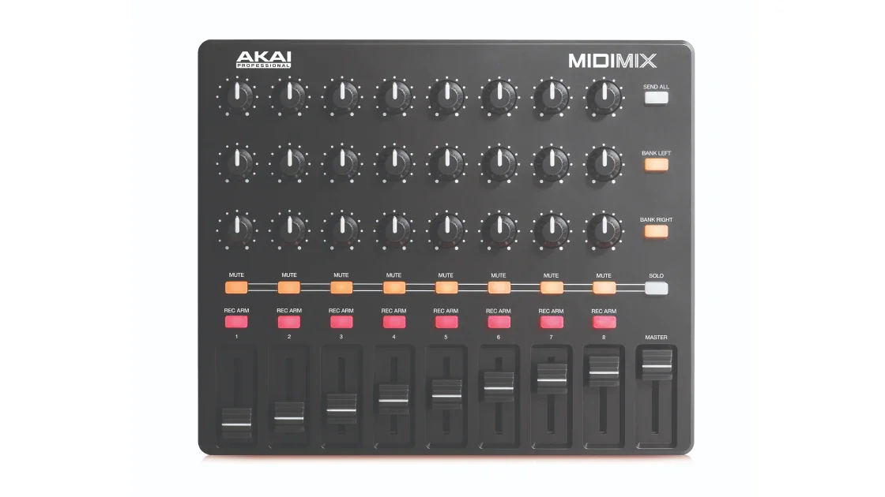
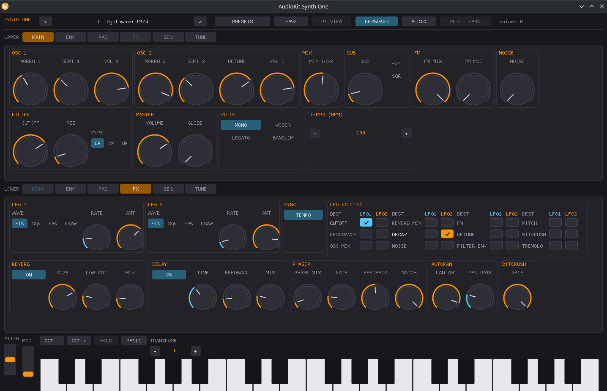
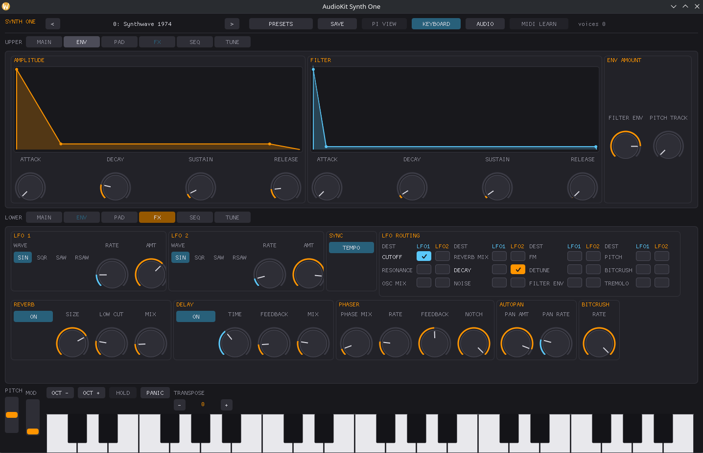

# Akai MIDI Mix



*Photo: Akai Professional. Used here to help you find your way around the
control surface; not affiliated with or endorsed by Akai.*

24 knobs (3 rows of 8), 8 channel faders plus a master fader, and 24
per-strip MUTE/SOLO/REC buttons. No keybed. This is the simplest driver in
the fixed-CC family: no SysEx, no modes, no startup handshake -- every knob
and fader is mapped the instant the driver loads.

## Quick start

```sh
./build/synthone-gui               # or: ./build/synthone --midi all
```

Plug the MIDI Mix in **before** launching (no hotplug). Look for:

```
  [ctrl]    akai-midimix <- MIDI Mix / MIDI 1
```

Nothing else to configure -- there's no device-side mode to select and no
query to wait on.

## What's mapped

| Control | Maps to |
| --- | --- |
| Knob row 1 (top knob, all 8 strips) | OSC1/OSC2 volume, OSC2 detune, sub volume, FM amount, noise volume, glide, OSC1/2 balance |
| Knob row 2 (middle knob, all 8 strips) | Filter attack/decay/sustain/release, filter/amp env mix, envelope pitch tracking, amp decay, amp sustain |
| Knob row 3 (bottom knob, all 8 strips) | LFO 1 amount, LFO 2 rate/amount, phaser mix/rate, autopan amount/rate, bitcrush rate |
| The 8 channel faders | Cutoff, resonance, attack, release, LFO 1 rate, reverb mix, delay mix, arp rate |
| Master fader | Master volume |
| SOLO button | Panic |
| BANK LEFT button | Arp/Seq on-off |
| BANK RIGHT button | Switch between Arp mode and Sequencer mode |

The 24 per-strip MUTE/SOLO/REC buttons play as plain (very low) notes --
this device has no keybed, and Synth One has no per-channel mixer concept
for them to control, so they're left alone rather than repurposed into
something arbitrary.

## Where this shows up in the app

Knob row 1 (oscillators/voice) lands entirely on **MAIN**; knob row 2
(envelope depth) on **ENV**; knob row 3 (LFO/phaser/autopan/bitcrush) on
**FX**, alongside the faders' reverb/delay mix and LFO 1 rate:





Cutoff, resonance, master volume (faders) land on **MAIN**; arp rate
(fader 8) shows up on **SEQ**:


SOLO/BANK LEFT/BANK RIGHT are global transport actions (Panic, Arp/Seq
toggle) -- they don't live on a specific panel; Panic mirrors the PANIC
button visible in the lower-left of every screenshot above.

## Troubleshooting

**Nothing responds at all.** Check `--controller-driver` isn't set to `off`,
and that the device actually appears in `--list-midi` -- this driver can
only match a device that's connected and reporting the name it expects
(`MIDI Mix`). If the reported name differs on your OS/firmware, see the
developer guide for how to extend the match list.

**A knob or fader does nothing.** Unlike the MPK Mini mk3, this driver has
no SysEx query to fail -- every control here is bound unconditionally from a
fixed table the moment the driver loads. If a specific knob or fader truly
does nothing, either it's one of the ones this driver deliberately leaves
unbound (the 24 MUTE/SOLO/REC buttons -- see above), or your unit is sending
a different CC than the confirmed reference this driver was built from.
MIDI-Learn it yourself as a reliable fallback either way.

**SOLO/BANK LEFT/BANK RIGHT don't do anything.** These report as MIDI CC
presses rather than Notes; check the transport CCs are arriving on the
channel your unit actually sends (see the developer guide's "CC transport"
section for the confirmed channel/CC numbers this driver expects).

## See also

- [MIDI controller drivers -- user guide](../midi-controller-user-guide.md)
- [Developer guide](../midi-controller-developer-guide.md)
