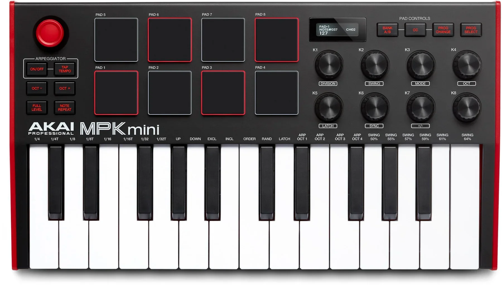

# Akai MPK Mini mk3



*Photo: Akai Professional. Used here to help you find your way around the
control surface; not affiliated with or endorsed by Akai.*

25 mini-keys, 8 knobs, and 16 backlit pads. This is the reference driver the
whole controller-driver framework was built around -- it's the only one that
talks back to the device over SysEx to discover what its knobs are already
sending, rather than assuming a fixed CC layout.

## Quick start

```sh
./build/synthone-gui               # or: ./build/synthone --midi all
```

Plug the MPK Mini mk3 in **before** launching -- there's no hotplug, so a
controller connected after startup won't be picked up until you restart.
Look for a status line like:

```
  [ctrl]    akai-mpk-mini-mk3 <- MPK mini 3 / MIDI 1
```

If you see `(SysEx TX unavailable)` next to it, the driver found the input
port but not a matching output port, so it can't run the discovery query --
the knobs will need manual MIDI Learn until that's resolved (see
[Troubleshooting](#troubleshooting)).

## What's mapped

The driver queries the device's 8 knobs on startup and binds each one to a
fixed synth parameter, using whatever CC the knob is *already* configured to
send -- you don't need to reprogram anything on the device itself.

| Program slot (**PROG SELECT**) | Mode | Knobs 1-8 |
| --- | --- | --- |
| 0 (RAM/default) | Sound | Cutoff, Resonance, Attack, Release, LFO 1 rate, Reverb mix, Delay mix, Master volume |
| 1 | Oscillators/voice | OSC1 volume, OSC2 volume, OSC2 detune, Sub volume, FM amount, Noise volume, Glide, OSC1/2 balance |
| 2 | Envelope depth | Filter attack, Filter decay, Filter sustain, Filter release, Filter/amp env mix, Envelope pitch tracking, Amp decay, Amp sustain |
| 3 | Modulation/FX | LFO 1 amount, LFO 2 rate, LFO 2 amount, Phaser mix, Phaser rate, Autopan amount, Autopan rate, Bitcrush rate |

Slots 4-8 have no designed mode; the knobs simply go unbound if you switch to
one of them. Use **PROG SELECT** (in the PAD CONTROLS row, alongside BANK
A/B, CC and PROG CHANGE) to step through slots -- consult your unit's manual
for the exact button combo, as this varies slightly by firmware.

### Function pads

8 of the 16 pads stop playing notes entirely and become dedicated buttons.
Which physical row is which is this driver's best-effort assumption, not a
confirmed fact (see the note below the table) -- if your unit's rows turn out
swapped, nothing misbehaves, the functions below just land on the opposite
row.

**Top row (PAD5-8): transport**

| Pad | Function |
| --- | --- |
| PAD5 | Panic -- immediately silences every voice |
| PAD6 | All notes off |
| PAD7 | Arp/Seq on/off |
| PAD8 | Switch between Arp mode and Sequencer mode |

**Bottom row (PAD1-4): panel switching** (`synthone-gui` only)

| Pad | Panel |
| --- | --- |
| PAD1 | MAIN (Generators) |
| PAD2 | ENV (Envelopes) |
| PAD3 | FX (Effects) |
| PAD4 | SEQ (Sequencer) |

The remaining 8 pads play notes normally. These 8 function pads are
rediscovered every time you switch **PROG SELECT**, so they work the same way
on every slot, including the undesigned ones.


Switching modes with **PROG SELECT**:


## Where this shows up in the app

Mode 0's K1/K2/K8 land on **MAIN** (cutoff, resonance, master volume), K3/K4
on **ENV** (amplitude attack/release):


K5/K6/K7 land on the **FX** panel (LFO 1 rate, reverb mix, delay mix):


Modes 1-3 each land entirely on one panel -- oscillators/voice on MAIN,
envelope depth on ENV, modulation/FX on FX:


The top-row transport pads (Panic, All notes off, Arp/Seq toggle) act
globally, not on a specific panel. The bottom-row panel-switch pads jump
directly to MAIN/ENV/FX/SEQ in `synthone-gui`.

## Troubleshooting

**Status line shows `(SysEx TX unavailable)`.** The driver found your MPK
Mini mk3's input port but couldn't pair it with an output port, so it can
identify the device by name but can't run the SysEx query that discovers
knob CCs. This can happen if only the input side is connected (e.g. via
`--midi` naming just one port), or if the in/out pairing heuristic doesn't
recognise your specific unit. The knobs need manual MIDI Learn in this case.

**Knobs don't respond even though the status line looks fine.** The query
may not have gotten a reply in time, or the SysEx program dump didn't parse
as expected -- this is a defensive check, not a bug: a wrong guess at a knob
CC risks colliding with a universal MIDI convention (e.g. CC 1 is always the
mod wheel), so the driver would rather bind nothing than bind something
wrong. MIDI-Learn the knob yourself as a reliable fallback.

**Switching PROG SELECT doesn't change what the knobs control.** The knobs
should go briefly unresponsive, then pick up the new slot's mapping. If
nothing changes, either your unit isn't sending a Program Change on PROG
SELECT the way this driver expects (unverified against physical hardware),
or you're on one of slots 4-8, which has no designed mode. Try slot 0 first
to confirm the driver is working at all.

**A pad plays a note instead of doing its function, or the wrong pad fires.**
Function pads are only claimed once the startup SysEx query completes -- if
it never does, all 16 pads fall back to playing notes (see the SysEx
entries above). If a pad *is* claimed but does the wrong thing, the
pad-to-function assumption in this driver is unverified against real
hardware -- worth reporting, but not something MIDI Learn can override
(these pads never reach the note path at all).

## See also

- [MIDI controller drivers -- user guide](../midi-controller-user-guide.md) --
  the full reference this manual is drawn from, alongside every other
  supported controller.
- [Developer guide](../midi-controller-developer-guide.md) -- architecture,
  the SysEx protocol reference for this device, and how to add a driver.
