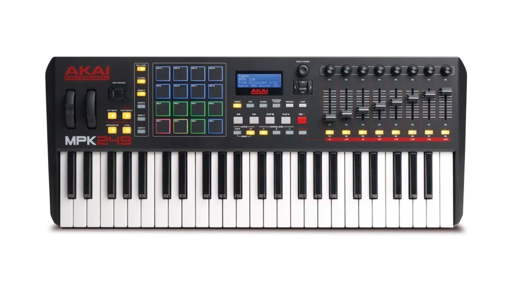
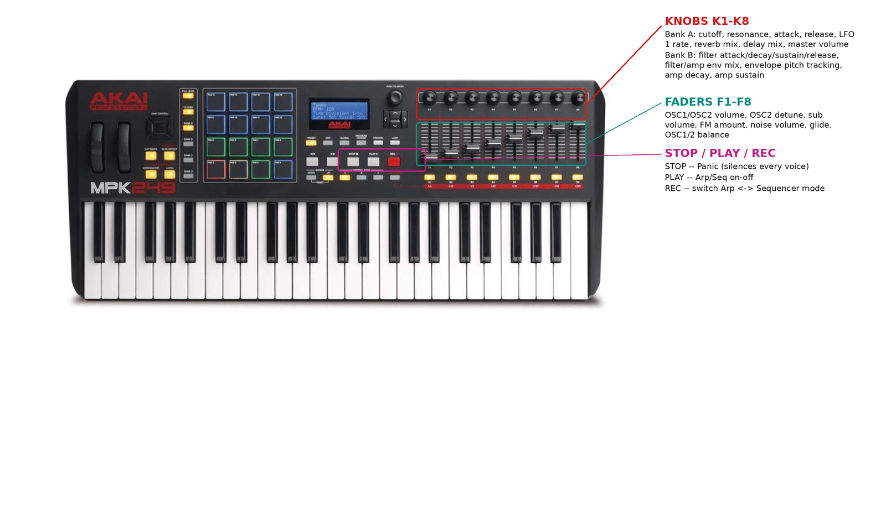

# Akai MPK249



*Photo: Akai Professional. Used here to help you find your way around the
control surface; not affiliated with or endorsed by Akai.*

49 keys, 16 RGB pads in 4 banks, 8 knobs, 8 faders, an LCD, and dedicated
transport buttons. This is the driver with the strictest precondition of the
bunch: it only works correctly on one specific onboard preset.

## Before you start: select preset 25 ("MPK Generic")

**This driver requires your MPK249 to be set to its onboard preset 25.**
Consult your unit's manual for how to select a program slot -- there's no
way for this driver to select or confirm that preset for you over MIDI. If
you're on a different preset (including the factory default), every knob and
fader below will simply do nothing until you switch, or until you bind them
yourself with MIDI Learn.

## Quick start

```sh
./build/synthone-gui               # or: ./build/synthone --midi all
```

Plug the MPK249 in **before** launching (no hotplug), with preset 25 already
selected on the device. Look for:

```
  [ctrl]    akai-mpk249 <- MPK249 / MIDI 1
```

## What's mapped

The front-panel BANK A/B/C switch changes which CC numbers the same
physical knobs send. Both Bank A and Bank B are mapped ahead of time
(whichever bank is actually selected on the device is the only one sending
anything, so having both mapped is harmless); Bank C has no separate
mapping in this driver.

| Control | Maps to |
| --- | --- |
| The 8 knobs, Bank A | Cutoff, resonance, attack, release, LFO 1 rate, reverb mix, delay mix, master volume |
| The 8 knobs, Bank B | Filter attack/decay/sustain/release, filter/amp env mix, envelope pitch tracking, amp decay, amp sustain |
| The 8 faders | OSC1/OSC2 volume, OSC2 detune, sub volume, FM amount, noise volume, glide, OSC1/2 balance |
| STOP | Panic |
| PLAY | Arp/Seq on-off |
| RECORD | Switch between Arp mode and Sequencer mode |

Not mapped: the BANK A/B/C switches themselves (solo/mute/record-arm per
channel strip on this driver's Zynthian reference -- Synth One has no
per-channel mixer for them to control), and the Rewind/Fast-Forward/Loop
transport buttons (no Synth One equivalent action). The keybed and 16 pads
play as plain notes.



## Where this shows up in the app

Bank A (cutoff, resonance, master volume) lands on **MAIN**; Bank A's
attack/release lands on **ENV**; Bank A's LFO 1 rate/reverb/delay mix lands
on **FX**:


Bank B (filter envelope, amp decay/sustain, envelope pitch tracking) lands
entirely on **ENV**:


The 8 faders (oscillators/voice/glide/balance) land entirely on **MAIN**.
STOP/PLAY/RECORD are global transport actions -- Panic mirrors the PANIC
button visible in the lower-left of every screenshot above; the Arp/Seq
toggle lives on **SEQ**.

## Troubleshooting

**Knobs and faders don't respond even though the status line looks fine.**
Check the device is actually set to onboard preset 25 ("MPK Generic") -- see
the precondition above. This driver's CCs only apply to that preset, and
there's no way for it to select or confirm the preset on your behalf.

**STOP/PLAY/RECORD don't do anything.** These report as MIDI CC presses
rather than Notes, and are gated to one confirmed MIDI channel -- a unit
reporting on a different channel than expected would show this symptom too.
See the developer guide's "CC transport" section for the confirmed values.

## See also

- [MIDI controller drivers -- user guide](../midi-controller-user-guide.md)
- [Developer guide](../midi-controller-developer-guide.md)
