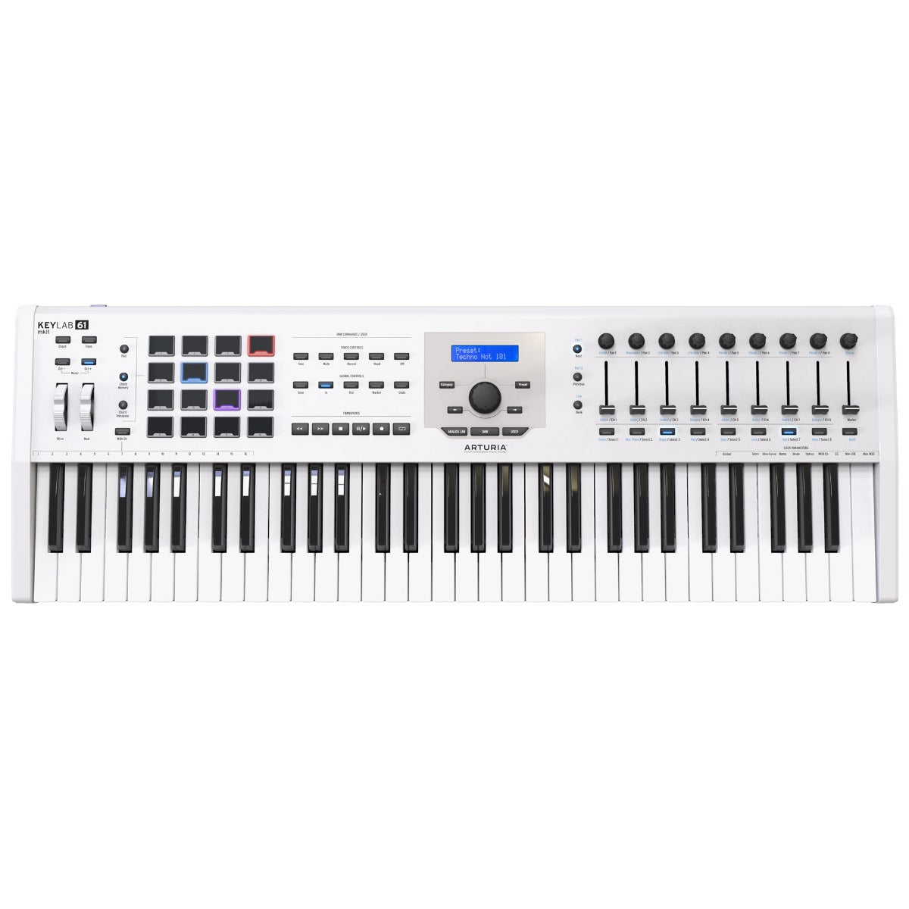
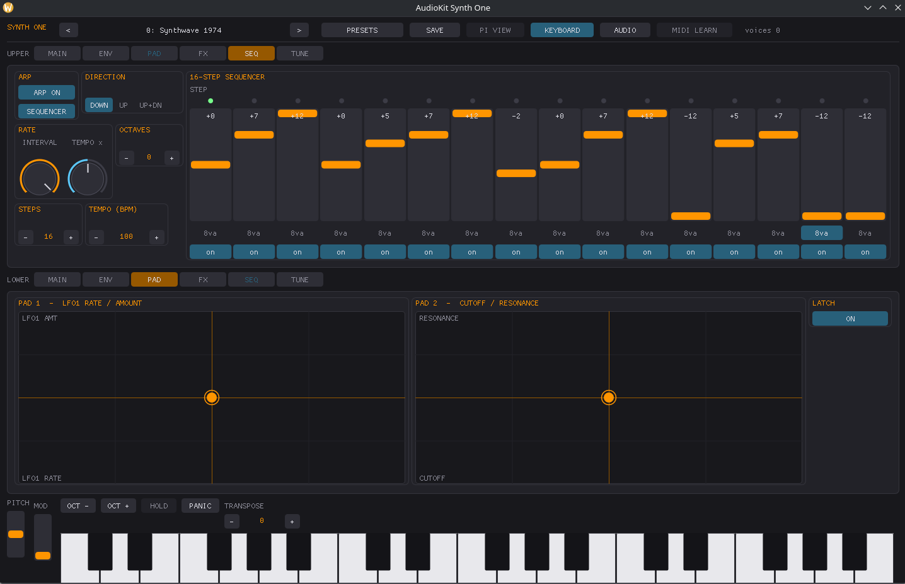

# Arturia KeyLab mkII 61



*Photo: Arturia / retailer product listing (white edition shown; the driver
works identically on the black edition). Used here to help you find your way
around the control surface; not affiliated with or endorsed by Arturia.*

61 semi-weighted keys, 16 RGB pads, an LCD, 9 knobs, 9 faders, and a full
transport/track/global control section. This driver's job is narrower than
the control surface suggests: it switches the device into "DAW mode" on
startup and claims only the 4 transport buttons that section exposes.

## Quick start

```sh
./build/synthone-gui               # or: ./build/synthone --midi all
```

Plug the KeyLab in **before** launching (no hotplug). On startup, the driver
sends a two-message handshake that switches the device into DAW mode so its
transport section reports the note numbers this driver expects -- you don't
need to do anything for this yourself. Look for:

```
  [ctrl]    arturia-keylab-61-mk2 <- KeyLab mkII 61 / MIDI 1
```

## What's mapped

| Control | Maps to |
| --- | --- |
| STOP | Panic |
| PLAY/PAUSE | Arp/Seq on-off |
| RECORD | Switch between Arp mode and Sequencer mode |
| METRONOME | All notes off |

That's the entire mapping. **Not mapped:** the 9 knobs, 9 faders, and 9
toggle buttons in the mixing strip -- there's no confirmed protocol
reference for what CCs they send once in DAW mode, so bind them yourself
with MIDI Learn if you want to use them. Also not mapped: the 8 SELECT
buttons, the track SOLO/MUTE/RECORD ARM/READ/WRITE buttons,
SAVE/PUNCH IN/PUNCH OUT/UNDO/NEXT/PREVIOUS/BANK, and the preset +/- buttons
-- none has a Synth One equivalent. The keybed and the 4x4 pad grid play as
plain notes.

## Where this shows up in the app

STOP/PLAY-PAUSE/RECORD/METRONOME are global transport actions, not tied to a
specific panel. Panic and All notes off mirror the PANIC button visible in
the lower-left of every panel screenshot; the Arp/Seq toggle lives on
**SEQ**:



If you MIDI-Learn the 9 knobs/faders yourself, where they land depends on
what you assign them to -- any of MAIN, ENV, FX, PAD, SEQ, or TUNE is a
valid target; see those panels' own screenshots in the other manuals in this
folder for what's available on each.

## Troubleshooting

**STOP/PLAY-PAUSE/RECORD/METRONOME don't do anything.** The DAW-mode-entry
handshake this driver sends on startup is unverified against real hardware
-- if your unit doesn't actually switch into DAW mode from those two
messages, the buttons won't send the note numbers this driver expects.
Check the status line doesn't show `(SysEx TX unavailable)` first; if it
doesn't, and the buttons still don't respond, that's a hardware/firmware
mismatch worth reporting.

**The knobs/faders/toggle buttons don't do anything.** That's expected, not
a bug -- see the mapping table above, none of them are mapped at all. Use
MIDI Learn.

## See also

- [MIDI controller drivers -- user guide](../midi-controller-user-guide.md)
- [Developer guide](../midi-controller-developer-guide.md)
