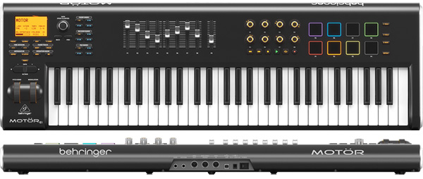

# Behringer MOTÖR61 / MOTÖR49



*Photo: Caravan Musical Instruments (a Behringer retailer) product listing;
the 61-key MOTÖR61 is shown. Used here to help you find your way around the
control surface; not affiliated with or endorsed by Behringer. This driver
supports both the MOTÖR61 and the smaller-keybed MOTÖR49 -- they share an
identical control surface and protocol aside from key count, so one driver
and this one manual cover both.*

A motorized-fader keyboard: 9 touch-sensitive 60mm faders across 3 banks
(Upper/Lower/Pedal), matching encoder banks, 8 backlit drum pads across 4
banks, and a full-size keybed (61 or 49 keys depending on model). This is
the richest driver in the fixed-CC family -- 25 confirmed absolute
fader/encoder CCs plus 4 confirmed transport pad notes, all bound the
instant the driver loads. No SysEx, no modes, no startup handshake.

## Quick start

```sh
./build/synthone-gui               # or: ./build/synthone --midi all
```

Plug it in **before** launching (no hotplug). Look for:

```
  [ctrl]    behringer-motor <- MOTÖR61 Keyboard / MIDI 1
```

(or `MOTÖR49 Keyboard`, depending on your model).

## What's mapped

| Control | Maps to |
| --- | --- |
| Upper-bank faders (8) | Cutoff, resonance, attack, release, LFO 1 rate, reverb mix, delay mix, master volume |
| Lower-bank faders (8) | OSC1/OSC2 volume, OSC2 detune, sub volume, FM amount, noise volume, glide, OSC1/2 balance |
| Pedal-bank faders (8) | Filter attack/decay/sustain/release, filter/amp env mix, envelope pitch tracking, amp decay, amp sustain |
| Master fader | Master volume |
| Upper-bank encoders 1-4 + "Pianoteq" encoders 5-8 (8 total) | LFO 1/LFO 2 depth and LFO 2 rate, phaser mix/rate, autopan amount/rate, bitcrush rate |
| Lower-bank encoder 1 | Arp rate |
| Pedal-bank encoder 1 | Stereo widen |
| First pad of Bank A | Panic |
| Second pad of Bank A | All notes off |
| Third pad of Bank A | Arp/Seq on-off |
| Fourth pad of Bank A | Switch between Arp mode and Sequencer mode |

The other 28 pads (the rest of Bank A plus Banks B/C/D) play as plain notes
-- this driver only claims the first 4. The motorized faders' "touch"
sensing plays as plain (very low, inaudible-range) notes too; this driver
has no use for it.

## Where this shows up in the app

Upper-bank faders (cutoff/resonance/master volume on **MAIN**,
attack/release on **ENV**, LFO 1 rate/reverb/delay mix on **FX**):


Lower-bank faders (oscillators/voice/glide/balance) land entirely on
**MAIN**. Pedal-bank faders (filter envelope, amp decay/sustain, envelope
pitch tracking) land entirely on **ENV**, shown above.

Upper-bank + Pianoteq encoders (LFO depth/rate, phaser, autopan, bitcrush)
land entirely on **FX**:


The lower-bank arp-rate encoder shows up on **SEQ**; the pedal-bank widen
encoder is in MAIN's VOICE section (shown above). The 4 claimed transport
pads act globally -- Panic/All notes off mirror the PANIC button in the
lower-left of every screenshot; the Arp/Seq toggle is on **SEQ**:


## Troubleshooting

**Nothing responds at all.** Check `--controller-driver` isn't `off`, and
that the device shows up in `--list-midi` as `MOTÖR61 Keyboard` or `MOTÖR49
Keyboard` (or close to it -- the `Ö` may render differently depending on
your OS's MIDI stack).

**A fader or encoder does nothing.** This driver binds every control
unconditionally from a fixed table -- no query to fail here. If one truly
does nothing, either it's one of the pads/touch-sense controls this driver
deliberately leaves unbound (see above), or your unit is sending a different
CC than the confirmed reference this driver was built from. MIDI-Learn it
yourself as a fallback.

**The transport pads don't do anything.** Check they're on Bank A (the
other 3 banks aren't claimed) and that the device is sending on the single
MIDI channel this driver expects -- see the developer guide's "CC transport"
section for the confirmed channel/CC numbers.

## See also

- [MIDI controller drivers -- user guide](../midi-controller-user-guide.md)
- [Developer guide](../midi-controller-developer-guide.md)
