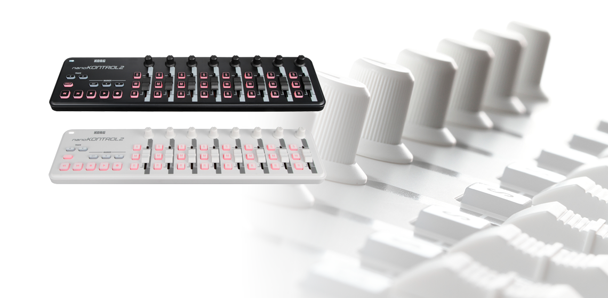
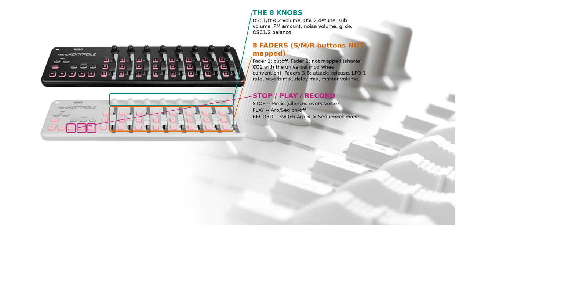

# Korg nanoKONTROL2



*Photo: Korg. Both the black and white editions are shown; the driver works
identically on either. Used here to help you find your way around the
control surface; not affiliated with or endorsed by Korg.*

8 channel strips, each with a knob, a fader, and 3 buttons, plus a dedicated
transport section. No keybed, no pads. Like the Akai MIDI Mix and Behringer
MOTÖR, everything here is mapped the instant the driver loads -- no SysEx,
no modes, no startup handshake.

## Quick start

```sh
./build/synthone-gui               # or: ./build/synthone --midi all
```

Plug it in **before** launching (no hotplug). Look for:

```
  [ctrl]    korg-nanokontrol2 <- nanoKONTROL2 / MIDI 1
```

## What's mapped

| Control | Maps to |
| --- | --- |
| Fader 1 | Cutoff |
| Fader 2 | **Not mapped** -- this fader happens to share CC1 with the universal MIDI mod wheel convention. Binding it would mean a mod wheel on a different, simultaneously-connected keyboard could unexpectedly move whatever this fader controlled, so it's left free. |
| Faders 3-8 | Attack, release, LFO 1 rate, reverb mix, delay mix, master volume |
| Knobs 1-8 | OSC1/OSC2 volume, OSC2 detune, sub volume, FM amount, noise volume, glide, OSC1/2 balance |
| PLAY | Arp/Seq on-off |
| STOP | Panic |
| RECORD | Switch between Arp mode and Sequencer mode |

Not mapped: the SOLO/MUTE/REC button rows and track/marker navigation
buttons -- these are per-mixer-channel controls on this driver's Zynthian
reference design, with no Synth One equivalent for them to control.



## Where this shows up in the app

The 8 knobs (oscillators/voice/glide/balance) land entirely on **MAIN**.
From the faders: fader 1's cutoff also lands on **MAIN**; attack/release on
**ENV**; LFO 1 rate/reverb mix/delay mix on **FX**; master volume back on
**MAIN**:


PLAY/STOP/RECORD are global transport actions -- Panic mirrors the PANIC
button visible in the lower-left of every screenshot above; the Arp/Seq
toggle lives on **SEQ**:


## Troubleshooting

**Fader 2 doesn't do anything.** That's expected -- see the mapping table
above, it deliberately isn't mapped to avoid colliding with the mod wheel
convention. Bind it yourself with MIDI Learn if you want to use it for
something.

**SOLO/MUTE/REC and navigation buttons don't do anything.** Also expected --
no Synth One equivalent for per-channel mixer controls.

**PLAY/STOP/RECORD don't do anything.** These report as MIDI CC presses
rather than Notes -- see the developer guide's "CC transport" section for
the confirmed CC numbers this driver expects.

## See also

- [MIDI controller drivers -- user guide](../midi-controller-user-guide.md)
- [Developer guide](../midi-controller-developer-guide.md)
