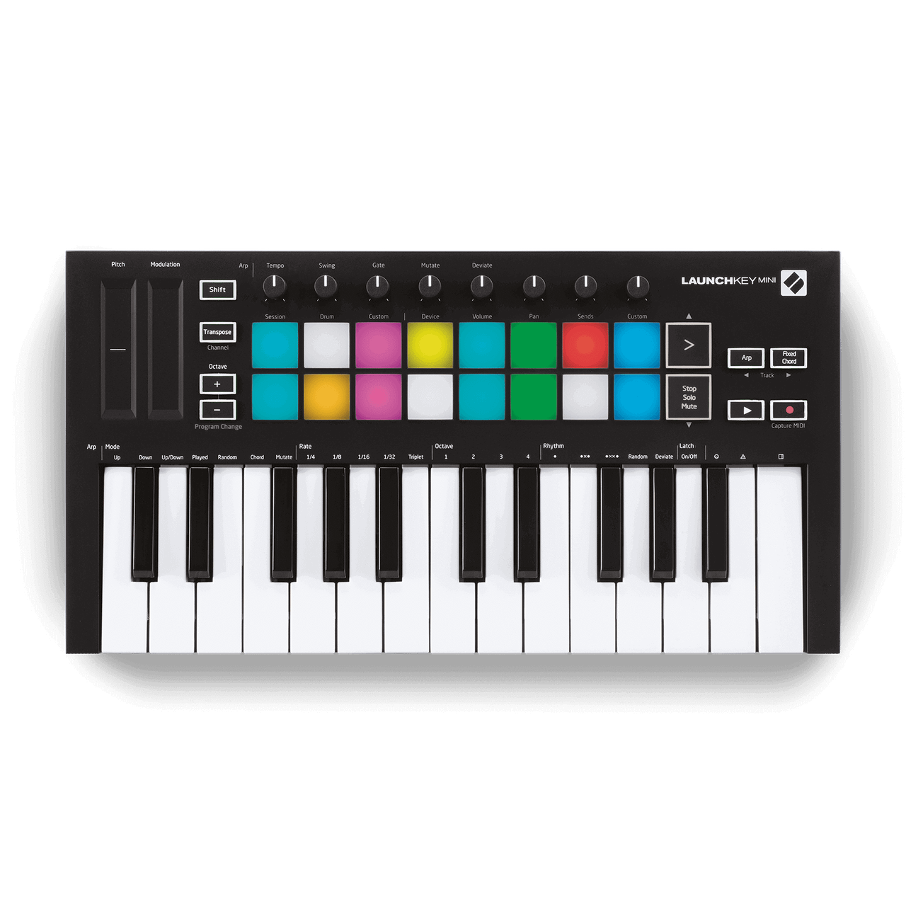
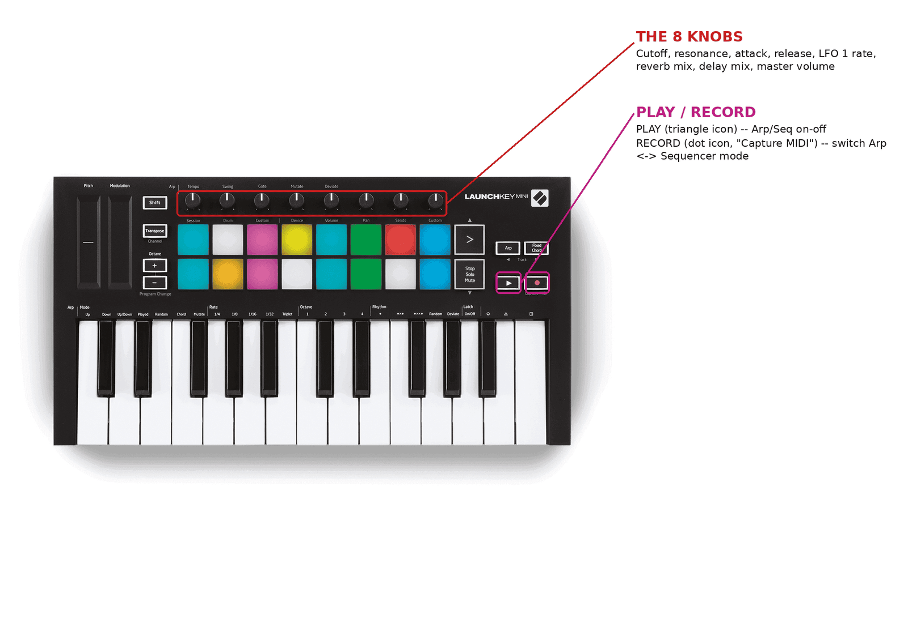

# Novation Launchkey Mini mk3



*Photo: Novation. Used here to help you find your way around the control
surface; not affiliated with or endorsed by Novation.*

25 mini-keys, 16 RGB pads, 8 knobs, and no physical faders. One of four
Launchkey drivers in this port -- see
[the Launchkey family overview](#the-launchkey-family) below for how the
other three (Launchkey MK3 88, Launchkey MK4 37, Launchkey Mini MK4 37)
compare.

## Quick start

```sh
./build/synthone-gui               # or: ./build/synthone --midi all
```

Plug it in **before** launching (no hotplug). On startup, the driver
automatically puts the device into "session mode" (an ordinary MIDI Note,
not something you'd notice) so the knobs send the CCs this driver expects.
Look for:

```
  [ctrl]    novation-launchkey-mini-mk3 <- Launchkey Mini MK3 / MIDI 1
```

## What's mapped

| Control | Maps to |
| --- | --- |
| The 8 knobs | Cutoff, resonance, attack, release, LFO 1 rate, reverb mix, delay mix, master volume |
| PLAY | Arp/Seq on-off |
| RECORD | Switch between Arp mode and Sequencer mode |

Not mapped: navigation (track left/right, up/down) and per-channel chain
buttons (select/mute/solo) -- no Synth One equivalent action for either. The
keybed and 16 pads play as plain notes.



## Where this shows up in the app

Cutoff/resonance/master volume land on **MAIN**; attack/release on **ENV**;
LFO 1 rate/reverb mix/delay mix on **FX**:


PLAY/RECORD are global transport actions -- the Arp/Seq toggle they drive
lives on **SEQ**:


## Troubleshooting

**Knobs don't respond.** Check the status line doesn't show `(SysEx TX
unavailable)` -- the session-mode handshake needs an output port the same
way SysEx does, even though it's sent as a plain MIDI Note rather than
SysEx. If the port pairing looks fine and knobs still don't respond, your
unit may be sending different CCs than the confirmed reference this driver
was built from; MIDI-Learn them yourself as a fallback.

**PLAY/RECORD don't do anything.** These report as MIDI CC presses rather
than Notes, and are gated to one confirmed MIDI channel -- a unit reporting
on a different channel would show this symptom. See the developer guide's
"CC transport" section for the confirmed values.

## The Launchkey family

| Controller | The 8 knobs | Sliders/master |
| --- | --- | --- |
| **Launchkey Mini mk3** (this device) | Cutoff, resonance, attack, release, LFO 1 rate, reverb mix, delay mix, master volume | -- (no physical sliders) |
| [Launchkey MK3 88](novation-launchkey-mk3-88.md) | OSC1/OSC2 volume, OSC2 detune, sub volume, FM amount, noise volume, glide, OSC1/2 balance | 8 faders: cutoff, resonance, attack, release, LFO 1 rate, reverb mix, delay mix, arp rate. Master fader: master volume. |
| [Launchkey MK4 37](novation-launchkey-mk4-37.md) | Filter attack/decay/sustain/release, filter/amp env mix, envelope pitch tracking, amp decay, amp sustain | -- (no physical sliders) |
| [Launchkey Mini MK4 37](novation-launchkey-mini-mk4-37.md) | **Not mapped** -- relative-encoder output | -- |

All four also map PLAY/RECORD identically to the table above.

## See also

- [MIDI controller drivers -- user guide](../midi-controller-user-guide.md)
- [Developer guide](../midi-controller-developer-guide.md)
