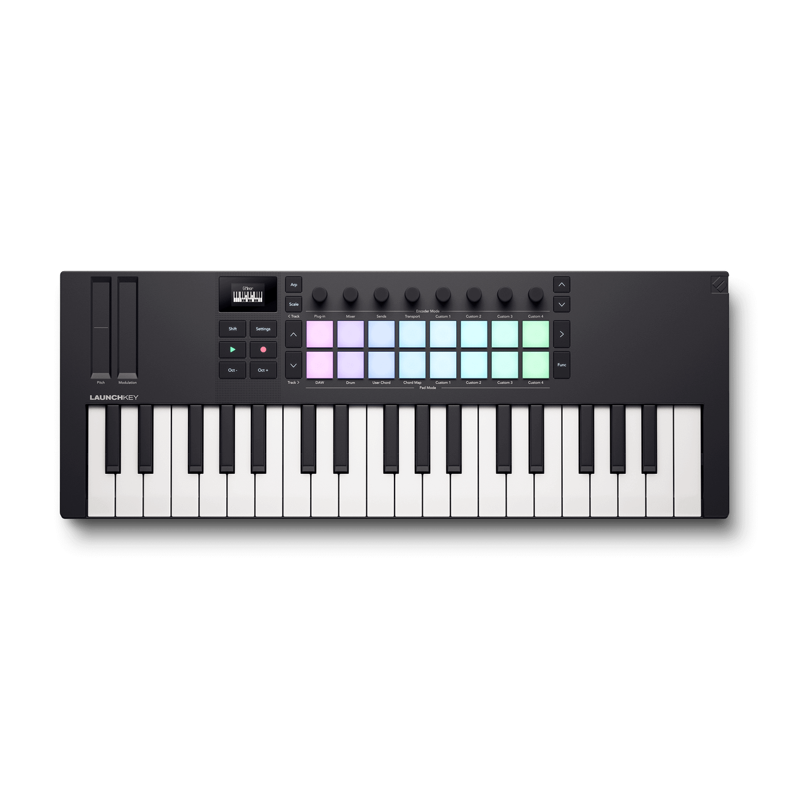
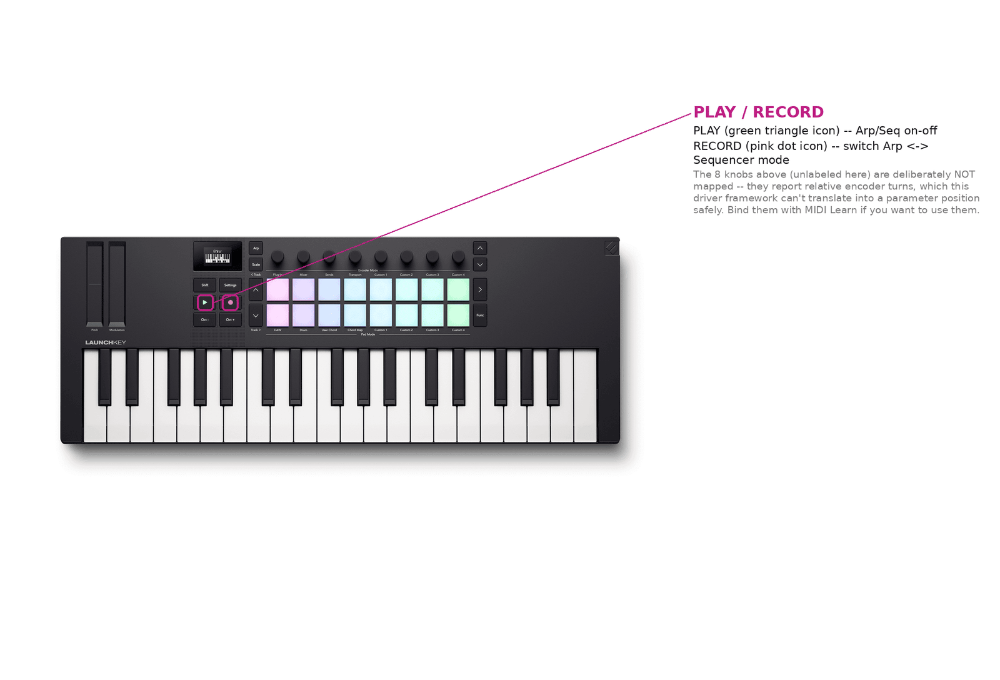

# Novation Launchkey Mini MK4 37



*Photo: Novation. Used here to help you find your way around the control
surface; not affiliated with or endorsed by Novation.*

37 mini-keys, 16 RGB pads, an OLED display, and 8 knobs. One of four
Launchkey drivers in this port -- see
[the Launchkey family overview](#the-launchkey-family) below for how the
other three (Launchkey Mini mk3, Launchkey MK3 88, Launchkey MK4 37)
compare. This is the one Launchkey with a hardware limitation the driver
can't work around: **its knobs are never mapped**.

## Quick start

```sh
./build/synthone-gui               # or: ./build/synthone --midi all
```

Plug it in **before** launching (no hotplug). On startup, the driver
automatically puts the device into "session mode" (an ordinary MIDI Note) so
PLAY/RECORD send the notes this driver expects. Look for:

```
  [ctrl]    novation-launchkey-mini-mk4-37 <- Launchkey Mini 37 MK4 / MIDI 1
```

## What's mapped

| Control | Maps to |
| --- | --- |
| The 8 knobs | **Not mapped.** This unit's knobs are confirmed relative-encoder output -- each turn sends a small delta (e.g. "+1" or "-1"), not an absolute position. This driver framework's CC path always treats an incoming value as an absolute 0-127 position, so binding a relative CC would make a small turn snap the target parameter towards its minimum instead of adjusting it smoothly. Bind them yourself with MIDI Learn if you want to use them -- Synth One's own MIDI Learn handles this the same way it would for any other knob, so this limitation is specific to the *driver's* automatic defaults, not to the app overall. |
| PLAY | Arp/Seq on-off |
| RECORD | Switch between Arp mode and Sequencer mode |

Not mapped either: navigation (track left/right, up/down) and per-channel
chain buttons (select/mute/solo) -- no Synth One equivalent action for
either. The keybed and 16 pads play as plain notes.



## Where this shows up in the app

Only PLAY/RECORD do anything by default, and both are global transport
actions rather than panel controls -- the Arp/Seq toggle they drive lives on
**SEQ**:


If you MIDI-Learn the 8 knobs yourself, where they land depends on what you
assign them to -- any parameter on MAIN, ENV, FX, PAD, SEQ, or TUNE is a
valid target.

## Troubleshooting

**The knobs don't do anything.** That's expected, not a bug -- see the
mapping table above. Use MIDI Learn if you want them bound to something.

**PLAY/RECORD don't do anything.** These report as MIDI CC presses rather
than Notes. Check the status line doesn't show `(SysEx TX unavailable)` --
the session-mode handshake needs an output port the same way SysEx does,
even though it's sent as a plain MIDI Note.

## The Launchkey family

| Controller | The 8 knobs | Sliders/master |
| --- | --- | --- |
| [Launchkey Mini mk3](novation-launchkey-mini-mk3.md) | Cutoff, resonance, attack, release, LFO 1 rate, reverb mix, delay mix, master volume | -- (no physical sliders) |
| [Launchkey MK3 88](novation-launchkey-mk3-88.md) | OSC1/OSC2 volume, OSC2 detune, sub volume, FM amount, noise volume, glide, OSC1/2 balance | 8 faders: cutoff, resonance, attack, release, LFO 1 rate, reverb mix, delay mix, arp rate. Master fader: master volume. |
| [Launchkey MK4 37](novation-launchkey-mk4-37.md) | Filter attack/decay/sustain/release, filter/amp env mix, envelope pitch tracking, amp decay, amp sustain | -- (no physical sliders) |
| **Launchkey Mini MK4 37** (this device) | **Not mapped** -- relative-encoder output | -- |

All four also map PLAY/RECORD identically to the table above.

## See also

- [MIDI controller drivers -- user guide](../midi-controller-user-guide.md)
- [Developer guide](../midi-controller-developer-guide.md)
