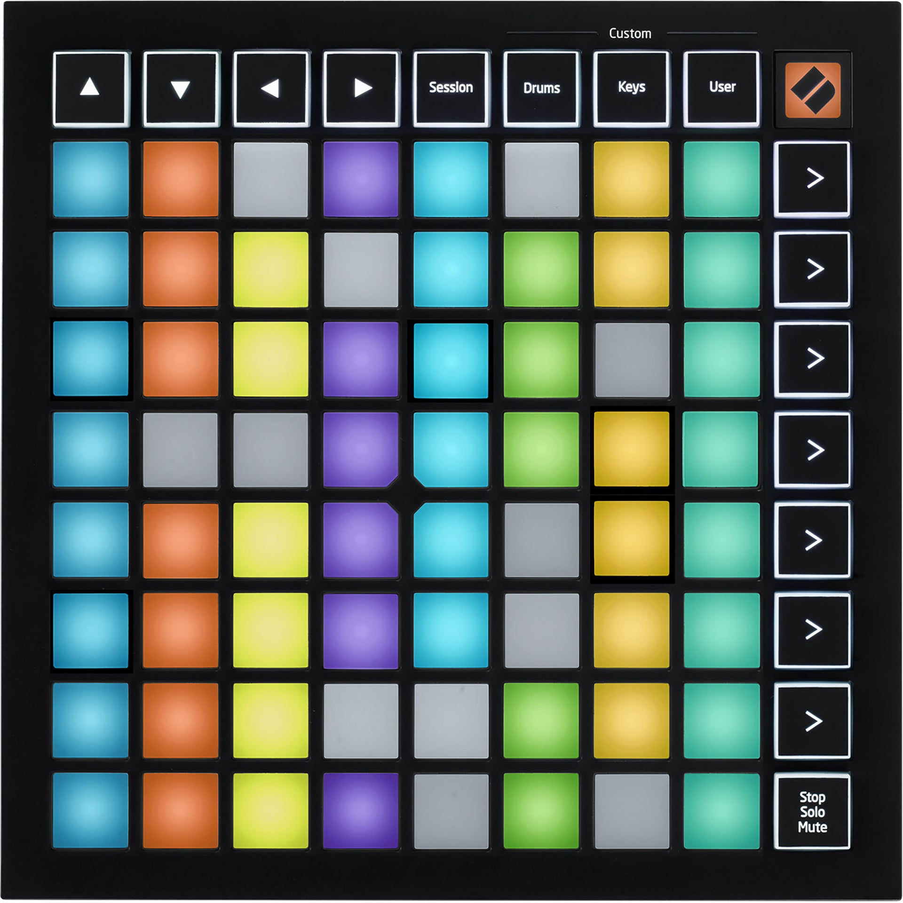

# Novation Launchpad Mini mk3



*Photo: Alto Music product listing. Used here to help you find your way
around the control surface; not affiliated with or endorsed by Novation.*

An 8x8 RGB clip-launch grid plus dedicated Session/Drums/Custom/User mode
buttons. No knobs, no faders, no keybed. Like the
[original Launchpad Mini](novation-launchpad-mini.md), this driver does
nothing beyond recognising the device.

## Quick start

```sh
./build/synthone-gui               # or: ./build/synthone --midi all
```

Plug it in **before** launching (no hotplug). Look for:

```
  [ctrl]    novation-launchpad-mini-mk3 <- Launchpad Mini MK3 / MIDI 1
```

## What's mapped

Nothing, by design. The 8x8 grid plays as plain, ordinary MIDI notes, same
as any unclaimed pad on any other supported controller. No knobs exist on
this device, and its dedicated buttons (arrows, Session/Drums/Custom/User)
have no Synth One transport-style action to map to.

## Where this shows up in the app

Nothing is mapped, so nothing shows up on any panel by default. If you
MIDI-Learn a grid pad yourself, where it lands depends on what you assign it
to -- any parameter or toggle on MAIN, ENV, FX, PAD, SEQ, or TUNE is a valid
target.

## Troubleshooting

**Nothing happens when I press pads or buttons -- is that broken?** No --
this is the documented, correct behavior for this device. Every pad plays a
plain note; the mode buttons do nothing unless you bind them yourself with
MIDI Learn.

**The device isn't recognised at all.** Check `--controller-driver` isn't
`off`, and that the device shows up in `--list-midi` as `Launchpad Mini
MK3` (or close to it).

## See also

- [Novation Launchpad family](novation-launchpad-x.md) -- how the other four
  supported Launchpads compare (only the Pro mk2 does anything beyond
  recognition).
- [MIDI controller drivers -- user guide](../midi-controller-user-guide.md)
- [Developer guide](../midi-controller-developer-guide.md)
