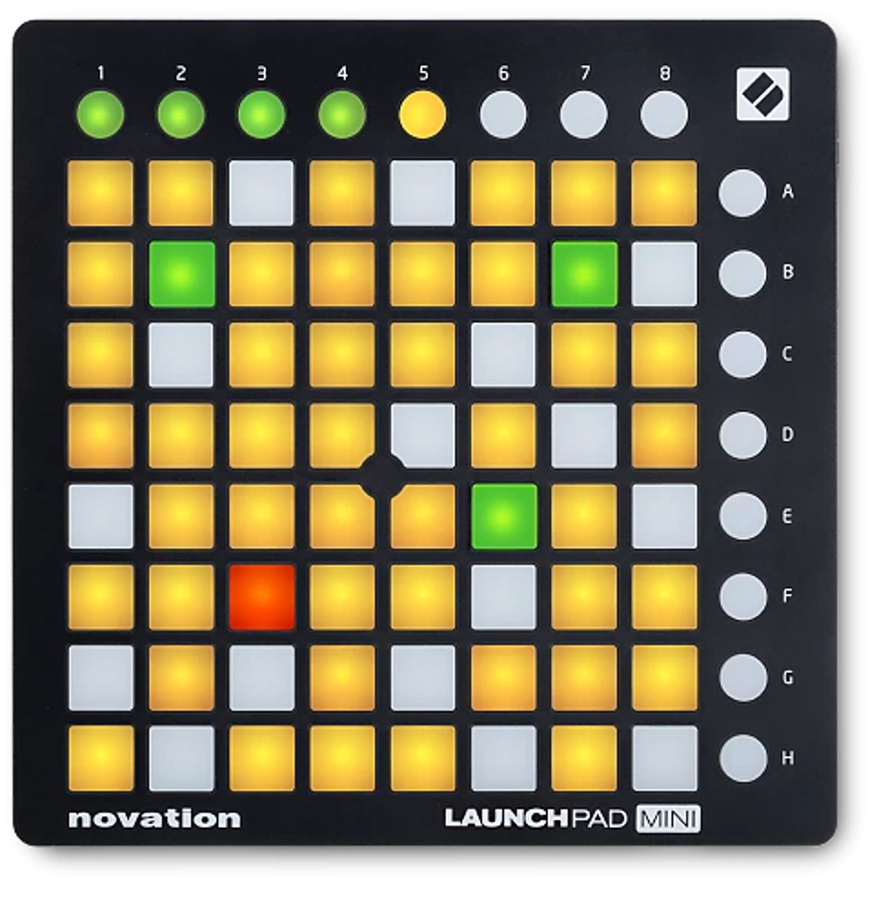

# Novation Launchpad Mini (original/mk1)



*Photo: Reverb.com marketplace listing. Used here to help you find your way
around the control surface; not affiliated with or endorsed by Novation.
This is the original (2013-era, "mk1") Launchpad Mini, long discontinued --
not to be confused with the current [Launchpad Mini mk3](novation-launchpad-mini-mk3.md)
or Novation's newer non-numbered "Launchpad Mini".*

An 8x8 clip-launch button grid with 8 top-row and 8 right-column CC buttons.
No knobs, no faders, no keybed. This is the simplest driver in the whole
port: it recognises the device by name and does nothing else.

## Quick start

```sh
./build/synthone-gui               # or: ./build/synthone --midi all
```

Plug it in **before** launching (no hotplug). Look for:

```
  [ctrl]    novation-launchpad-mini <- Launchpad Mini / MIDI 1
```

There's nothing further to configure -- there's no knob or fader for this
driver to bind.

## What's mapped

Nothing, by design. The 8x8 grid plays as plain, ordinary MIDI notes, same
as any unclaimed pad on any other supported controller. The 8 CC buttons
along the top and right edge (silkscreened Up/Down/Left/Right/Session/
User1/User2/Mixer on real hardware) have no Synth One transport-style action
to map to, unlike the Play/Record buttons the Akai/Novation/Korg drivers
claim elsewhere -- so this device gets pure recognition and nothing more.

This isn't a research gap -- see the developer guide for the full reasoning
(this device's grid exists for Ableton clip-launching, a concept Synth One
has no equivalent of).

## Where this shows up in the app

Nothing is mapped, so nothing shows up on any panel by default. If you
MIDI-Learn a grid pad or the 8 CC buttons yourself, where they land depends
on what you assign them to -- any parameter or toggle on MAIN, ENV, FX, PAD,
SEQ, or TUNE is a valid target.

## Troubleshooting

**Nothing happens when I press pads or buttons -- is that broken?** No --
see [What's mapped](#whats-mapped) above, this is the documented, correct
behavior for this device. Every pad plays a plain note (useful if you want
to actually play the grid as a keyboard-like surface); the 8 CC buttons do
nothing unless you bind them yourself with MIDI Learn.

**The device isn't recognised at all.** Check `--controller-driver` isn't
`off`, and that the device shows up in `--list-midi`. The original
Launchpad Mini's reported name can vary by OS/driver version -- see the
developer guide for how to extend the name-match list if yours differs.

## See also

- [Novation Launchpad family](novation-launchpad-x.md) -- how the other four
  supported Launchpads compare (only the Pro mk2 does anything beyond
  recognition).
- [MIDI controller drivers -- user guide](../midi-controller-user-guide.md)
- [Developer guide](../midi-controller-developer-guide.md)
