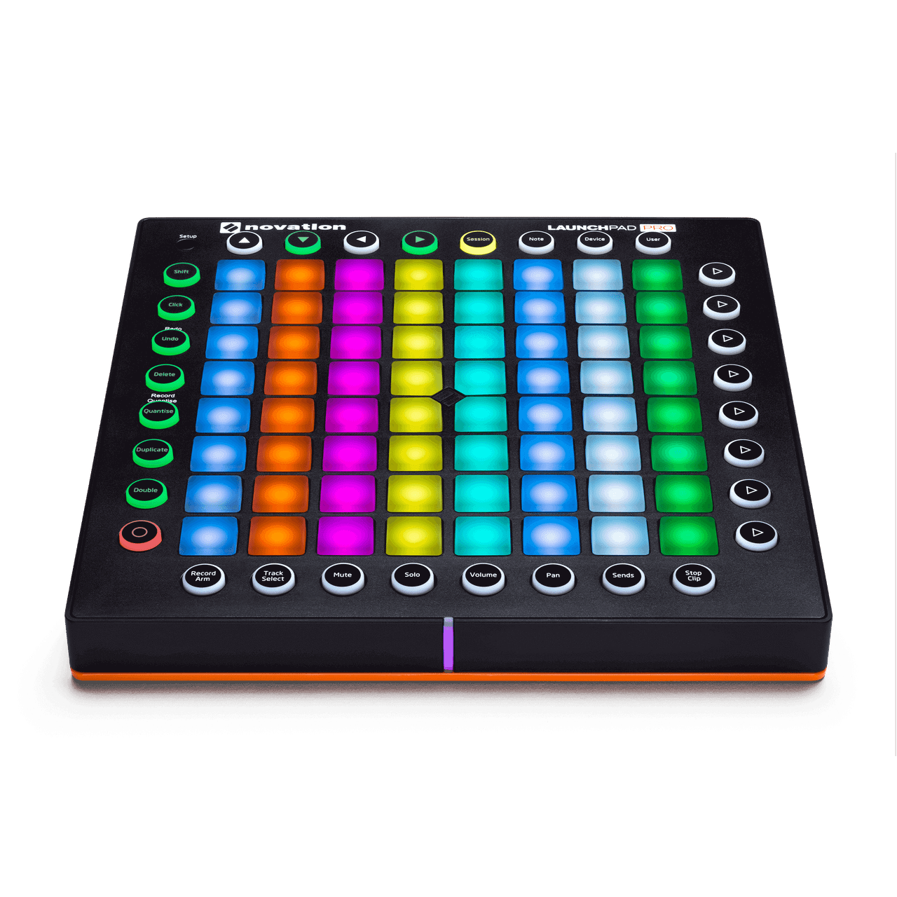

# Novation Launchpad Pro mk2



*Photo: Novation. Used here to help you find your way around the control
surface; not affiliated with or endorsed by Novation.*

An 8x8 RGB clip-launch grid with Session/Note/Device/User modes and a
dedicated transport row. This is the one Launchpad in this port that does
more than device recognition -- see
[Novation Launchpad family](#novation-launchpad-family) below for how the
other four (Launchpad Mini, Launchpad X, Launchpad Mini mk3, Launchpad Pro
mk3) compare.

## Quick start

```sh
./build/synthone-gui               # or: ./build/synthone --midi all
```

Plug it in **before** launching (no hotplug). On startup, the driver
switches the device into DAW mode via an automatic SysEx handshake -- you
don't need to do anything for this yourself. Look for:

```
  [ctrl]    novation-launchpad-pro-mk2 <- Launchpad Pro / MIDI 1
```

## What's mapped

| Control | Maps to |
| --- | --- |
| STOP | Panic |
| PLAY | Arp/Seq on-off |
| RECORD | Switch between Arp mode and Sequencer mode |

*No annotated diagram for this device*: STOP/PLAY/RECORD are the note
numbers this device reports **after** switching into DAW mode, and this
project can't confidently match those 3 note numbers back to specific
silkscreened buttons on a stock-firmware product photo (the Session/Note/
Device/User-mode labels visible on the photo are the *pre-DAW-mode*
button names, and Novation doesn't publish which physical button they
remap to once DAW mode is entered). Guessing at a box here risked being
actively wrong rather than just incomplete, which is worse -- see the
developer guide's "Known gaps" section.

That's the entire mapping. The 8x8 clip-launch grid plays as plain notes,
same as the rest of the Launchpad family. No knobs exist on this device to
map, and everything else on the control surface (Session/Note/Device/User
mode buttons, Setup, Click, Undo/Redo, Delete, Quantise, Duplicate, Double,
Record Arm/Track Select/Mute/Solo/Volume/Pan/Sends/Stop Clip) has no Synth
One equivalent action.

## Where this shows up in the app

STOP/PLAY/RECORD are global transport actions, not tied to a specific panel
-- Panic mirrors the PANIC button visible in the lower-left of every panel
screenshot; the Arp/Seq toggle lives on **SEQ**:


## Troubleshooting

**STOP/PLAY/RECORD don't do anything.** The DAW-mode-entry handshake this
driver sends on startup is unverified against real hardware -- if your unit
doesn't actually switch into DAW mode from that SysEx message, the buttons
won't send the values this driver expects. Check the status line doesn't
show `(SysEx TX unavailable)` first; if it doesn't, and the buttons still
don't respond, that's a hardware/firmware mismatch worth reporting.

**The device isn't recognised at all.** Check `--controller-driver` isn't
`off`, and that the device shows up in `--list-midi` as `Launchpad Pro` (or
close to it).

## See also

- [MIDI controller drivers -- user guide](../midi-controller-user-guide.md)
- [Developer guide](../midi-controller-developer-guide.md)

## Novation Launchpad family

Five Launchpad devices are recognised by this port. Four of them --
[Launchpad Mini](novation-launchpad-mini.md),
[Launchpad X](novation-launchpad-x.md),
[Launchpad Mini mk3](novation-launchpad-mini-mk3.md), and
[Launchpad Pro mk3](novation-launchpad-pro-mk3.md) -- do **nothing beyond
recognising the device**: no knobs exist on any of them to map, and their
only dedicated buttons are arrow keys/mode buttons, which have no Synth One
transport-style action to map to. The 8x8 clip-launch grid plays as plain,
ordinary notes on all of them.

**Launchpad Pro mk2** (this device) is the exception -- see
[What's mapped](#whats-mapped) above.
