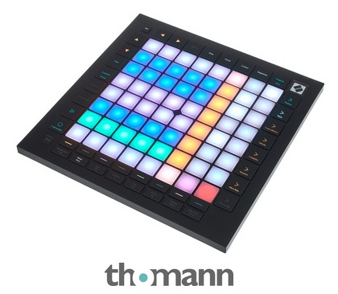

# Novation Launchpad Pro mk3



*Photo: Thomann product listing. Used here to help you find your way around
the control surface; not affiliated with or endorsed by Novation.*

An 8x8 velocity- and pressure-sensitive RGB grid, a built-in 4-track/32-step
sequencer, and extensive Custom Mode controls. No knobs, no faders, no
keybed. Despite the deep onboard sequencer this hardware has, this driver
does nothing beyond recognising the device -- see
[Novation Launchpad family](#novation-launchpad-family) below for why (and
how [Launchpad Pro mk2](novation-launchpad-pro-mk2.md) differs).

## Quick start

```sh
./build/synthone-gui               # or: ./build/synthone --midi all
```

Plug it in **before** launching (no hotplug). Look for:

```
  [ctrl]    novation-launchpad-pro-mk3 <- Launchpad Pro MK3 / MIDI 1
```

## What's mapped

Nothing, by design. The 8x8 grid plays as plain, ordinary MIDI notes, same
as any unclaimed pad on any other supported controller. No knobs exist on
this device, and its extensive button set has no Synth One transport-style
action to map to -- Synth One has its own, unrelated 16-step sequencer (see
the SEQ panel), so this device's onboard sequencer has nothing to hand
control to.

## Where this shows up in the app

Nothing is mapped, so nothing shows up on any panel by default. If you
MIDI-Learn a grid pad yourself, where it lands depends on what you assign it
to -- any parameter or toggle on MAIN, ENV, FX, PAD, SEQ, or TUNE is a valid
target.

## Troubleshooting

**Nothing happens when I press pads or buttons -- is that broken?** No --
this is the documented, correct behavior for this device. Every pad plays a
plain note; the rest of the control surface does nothing unless you bind it
yourself with MIDI Learn.

**The device isn't recognised at all.** Check `--controller-driver` isn't
`off`, and that the device shows up in `--list-midi` as `Launchpad Pro MK3`
(or close to it).

## See also

- [MIDI controller drivers -- user guide](../midi-controller-user-guide.md)
- [Developer guide](../midi-controller-developer-guide.md)

## Novation Launchpad family

Five Launchpad devices are recognised by this port. Four of them --
[Launchpad Mini](novation-launchpad-mini.md),
[Launchpad X](novation-launchpad-x.md),
[Launchpad Mini mk3](novation-launchpad-mini-mk3.md), and
**Launchpad Pro mk3** (this device) -- do nothing beyond recognising the
device. Only [Launchpad Pro mk2](novation-launchpad-pro-mk2.md) switches
into DAW mode on startup and claims dedicated STOP/PLAY/RECORD transport
buttons.
