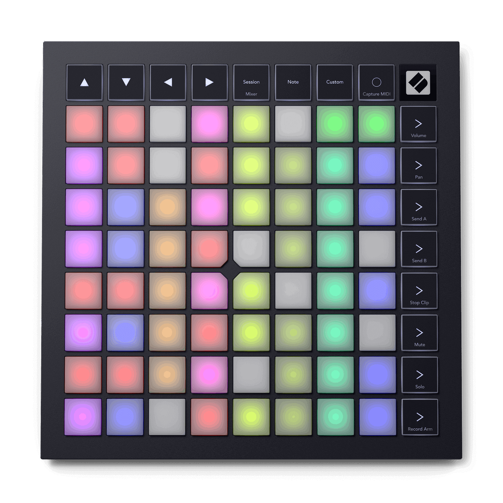

# Novation Launchpad X



*Photo: Novation. Used here to help you find your way around the control
surface; not affiliated with or endorsed by Novation.*

An 8x8 velocity- and pressure-sensitive RGB clip-launch grid plus 16
dedicated mode/navigation buttons. No knobs, no faders, no keybed. Like the
[Launchpad Mini](novation-launchpad-mini.md) and
[Launchpad Mini mk3](novation-launchpad-mini-mk3.md), this driver does
nothing beyond recognising the device.

## Quick start

```sh
./build/synthone-gui               # or: ./build/synthone --midi all
```

Plug it in **before** launching (no hotplug). Look for:

```
  [ctrl]    novation-launchpad-x <- Launchpad X / MIDI 1
```

## What's mapped

Nothing, by design. The 8x8 grid plays as plain, ordinary MIDI notes, with
velocity and polyphonic aftertouch passed through untouched -- same as any
unclaimed pad on any other supported controller. No knobs exist on this
device, and its 16 dedicated buttons have no Synth One transport-style
action to map to.

## Where this shows up in the app

Nothing is mapped, so nothing shows up on any panel by default. If you
MIDI-Learn a grid pad yourself, where it lands depends on what you assign it
to -- any parameter or toggle on MAIN, ENV, FX, PAD, SEQ, or TUNE is a valid
target.

## Troubleshooting

**Nothing happens when I press pads or buttons -- is that broken?** No --
this is the documented, correct behavior for this device. Every pad plays a
plain note (with full velocity/aftertouch); the 16 dedicated buttons do
nothing unless you bind them yourself with MIDI Learn.

**The device isn't recognised at all.** Check `--controller-driver` isn't
`off`, and that the device shows up in `--list-midi` as `Launchpad X` (or
close to it).

## See also

- [Novation Launchpad family](#novation-launchpad-family) -- how the other
  four supported Launchpads compare.
- [MIDI controller drivers -- user guide](../midi-controller-user-guide.md)
- [Developer guide](../midi-controller-developer-guide.md)

## Novation Launchpad family

Five Launchpad devices are recognised by this port. Four of them --
[Launchpad Mini](novation-launchpad-mini.md), **Launchpad X** (this device),
[Launchpad Mini mk3](novation-launchpad-mini-mk3.md), and
[Launchpad Pro mk3](novation-launchpad-pro-mk3.md) -- do nothing beyond
recognising the device. Only
[Launchpad Pro mk2](novation-launchpad-pro-mk2.md) switches into DAW mode on
startup and claims dedicated STOP/PLAY/RECORD transport buttons.
