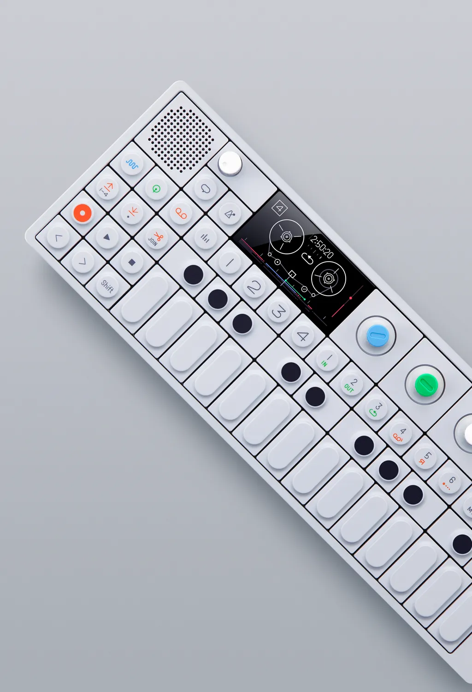

# Teenage Engineering OP-1 (original)



*Photo: Teenage Engineering official press material (angled hand-held shot,
their usual style of product photography). Used here to help you find your
way around the control surface; not affiliated with or endorsed by Teenage
Engineering. This is the **original OP-1** ("OP-1 original" in Teenage
Engineering's own naming) -- not the newer OP-1 field, which has a different
layout and is not what this driver targets.*

A synthesizer/sampler/sequencer with a tiny keybed, 4 encoders, an OLED
display, and dozens of function buttons across 4 colored modes. This driver
maps almost nothing -- deliberately, not as a research gap (see
[What's mapped](#whats-mapped) below).

## Before you start: set MIDI Mode

Put the OP-1 into MIDI Mode: **Shift+COM**, then choose **CTRL**. Consult
your unit's manual if the exact button combo has changed on your firmware
version.

## Quick start

```sh
./build/synthone-gui               # or: ./build/synthone --midi all
```

Plug it in **before** launching (no hotplug), with MIDI Mode already
selected on the device. Look for:

```
  [ctrl]    teenage-engineering-op1 <- OP-1 / MIDI 1
```

## What's mapped

| Control | Maps to |
| --- | --- |
| PLAY | Arp/Seq on-off |
| REC | Switch between Arp mode and Sequencer mode |

That's the entire mapping, and it's correct as designed, not incomplete:

- The **4 encoders** report relative turns rather than a position (the same
  limitation as the [Novation Launchkey Mini MK4 37](novation-launchkey-mini-mk4-37.md)'s
  knobs), which this driver framework can't translate into a parameter
  position safely.
- Every other button -- **HELP, METRONOME, the 4 MODE buttons, T1-T4, both
  arrow pairs, SCISSOR, all 8 SS buttons, SEQ, SHIFT, MICRO, COM** -- is a
  plain Control Change with no Synth One equivalent action worth inventing.
- There's no confirmed dedicated STOP button on this device to give a third
  transport function to.

The keys/pads play as plain notes, same as any other keybed in this port.
Bind anything else yourself with MIDI Learn.

*No annotated diagram for this device*: Teenage Engineering's own press
photography for the OP-1 is uniformly shot at dramatic angles (see the photo
above), never a plain top-down frontal shot, so there isn't a source image
this project could draw accurate, non-misleading boxes on. PLAY and REC are
small icon buttons near the top-left of the unit; consult your own OP-1 or
its manual to locate them precisely.

## Where this shows up in the app

PLAY/REC are global transport actions, not tied to a specific panel -- the
Arp/Seq toggle they drive lives on **SEQ**:


If you MIDI-Learn the 4 encoders or any other button yourself, where they
land depends on what you assign them to -- any parameter on MAIN, ENV, FX,
PAD, SEQ, or TUNE is a valid target. Because the encoders are relative,
prefer assigning them (via MIDI Learn) to a control you'd normally nudge in
small steps rather than one you want to jump to an absolute position.

## Troubleshooting

**PLAY/REC don't do anything.** Confirm the device is actually in MIDI Mode
(Shift+COM → CTRL) -- outside that mode it won't send the CCs this driver
expects at all. These report as MIDI CC presses rather than Notes and are
claimed on any channel, so channel mismatch isn't the likely cause here; see
the developer guide's "CC transport" section for the confirmed CC numbers.

**The encoders don't do anything.** Expected -- see
[What's mapped](#whats-mapped) above, they're deliberately left unbound
because their relative-turn output can't be mapped safely by this driver's
automatic defaults. MIDI-Learn works fine for relative controls in Synth
One's own MIDI Learn system; only this driver's *automatic* CC-to-parameter
defaults require an absolute position.

## See also

- [MIDI controller drivers -- user guide](../midi-controller-user-guide.md)
- [Developer guide](../midi-controller-developer-guide.md)
