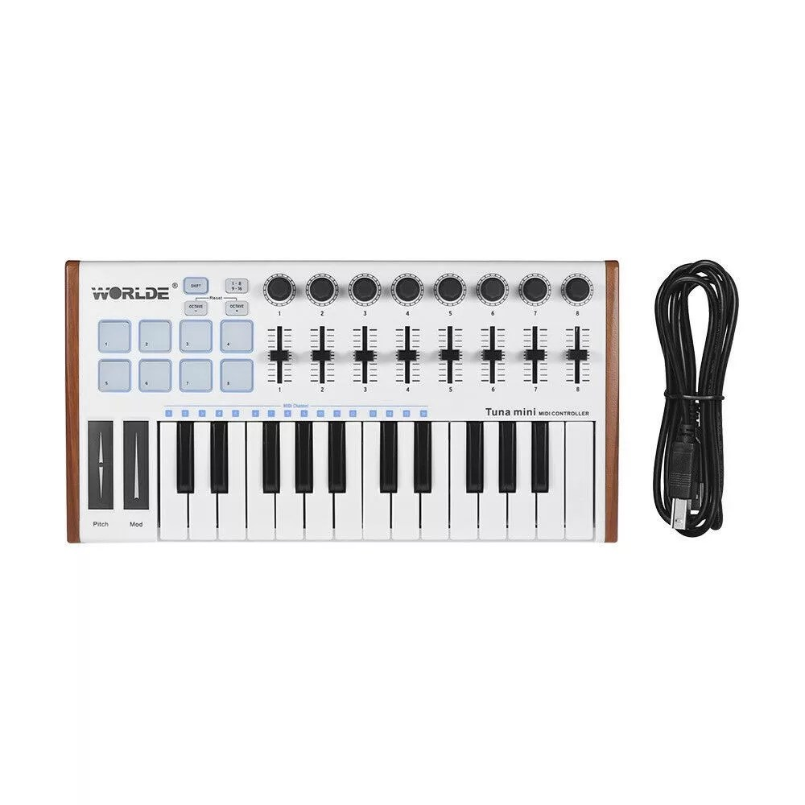

# WORLDE MINI



*Photo: a retailer listing for the WORLDE "Tuna Mini" 25-key controller.
**This is a visual approximation, not a confirmed match** -- WORLDE sells a
whole family of near-identical budget 25-key controllers under names like
Tuna Mini, Panda Mini, and Easykey.25, and this project doesn't have the
exact unit this driver targets (ALSA client name `WORLDE MINI IN 1`, per
Zynthian's own reference driver) in hand to photograph or confirm against.
The layout shown -- 25 mini-keys, 8 pads, 8 knobs, 8 faders, pitch/mod
strips -- matches the *class* of device this driver supports; treat the
photo as illustrative of "this style of budget controller," not a
guaranteed match for your specific unit's silkscreen. Not affiliated with
or endorsed by WORLDE.*

A budget clone of the Akai MPK Mini's layout: 25 keys, 8 note-based pads
(4 claimed, 4 free) on MIDI channel 10, a second CC-based pad bank, and
knobs/faders this driver doesn't map.

## Quick start

```sh
./build/synthone-gui               # or: ./build/synthone --midi all
```

Plug it in **before** launching (no hotplug). Look for:

```
  [ctrl]    worlde-mini <- WORLDE MINI / MIDI 1
```

If your unit reports a different name (e.g. it's silkscreened "Tuna Mini,"
"Panda Mini," or similar), see [Troubleshooting](#troubleshooting) below.

## What's mapped

4 of the 8 note-based pads (channel 10, notes 36-43) are claimed as
transport buttons:

| Pad | Function |
| --- | --- |
| 1st | Panic |
| 2nd | All notes off |
| 3rd | Arp/Seq on-off |
| 4th | Switch between Arp mode and Sequencer mode |

The other 4 pads, the keybed, and the second CC-based pad bank play/pass
through normally. No knobs or faders are mapped -- none are documented for
this device, so bind them yourself with MIDI Learn if you want to use them.

*No annotated diagram for this device*: as the photo caption above explains,
this project doesn't have a confirmed-correct photo of the exact unit this
driver targets, so drawing boxes around specific pads on a *possibly*
different sibling device's silkscreen would manufacture a false sense of
precision. The pad numbering in the table above (1st-4th, left to right) is
the reliable reference.

## Where this shows up in the app

The 4 claimed transport pads act globally, not tied to a specific panel --
Panic and All notes off mirror the PANIC button visible in the lower-left of
every panel screenshot; the Arp/Seq toggle lives on **SEQ**:


If you MIDI-Learn the knobs/faders yourself, where they land depends on what
you assign them to -- any parameter on MAIN, ENV, FX, PAD, SEQ, or TUNE is a
valid target.

## Troubleshooting

**The device isn't recognised at all.** This driver matches on the ALSA
client-name substrings `WORLDE MINI`, `WORLDE Mini`, and `Worlde Mini`. If
your unit is one of WORLDE's many similarly-specced siblings (Tuna Mini,
Panda Mini, Easykey.25, etc.) and reports a different name, it won't match
automatically -- check with `--list-midi`, then either rename/alias your
device at the ALSA level, or force the driver explicitly:

```sh
./build/synthone --controller-driver worlde-mini
```

If your unit's 4 transport pads and channel-10 note numbers don't line up
with the mapping above once forced, that's a real hardware difference
between your specific WORLDE model and the unit this driver's protocol facts
were transcribed from -- worth reporting, but expected given the "closest
match, not confirmed" caveat on the photo above.

**The claimed pads play a note instead of doing their function.** Check
they're arriving on MIDI channel 10 -- this driver's pad claim is
channel-gated, per the confirmed protocol reference. A unit sending on a
different channel would show this symptom.

**Knobs/faders don't do anything.** Expected -- see
[What's mapped](#whats-mapped) above, none are mapped by this driver. Use
MIDI Learn.

## See also

- [MIDI controller drivers -- user guide](../midi-controller-user-guide.md)
- [Developer guide](../midi-controller-developer-guide.md)
