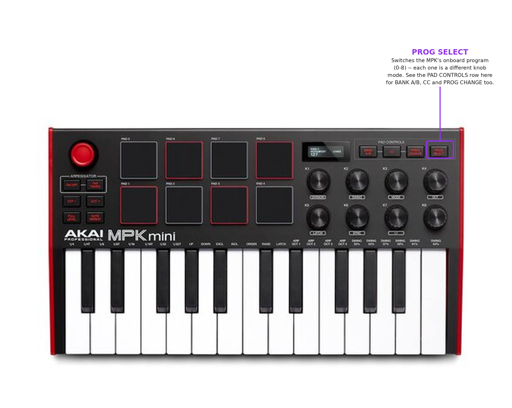

# MIDI controller drivers -- developer guide

This covers the architecture behind `--controller-driver` and MIDI SysEx
support: how bytes get from the wire to a driver, how a driver is matched
and loaded, how it can seed default parameter mappings without stepping on
the user's own MIDI Learn, and what it takes to add a driver for a new
controller. If you just want to *use* a supported controller, see the
[user guide](midi-controller-user-guide.md) instead.

Read this alongside [linux/README.md](../README.md) -- in particular the
render-thread discipline described there ("no allocation, no blocking, no
locks" on the audio render thread) applies here too, and is called out
again below at the one place it actually matters for this subsystem.

## Why this exists, and what it deliberately doesn't do

Zynthian's [`zyngine/ctrldev`](https://github.com/zynthian/zynthian-ui/tree/vangelis/zyngine/ctrldev)
drivers are the model, but Zynthian is a multi-chain rack with a mixer,
a pad-grid launcher, and a pattern sequencer -- most of what a Zynthian
driver's knobs and pads *do* has no equivalent in Synth One, which is a
single preset-based synth. So this port's driver framework is narrower on
purpose:

- A driver identifies a device by name and, optionally, talks SysEx to it.
- A driver can seed default CC-to-parameter mappings for its knobs.
- **Most pads and keys need no driver code at all.** They flow through as
  ordinary MIDI notes; a driver never intercepts them by default. A driver
  *can* opt a specific (channel, note) into a separate function-pad path
  (see "Pad-button transport" below) when the device's own layout calls for
  dedicated buttons rather than playable pads -- the Akai MPK Mini mk3
  driver does this for 8 of its 16 pads.
- There is no mixer/chain/launcher concept to control, so there's nothing
  resembling Zynthian's `zynthian_ctrldev_zynpad`/`zynmixer` base classes
  here -- one flat `ControllerDriver` interface covers everything this port
  needs.

## Data flow, end to end

```
ALSA seq / WinMM  --(raw bytes)-->  MidiInput reader thread
                                         |
              +---------------------+---+---+--------------------+
              |                     |       |                    |
       note-on/off,          note-on/off  SysEx (0xF0..0xF7) Program Change
       PadFilter says NOT     claimed by  -> SysExAssembler  -> ProgramChangeQueue
       a function pad ->      PadFilter      -> SysExQueue          |
       MidiQueue               (is a         |                    |
              |                function     |                    |
              |                pad) ->      |                    |
              |                PadButtonQueue                    |
              |                     |       |                    |
       audio render          control-thread poll loop (all three queues)
       callback              (`while (gRunning)` /
       (host/main.cpp         `while (!glfwWindowShouldClose)`)
       `render` lambda;                |
       JACK/PortAudio    ControllerDriverManager::dispatchSysEx /
       callback thread)  dispatchProgramChange / dispatchPadButton
              |                     |       |                    |
       Engine::handleMidi    driver->onPadButton(...)   driver->onSysEx(...) /
       (mCcToParameter,       -> Engine::panic() /       driver->onProgramChange(...)
        then                     allNotesOff() /                   |
        mDeviceDefaultCc          setParameter() (top row) /  Engine::setDeviceDefaultCc(...) /
        fallback)                 PadReport -> observer            clearDeviceDefaults()
                                   (bottom row, GUI only)
```

**The function-pad path branches *before* `MidiQueue`, inside the reader
thread itself** -- not after, and not via a second queue that tells `Engine`
to retroactively ignore a note. See "Pad-button transport" below for why
that distinction matters.

Two threads matter here, and they're isolated from each other on purpose:

- **The MIDI reader thread** (ALSA: its own `std::thread`; WinMM: whatever
  thread the OS invokes the callback on) does the byte-level parsing and
  reassembly. It's *not* the audio render thread, so unlike
  `S1DSPKernel+process.mm`, it's fine for this code to allocate
  (`std::vector`, `new`) -- and `SysExAssembler`/the WinMM buffer pool do.
- **The audio render callback** only ever touches the small, fixed-size,
  lock-free `MidiQueue`/`mCcToParameter`/`mDeviceDefaultCc` structures via
  `Engine::handleMidi()`. SysEx/Program Change dispatch, driver matching, and
  everything a driver itself does (including calling
  `Engine::setDeviceDefaultCc`) all happen on the *control* thread instead --
  the same ~50 ms poll loop that already calls `engine.drainNotifications()`.
  **A driver must never be called from the render thread**, and nothing in
  this framework does that.

## SysEx transport (`host/MidiSysEx.h`)

Three pieces, all header-only and platform-independent:

- **`SysExMessage`** -- a reassembled message, `0xF0`..`0xF7` inclusive, in
  a fixed 512-byte buffer (`SysExMessage::kMaxLength`). Comfortably covers
  the MPK Mini mk3's 254-byte program dump; a longer message is dropped,
  not truncated-and-kept, since this path exists for startup handshakes,
  not general SysEx passthrough. Also carries a `sourceId` -- the ALSA
  client id or WinMM device index the message arrived on -- so
  `ControllerDriverManager` can route a reply to the driver that's waiting
  on it.
- **`SysExQueue`** -- a lock-free SPSC ring of `SysExMessage`, capacity 16.
  Deliberately a *separate* ring from `MidiQueue` (the note/CC path):
  reusing that 1024-slot ring would mean either bloating every slot to fit
  a rare, variable-length payload, or storing heap pointers in a lock-free
  structure with the lifetime hazards that brings. Two small, simple rings
  beat one complicated one.
- **`SysExAssembler`** -- accumulates raw bytes into a complete message.
  Terminates on `0xF7`; a `0xF0` always restarts accumulation (defends
  against a dropped terminator leaving stale bytes around); MIDI System
  Realtime bytes (`0xF8`-`0xFF`, except `0xF7` itself) that can legally
  appear interleaved inside a live SysEx stream are skipped rather than
  treated as payload. One instance per reader thread -- not thread-safe by
  itself, matching how `MidiInput` already owns one queue per platform.
  Exercised directly (no hardware needed) by
  `tools/sysex_assembler_test.cpp` -- run it after touching this file.

### ALSA (`host/AlsaMidi.cpp`, `AlsaMidiOut.cpp`)

- RX: `MidiInput::run()`'s event switch has a `case SND_SEQ_EVENT_SYSEX:`
  that feeds `event->data.ext.ptr`/`.len` through `mSysExAssembler.append()`
  *before* `snd_seq_free_event(event)` runs a few lines later -- `append()`
  copies synchronously, so the pointer's validity window is respected.
  ALSA sequencer events can in principle split one logical SysEx message
  across several `SND_SEQ_EVENT_SYSEX` events; the assembler handles that
  the same way it handles any other fragmentation.
- TX: `MidiOutput::sendSysEx()` builds an `snd_seq_event_t`, calls
  `snd_seq_ev_set_sysex(&ev, length, data)`, and sends it with
  `snd_seq_event_output_direct()` -- the same `_direct`, unscheduled send
  path `noteOn`/`noteOff` already use.
- `MidiInput::connectedSources()` is new: it returns whatever
  `connect()` actually subscribed to (the `all` branch could subscribe to
  several sources), which is what `ControllerDriverManager::load()` matches
  driver name-hints against.

### WinMM (`host/WinMidi.cpp`, `WinMidiOut.cpp`)

This side is **implemented from documented WinMM behaviour and has not been
run against a real Windows install** -- this port cross-compiles from Linux
and this codebase's dev environment has no Windows runtime. Treat it as
higher-risk than the ALSA side until someone validates it on real hardware.

- RX: a small pool of `MIDIHDR` buffers (`kSysExBufferCount = 4`,
  `kSysExBufferSize = 1024`) is prepared and posted per opened `HMIDIIN` via
  `midiInPrepareHeader`/`midiInAddBuffer`, before `midiInStart`. The
  callback (`midiCallback`) now handles `MIM_LONGDATA` in addition to the
  pre-existing `MIM_DATA` -- previously SysEx was structurally impossible
  to receive at all (no buffers were ever posted for it, and the callback
  explicitly rejected anything but `MIM_DATA`). `MidiInput::enqueueSysExFragment()`
  feeds the buffer through the same `SysExAssembler` and re-posts it via
  `midiInAddBuffer` for the next chunk -- documented as the one call that's
  safe to make from inside the `MIM_LONGDATA` callback itself. Teardown
  (`~MidiInput()`) calls `midiInReset` (which returns every outstanding
  buffer through the callback, seen as `mRunning == false` there so nothing
  gets re-posted) then `midiInUnprepareHeader` on each one before freeing
  it -- skipping the unprepare step would be undefined behaviour.
- TX: `MidiOutput::sendSysEx()` uses `midiOutPrepareHeader`/`midiOutLongMsg`,
  then polls `midiOutUnprepareHeader` until it stops returning
  `MIDIERR_STILLPLAYING` (bounded to 2 seconds). This output is opened with
  `CALLBACK_NULL`, so there's no `MOM_DONE` notification to wait on instead
  -- the poll is the standard callback-free idiom for a synchronous SysEx
  send on WinMM.

## Program Change transport (`host/MidiSysEx.h`)

A driver's other input: `ProgramChangeMessage`/`ProgramChangeQueue`, added for
mode switching (see below) and structurally identical to
`SysExMessage`/`SysExQueue` -- a small SPSC ring (capacity 8) carrying
`{channel, program, sourceId}` from the reader thread to the control thread.
Kept separate from `MidiQueue` for the same reason SysEx is: driver dispatch
happens on the control thread, not the render thread, so this message kind
needs its own path off the hot note/CC ring regardless of how simple (2
bytes) it is.

Program Change was already reaching the existing `MidiQueue` on Windows (it's
just another packed short message `enqueuePacked()` forwards, with
`length == 2`) but was silently dropped on Linux (no `SND_SEQ_EVENT_PGMCHANGE`
case existed in `AlsaMidi.cpp`'s `run()`). Both platforms now *additionally*
push a copy onto `ProgramChangeQueue` when a controller driver wants it --
the existing `MidiQueue` path (Windows-only, and `Engine::handleMidi()`
falling through to `mKernel->handleMIDIEvent()` for it) is unchanged.

- ALSA: `run()`'s switch gained `case SND_SEQ_EVENT_PGMCHANGE:`, reading
  `event->data.control.channel`/`.value`.
- WinMM: `enqueuePacked()` additionally checks `kind == 0xC0` and, if so,
  resolves `sourceId` by scanning `mHandles` for the `HMIDIIN` the callback
  fired on (same lookup pattern `enqueueSysExFragment()` already uses for the
  SysEx path) before pushing.

## Pad-button transport (`host/PadFilter.h`)

Some devices dedicate part of their pad grid to functions rather than notes
(see "Function pads" below for what the Akai MPK Mini mk3 driver does with
this). Turning a note *off* is a suppression problem, not a routing one --
and that constraint shapes this whole piece differently from SysEx/Program
Change above.

**Why this can't be "duplicate into a side queue, tell `Engine` to ignore it
later," the way SysEx and Program Change work:** `MidiQueue` (the note/CC
path) is drained inside the *audio render callback* -- every audio buffer,
millisecond-scale. `SysExQueue`/`ProgramChangeQueue` are drained by the
*control thread*'s ~50 ms poll loop, which is what calls into driver code.
If a claimed pad's note-on were pushed to `MidiQueue` as usual and a driver
only found out about it later via a side queue, the render thread would
already have turned the note into sound several buffers before the control
thread could ever tell it not to -- the suppression would always lose that
race. The only point where a note can be stopped before it's too late is
**inside the MIDI reader thread itself, at the moment of reception, before
it's ever pushed to `MidiQueue`.**

Two pieces, both in `host/PadFilter.h`, header-only, platform-independent,
same publish/consult shape as `Engine::mDeviceDefaultCc`:

- **`PadFilter`** -- a 128-bit claimed-note table (`std::atomic<uint32_t>
  mNoteBits[4]`) plus an optional claimed channel. A driver (control thread)
  calls `claimNote()`/`unclaimNote()`/`claimChannel()`/`clear()` -- release
  stores. The MIDI reader thread calls `isPadNote(channel, note)` -- acquire
  loads, wait-free, no locks, no allocation on either side. `claimChannel()`
  is optional: if a driver never calls it, `isPadNote()` matches a claimed
  note on *any* channel, which is the safer default when a device's pad
  channel isn't confirmed (see "Function pads" below).
- **`PadButtonMessage`/`PadButtonQueue`** -- structurally identical to
  `ProgramChangeMessage`/`ProgramChangeQueue` (SPSC ring, capacity 16),
  carrying `{channel, note, isNoteOn, sourceId}` from the reader thread to
  the control thread for whatever a claimed pad should actually *do* --
  that part is fine to be control-thread-speed, since it's a driver
  reacting to a discrete button press, not audio.

Reader-thread interception, both platforms, same shape: before a note-on or
note-off would be pushed to `MidiQueue`, check `PadFilter::isPadNote()`
first. If claimed, build a `PadButtonMessage` and push it to
`PadButtonQueue` *instead* -- the note never reaches `MidiQueue`, so it
never reaches `Engine::handleMidi()`, so it can never sound. Everything else
(CONTROLLER, PITCHBEND, SYSEX, PGMCHANGE) is untouched by this check.

- ALSA: `run()`'s `SND_SEQ_EVENT_NOTEON`/`NOTEOFF` cases each check
  `mPadFilter->isPadNote(channel, note)` first; a hit builds and pushes a
  `PadButtonMessage` (`isNoteOn = velocity > 0` for NOTEON, always `false`
  for NOTEOFF) and returns without touching `m.length`, so the original
  note-building code below it never runs.
- WinMM: `enqueuePacked()` runs the same check right after decoding
  `kind`/channel/note from the packed short message and before the existing
  `mQueue->push(m)` call; a hit resolves `sourceId` the same way the
  Program Change path does (scanning `mHandles` for the callback's
  `HMIDIIN`) and returns early.

`MidiInput::start()` gained two more optional trailing parameters,
`const PadFilter *padFilter` and `PadButtonQueue *padButtonQueue`, both
defaulting to `nullptr` (no suppression, matching pre-existing behaviour)
for a driver that has no use for this path.

### The driver side: `onPadButton()` and `PadReport`

```cpp
enum class PadRow { Bottom, Top };
struct PadReport {
    bool   reported = false;
    PadRow row = PadRow::Bottom;
    int    index = 0; // 0-3
};

virtual PadReport onPadButton(int channel, int note, bool isDown) { return {}; }
```

A driver resolves the raw `note` back to a semantic (row, index) itself --
only it knows its own pad table. Two different things can happen from
there, and `AkaiMpkMiniMk3` does both:

- **Handle it directly**, using the same `Engine&` the driver already holds
  from `init()` -- `engine.panic()`, `engine.setParameter(...)`, etc. --
  and return a default-constructed `PadReport{}` (`reported == false`).
  This is the right shape for anything the driver framework already has
  full context for, with no GUI/panel concept involved.
- **Report it outward** as `PadReport{true, row, index}` for something the
  driver framework *can't* reach on its own -- `host/ctrldev/` has no
  `UiState`, no panel concept, and stays that way on purpose (see "Why this
  exists" above; the headless CLI host has no panels at all). The manager
  forwards a `reported == true` result to whatever observer the *host*
  registered, and it's the host's job to decide what a `(row, index)` means.

`ControllerDriverManager::dispatchPadButton(msg)` (mirrors `dispatchSysEx`)
routes to the loaded driver whose `inputSourceId` matches `msg.sourceId`,
falling back to offering it to every loaded driver the same way SysEx/PC
dispatch does; then, if `onPadButton()`'s result is `reported`, calls the
registered observer:

```cpp
using PadButtonObserver = std::function<void(PadRow row, int index, bool isDown)>;
void setPadButtonObserver(PadButtonObserver observer);
```

`gui/main.cpp` is the only host that registers one -- it maps a `Bottom`
report's `index` (0-3) directly onto `ui.topPanel`, the same field the
existing panel-tab click handling already mutates:

```cpp
driverManager.setPadButtonObserver([&ui](s1::ctrldev::PadRow row, int index, bool isDown) {
    if (row != s1::ctrldev::PadRow::Bottom || !isDown) return;
    static constexpr s1gui::Panel kBottomRowPanels[4] = {
        s1gui::Panel::Generators, s1gui::Panel::Envelopes,
        s1gui::Panel::Effects, s1gui::Panel::Sequencer,
    };
    ui.topPanel = kBottomRowPanels[index];
});
```

`host/main.cpp` (headless) never registers an observer -- `Top`-row
functions still work there (they're handled entirely inside the driver via
`Engine&`), but there's no panel to switch to, so `Bottom`-row reports are
simply never observed. Both hosts still drain `PadButtonQueue` into
`dispatchPadButton()` in their poll loop regardless, since `Top`-row
handling depends on that drain happening.

`ControllerDriver::init()` gained a fourth parameter, `PadFilter &padFilter`
-- a driver that wants this feature calls `padFilter.claimNote(...)` from
wherever it discovers its pad table (for `AkaiMpkMiniMk3`, that's
`parsePads()`, run from `onSysEx()`); a driver that doesn't want it simply
never touches the reference.

## The driver interface (`host/ctrldev/ControllerDriver.h`)

```cpp
class ControllerDriver {
public:
    virtual std::vector<std::string> deviceNameHints() const = 0;
    virtual const char *driverName() const = 0;
    virtual void init(Engine &engine, MidiOutput *midiOut, bool allowConfigure, PadFilter &padFilter) = 0;
    virtual void onSysEx(const uint8_t *data, size_t length) {}
    virtual void onProgramChange(int program) {}
    virtual PadReport onPadButton(int channel, int note, bool isDown) { return {}; }
};
```

- **`deviceNameHints()`** -- case-insensitive substrings matched against
  `MidiSource::name`. A device is claimed if its name contains *any* one of
  them. Keep this list generous: the same physical device can report subtly
  different names across ALSA/WinMM/firmware revisions.
- **`init(engine, midiOut, allowConfigure, padFilter)`** -- called once,
  after the manager has matched a device and tried to pair a same-device
  output. `midiOut` is `nullptr` when no output was found; `init()` must
  still work as a plain input in that case (skip anything needing SysEx
  TX). `midiOut` is a private `MidiOutput` the manager owns and connected
  itself -- independent of any `--midi-out` the user also configured, so
  the two never fight over one `MidiOutput`'s connection state.
  `allowConfigure` reflects `--controller-driver-configure` (default off):
  permission to *write* to the device, not just read from it -- gate any
  such write behind this rather than firing it unconditionally. `padFilter`
  is the driver's handle for claiming function pads -- see "Pad-button
  transport" above; a driver with no function pads never touches it.
- **`onSysEx(data, length)`** -- a complete, reassembled message addressed
  to this driver's device. Default implementation ignores it.
- **`onProgramChange(program)`** -- a Program Change addressed to this
  driver's device arrived, `program` in `[0,127]`. Default implementation
  ignores it. The hook for mode/bank switching -- see below.
- **`onPadButton(channel, note, isDown)`** -- a note claimed via
  `padFilter.claimNote()` fired, diverted before it could reach `MidiQueue`.
  Default implementation reports nothing. See "Pad-button transport" above.

## The manager (`host/ctrldev/ControllerDriverManager`)

A small static registration table, deliberately not a plugin system:

```cpp
// ControllerDriverManager.cpp
const Entry kDrivers[] = {
    {"akai-mpk-mini-mk3", makeAkaiMpkMiniMk3},
};
```

`load(wantedName, engine, connectedInputs, allowConfigure, padFilter, status)`:

1. `wantedName == "off"` -> does nothing, returns `false`.
2. For each registered driver where `wantedName == "auto"` or matches its
   name exactly: instantiate it, lower-case its `deviceNameHints()`, and
   check them (substring match) against every connected input's
   lower-cased name.
3. On a match, find a same-device *output* port:
   - Prefer the same ALSA client id as the matched input (a USB MIDI
     interface's in/out ports typically share one client).
   - Fall back to an identical port *name* (the only signal on WinMM, where
     input and output devices are independently numbered).
4. Open a private `MidiOutput` for TX if an output was found; call
   `driver->init(engine, outPtrOrNull, allowConfigure, padFilter)`.
5. Fill `status` with something printable either way (what loaded and from
   where, or why nothing did) -- `host/main.cpp` prints this on a `[ctrl]`
   status line; `gui/main.cpp` prints it once at startup if something
   loaded.

`dispatchSysEx(msg)`/`dispatchProgramChange(msg)`/`dispatchPadButton(msg)`
route a message to the loaded driver whose `inputSourceId` matches
`msg.sourceId`; if nothing matches (unset source id, or a startup race),
it's offered to every loaded driver rather than dropped.
`dispatchPadButton()` additionally forwards a `reported` result to the
observer registered via `setPadButtonObserver()` -- see "Pad-button
transport" above.

`Loaded` (the manager's internal per-driver record) stores its `MidiOutput`
by value inside a `std::vector<std::unique_ptr<Loaded>>`, not
`std::vector<Loaded>` -- `MidiOutput` owns a raw ALSA seq handle or WinMM
handles with no defined copy/move semantics, so a plain vector reallocating
as more drivers load would silently double-close a handle. The indirection
sidesteps that regardless of how many drivers end up registered.

**No hotplug.** Matching happens once, against whatever `MidiInput` already
connected at startup. This mirrors an existing limitation of MIDI port
handling generally in this port (see `linux/README.md`) -- not something
new introduced here, and not addressed by this framework either.

## `Engine`'s device-scoped CC fallback

A driver's knob defaults live in a table that's deliberately *separate*
from the existing MIDI-Learn table (`Engine::mCcToParameter`), so a
driver's default is never indistinguishable from something the user
actually bound, and never gets wiped by "Clear All MIDI Learn":

```cpp
// Engine.h
S1Parameter deviceDefaultForCc(int cc) const;
void setDeviceDefaultCc(int cc, S1Parameter parameter);
void clearDeviceDefaults();
```

Backed by `std::atomic<int> mDeviceDefaultCc[128]` (same shape as
`mCcToParameter`, initialised to `-1`). `Engine::handleMidi()`
(`Engine.cpp`, the CC branch under `status == 0xB0`) checks this table
*after* the user's own `mCcToParameter`, and only if that CC has nothing
bound:

```cpp
const int mapped = mCcToParameter[cc].load(std::memory_order_acquire);
if (mapped >= 0 && mapped < S1Parameter::S1ParameterCount) {
    /* ... existing user-learned-CC handling, unchanged ... */
    return;
}
const int deviceDefault = mDeviceDefaultCc[cc].load(std::memory_order_acquire);
if (deviceDefault >= 0 && deviceDefault < S1Parameter::S1ParameterCount) {
    /* ... same shape as above, using mDeviceDefaultCc instead ... */
    return;
}
```

This is the one place in the whole feature that runs on the **audio render
thread** (`Engine::handleMidi()` is called from the `render` lambda in
`host/main.cpp`/`gui/main.cpp`, which runs on the JACK/PortAudio callback
thread). That's why it's one more atomic load and branch, not a
`std::function` hook or anything that could allocate or block --
`setDeviceDefaultCc()`/`clearDeviceDefaults()` themselves are only ever
called from driver code on the control thread, but the *read* side has to
satisfy the same "no allocation, no blocking, no locks" discipline as
`S1DSPKernel+process.mm` does, because it's reached from the same callback.

## Modes: reaching more than 8 knobs' worth of parameters

A physical controller has a fixed number of knobs; Synth One has far more
parameters than that. `ControllerDriver::onProgramChange()` is the general,
framework-level answer: a driver that wants "modes" or "banks" reacts to an
incoming Program Change by clearing and re-seeding
`Engine`'s existing device-default CC table for a *different* set of target
parameters. No new Engine state is needed for this -- `mDeviceDefaultCc` is
already just a flat 128-entry table with no concept of "mode" baked in; a
driver own the concept entirely by re-populating that same table each time
the mode changes:

```cpp
void YourDriver::onProgramChange(int program) {
    engine.clearDeviceDefaults();      // old mode's mapping no longer applies
    if (program not in a mode you've designed) return;  // leave unbound, don't guess
    // ... determine the new mode's 8 target parameters and seed them,
    // synchronously if you already know the CCs, or after a fresh SysEx
    // query if (like the MPK driver) you need to discover them per-mode.
}
```

This works for *any* trigger a driver can turn into a Program Change --
what actually produces the PC message is entirely device-specific and none
of the framework's concern. The Akai MPK Mini mk3 happens to have a
hardware-native one: its PAD CONTROLS row includes a **PROG SELECT** button
that switches between the device's onboard program slots (0 = RAM/current,
1-8 = stored) with no reprogramming required, and Zynthian's own driver
already relies on this producing a Program Change -- see
`AkaiMpkMiniMk3.cpp`'s file-header comment for the caveat that this specific
assumption (PROG SELECT reliably sends PC) is unverified against real
hardware here, same status as the rest of the protocol detail below.



The MPK driver's mode table (`kModeTargets[kModeCount][8]`) treats the
program number directly as the mode index, with 4 designed modes:

| Mode (program) | Focus | Targets |
| --- | --- | --- |
| 0 | Sound (default) | cutoff, resonance, attackDuration, releaseDuration, lfo1Rate, reverbMix, delayMix, masterVolume |
| 1 | Oscillators/voice | morph1Volume, morph2Volume, morph2Detuning, subVolume, fmAmount, noiseVolume, glide, morphBalance |
| 2 | Envelope depth | filterAttackDuration, filterDecayDuration, filterSustainLevel, filterReleaseDuration, filterADSRMix, adsrPitchTracking, decayDuration, sustainLevel |
| 3 | Modulation/FX depth | lfo1Amplitude, lfo2Rate, lfo2Amplitude, phaserMix, phaserRate, autoPanAmount, autoPanFrequency, bitCrushSampleRate |

`onProgramChange(program)`:
1. Always `engine.clearDeviceDefaults()` first -- the previous mode's
   mapping must not silently persist into the new one if the following
   query fails or the slot is undesigned.
2. If `program` is outside `[0, kModeCount)`, stop there -- no target set
   exists for it, so the knobs stay unbound rather than reusing an
   unrelated mode's mapping or guessing at one.
3. Otherwise record `mCurrentMode = program` and re-run the same
   `sendQuery(program)` used at startup, for that specific slot -- the
   query command already takes an arbitrary program number (0-8), so this
   is a direct reuse of the already-confirmed protocol, not new surface
   area. The reply arrives later via `onSysEx()`/`parseKnobs()`, which reads
   `kModeTargets[mCurrentMode]` to know what to seed.

Only 4 of the device's 9 program slots have a designed mode; switching to
slot 4-8 clears the knob defaults and leaves them there, deliberately -- add
a row to `kModeTargets` (and bump `kModeCount`) to give a slot a purpose
rather than inventing a mapping speculatively.

## Function pads: top row transport, bottom row tab-switch

Built on the "Pad-button transport" mechanism above. Rather than playing
notes, 8 of the MPK Mini mk3's 16 pads are claimed as dedicated buttons:

| Table index | Silkscreen (assumed) | Row | Behavior |
| --- | --- | --- | --- |
| 0-3 | PAD1-4 | Bottom | Reported outward as `PadReport{true, Bottom, 0..3}` |
| 4-7 | PAD5-8 | Top | Handled internally, never reported |

**Bottom row** -- `gui/main.cpp`'s observer maps index 0-3 directly onto
`ui.topPanel`: MAIN (Generators), ENV (Envelopes), FX (Effects), SEQ
(Sequencer) -- a direct-select shortcut for 4 of the app's 6 panels. This is
GUI-only; the headless `synthone` host has no panel concept, so a bottom-row
press there is simply never observed (the note is still suppressed --
`PadFilter` operates below the GUI/headless split -- it just doesn't do
anything else there).

**Top row** -- handled entirely inside `AkaiMpkMiniMk3::onPadButton()`,
directly against its own `Engine&`, on the down edge only (`isDown`):

| Index | Function | Implementation |
| --- | --- | --- |
| 4 | Panic | `engine.panic()` |
| 5 | All notes off | `engine.allNotesOff()` |
| 6 | Arp/Seq on-off | toggles `arpIsOn` via `setParameter`/`getParameter` |
| 7 | Arp<->Seq mode | toggles `arpIsSequencer` the same way |

These four were chosen as the closest things to "transport" Synth One
actually has -- there's no play/stop/record; the arp/sequencer just runs
once armed, so on/off and arp-vs-sequencer-mode are the two switches that
matter live.

**Discovery**: `parsePads()` runs from `onSysEx()`, right before
`parseKnobs()`, reading the pad table's first 8 notes (table offset 43,
3 bytes per pad -- see the protocol reference below) and claiming each one
in `PadFilter`. It also keeps a local `mPadNote[8]` so `onPadButton()` can
resolve a raw note back to a table index. Same defensive style as
`parseKnobs()`: an implausible note (`> 127`) or a body too short to
contain the whole table aborts the claim entirely rather than claiming a
partial or wrong set.

**Pads are re-discovered on *every* `onProgramChange()`, not just the 4
designed knob modes (0-3).** `clearPadClaims()` runs unconditionally at the
top of `onProgramChange()`, and a fresh query is sent for every program
number 0-8 -- unlike the knob targets, which stay unbound outside the
designed modes, pad repurposing has to survive *any* onboard mode switch,
since there's no reason a user switching to an undesigned program slot
would expect their transport/tab-switch buttons to start playing notes
again.

**Known unverified risk**: the pad table's index-to-physical-pad mapping
(table index N == silkscreened PAD(N+1), indices 0-3 = bottom row, 4-7 =
top row) is a documented assumption, not a confirmed fact -- there is no
available source that pins table order to physical layout for this device.
If wrong, the practical effect is top and bottom row functions being
swapped, not notes leaking through or a crash; see "Known gaps" below. Also
unconfirmed: whether pads share the keybed's MIDI channel or use a distinct
one -- `parsePads()` never calls `PadFilter::claimChannel()`, so claims
default to matching on any channel, which degrades safely either way.

## Adding a driver for a new controller

1. Create `host/ctrldev/YourDevice.h`/`.cpp`, modelled on
   `AkaiMpkMiniMk3.{h,cpp}`. Implement `deviceNameHints()`, `driverName()`,
   `init()`, and `onSysEx()` if you need it.
2. Register it in `ControllerDriverManager.cpp`'s `kDrivers` table.
3. Add the new `.cpp` to `synthone_host`'s sources in `CMakeLists.txt`
   (next to the existing `host/ctrldev/*.cpp` entries).
4. If your device has no SysEx worth speaking (many controllers don't),
   `init()` can be as simple as calling `engine.setDeviceDefaultCc()` with
   fixed CCs the device is documented to send -- no need to touch
   `onSysEx()` at all in that case.
5. Pads/keys need *no* driver code by default -- they already work via the
   ordinary `MidiQueue -> Engine::handleMidi()` path regardless of which
   channel they're sent on. Only write code for what genuinely needs
   device-specific handling (SysEx identification, knob CC discovery). If
   the device has dedicated function pads that should stop playing notes
   and do something else instead, see "Pad-button transport" and "Function
   pads" above -- claim them via the `padFilter` passed into `init()` and
   implement `onPadButton()`.
6. **Don't guess at CC numbers you haven't confirmed.** CC 1 (mod wheel)
   and CC 64 (sustain) are universal MIDI conventions; seeding a device
   default onto one of those hijacks it for anyone who also uses that
   control physically. Prefer discovering real CCs via SysEx query where
   possible (see the MPK driver below), and when you can't, say so in the
   user guide rather than shipping a plausible-looking guess.
7. If the device reaches more parameters than its knobs can cover in one
   pass, implement `onProgramChange()` for mode/bank switching -- see
   "Modes" above. Optional; most controllers won't need it.

## Testing without hardware

- **`SysExAssembler`/`SysExQueue`/`ProgramChangeQueue`** are pure,
  allocation-free, and have no platform dependency -- exercised by
  `tools/sysex_assembler_test.cpp`
  (`cmake --build build --target sysex_assembler_test && ./build/sysex_assembler_test`).
  Covers whole-message delivery, byte-at-a-time fragmentation, multi-chunk
  fragmentation, a dropped terminator followed by a fresh message (resync
  on `0xF0`), interleaved Realtime bytes, overflow handling, and both
  queues' push/pop/capacity behaviour. Run this after touching
  `MidiSysEx.h` -- it's fast and needs nothing else built.
- **`PadFilter`/`PadButtonQueue`, and the MPK driver's pad-table parsing**
  are covered the same way by `tools/pad_filter_test.cpp`
  (`cmake --build build --target pad_filter_test && ./build/pad_filter_test`).
  Claim/unclaim/channel-wildcard `PadFilter` logic and `PadButtonQueue`
  push/pop/capacity are tested directly; the MPK driver section builds a
  synthetic 254-byte reply (see `buildSyntheticReply()` in that file),
  drives it through `onSysEx()` on an unstarted `s1::Engine` (safe, since
  every `Engine` method a driver reaches for -- `panic()`,
  `allNotesOff()`, `setParameter()`, `getParameter()` -- guards on
  `if (mKernel)` internally), and confirms all 8 claimed notes resolve
  correctly through `onPadButton()`, an out-of-table note degrades to
  unreported rather than crashing, and `onProgramChange()` clears prior
  claims immediately. Run this after touching `PadFilter.h`,
  `AkaiMpkMiniMk3.cpp`'s pad handling, or the `ControllerDriver`/Manager
  pad-button interface.
- **A new driver's parsing logic** (anything in `onSysEx()`) is testable
  the same way: hand-build a synthetic byte sequence matching your device's
  documented envelope and feed it through directly, no hardware needed for
  the *logic*, only for confirming the envelope itself is right.
- **A driver with no SysEx** (all five in "Other Akai drivers" below) is
  simpler to test than the MPK Mini mk3: there's no reply to synthesize,
  just `init()` followed by `Engine::deviceDefaultForCc()` checks and, for
  the three with claimed function pads, the same `onPadButton()` pattern
  `pad_filter_test.cpp` uses. See `tools/akai_midimix_test.cpp` for the
  shortest example of this shape.
- **ALSA SysEx RX/TX plumbing** is, in principle, testable end-to-end with
  `amidi`/`aconnect`/`aseqdump` against a virtual ALSA client, injecting raw
  bytes with `amidi -p <port> -S "F0 ..."` and confirming they reach
  `ControllerDriverManager::dispatchSysEx()`. This needs a working ALSA
  sequencer (`/dev/snd/seq`) -- not guaranteed to exist in every dev/CI
  environment (it doesn't in the container this feature was originally
  built in), so treat this as "do it if you have it," not an assumption.
- **Real hardware** is the only way to confirm a specific device's SysEx
  byte layout and factory defaults. Nothing above substitutes for it.

## Akai MPK Mini mk3 protocol reference

Implemented in `host/ctrldev/AkaiMpkMiniMk3.cpp`. Transcribed from
Zynthian's shipped driver
(`zyngine/ctrldev/zynthian_ctrldev_akai_mpk_mini_mk3.py` on the `vangelis`
branch of `zynthian/zynthian-ui`), itself sourced from
[tsmetana/mpk3-settings](https://github.com/tsmetana/mpk3-settings/blob/master/src/message.h)
-- a working reference implementation, not a guess, but **not independently
validated against physical hardware** in this project.

All offsets are relative to the byte *after* the leading `0xF0` (offset 0 =
manufacturer byte); the wire message is `F0 <these bytes> F7`.

Envelope (first 7 bytes, every command):

| offset | field | values |
| --- | --- | --- |
| 0 | manufacturer | `0x47` (Akai) |
| 1 | direction | `0x7F` host->device, `0x00` device->host |
| 2 | product | `0x49` (MPK Mini mk3) |
| 3 | command | `0x64` write, `0x66` query-request, `0x67` query-reply |
| 4, 5 | payload length | `(246>>7)&127, 246&127` for write/reply; unused for query-request |
| 6 | program slot | 0 (RAM/current) - 8 |

Query request is just the envelope, wrapped: `F0 47 7F 49 66 00 01 <program>
F7` (9 bytes). `AkaiMpkMiniMk3::sendQuery()` asks for slot 0 (RAM/current) at
`init()`, and whatever slot `onProgramChange()` was just told about after
that -- see "Modes" above.

Write/reply body continues for 246 more bytes (252 total; the full wire
message including `F0`/`F7` is 254 bytes -- this exact length, plus the
command byte `0x67`, is what `onSysEx()` checks before trusting a reply):

| offset | field |
| --- | --- |
| 7-22 | program name (16 chars) |
| 23-42 | pads channel, aftertouch, keybed channel, keybed octave, arp settings, tempo, joystick config |
| **43-90** | **16 pads x 3 bytes each: note, program-change, CC** -- first 8 (offsets 43-66) parsed by `parsePads()` and claimed as function pads; see "Function pads" above |
| **91-250** | **8 knobs x 20 bytes each: mode (0=absolute/1=relative), CC, min, max, name[16]** |
| 251 | transpose |

`parseKnobs()` reads the CC byte (offset `+1`) from each of the 8 knob
blocks at `91 + k*20` and calls `engine.setDeviceDefaultCc(cc, target)` for
the active mode's target row (`kModeTargets[mCurrentMode]` -- see "Modes"
above for the full table and how `mCurrentMode` gets set).

Before trusting any of it, `parseKnobs()` sanity-checks each block (`mode
<= 1`, `cc <= 127`); a single implausible value aborts parsing for *all*
eight knobs rather than seeding a partial or garbage mapping -- if the
offset assumption is wrong for a given firmware/unit, the result is "the
knobs stay unbound," never "the knobs are bound to something wrong."

`writeProgram()` (the `CMD_WRITE_DATA` path) is implemented but not called
anywhere automatically, even when `--controller-driver-configure` is
passed -- it's reserved for a future pass once the read path above has seen
real hardware. If you pick this up: the pad-table offset (43) is now read
by `parsePads()` (see "Function pads" above) but still never written by
this driver; validate against real hardware before writing to it, since a
wrong write could alter what's stored on the device itself, not just what
this driver reads.

## Other Akai drivers: protocol references

Five more Akai devices are supported, all simpler than the MPK Mini mk3
above in the same way: none needs SysEx at all (their knobs/faders/buttons
send fixed CC/note numbers in the device's default power-on state), so each
`init()` seeds `Engine`'s device-default CC map directly from a compile-time
table -- see the developer guide's "Adding a driver" step 4. Protocol facts
for all five are transcribed from Zynthian's shipped drivers
(`zyngine/ctrldev/zynthian_ctrldev_akai_*.py` on the `vangelis` branch of
`zynthian/zynthian-ui`); the APC40 mk2's are additionally cross-checked
against Akai's own published protocol document (cited in that driver's file
header) -- none are independently validated against physical hardware in
this project's development environment. Each driver's own file header has
the full citation and design rationale; this table is a quick index.

| Driver | Driver name | SysEx? | Function pads | Notable caveat |
| --- | --- | --- | --- | --- |
| `AkaiMidiMix.cpp` | `akai-midimix` | No | 3 (SOLO/BANK L/BANK R -> panic/arp on-off/arp\<->seq) | 24 per-strip MUTE/SOLO/REC buttons deliberately unclaimed -- no mixer-strip concept in Synth One |
| `AkaiApcKey25.cpp` | `akai-apc-key25` | No | 3 (STOP ALL CLIPS/PLAY/RECORD -> panic/arp on-off/arp\<->seq) | Device-name hints are exact strings, not a bare "APC Key 25" substring, to avoid claiming mk2 hardware |
| `AkaiApcKey25Mk2.cpp` | `akai-apc-key25-mk2` | No | Same 3, same notes as gen 1 | Shares gen 1's fixed knob CCs and transport notes byte-for-byte per Zynthian's own source |
| `AkaiApc40Mk2.cpp` | `akai-apc40-mk2` | No | Same 3 transport notes as APC Key 25 | TRACK FADER shares one CC across all 8 physical faders (channel distinguishes which -- `Engine::mDeviceDefaultCc` is channel-blind, so only one target is bindable, not 8); TEMPO KNOB and CUE LEVEL deliberately unbound (relative/ambiguous per Akai's own doc) |
| `AkaiMpk249.cpp` | `akai-mpk249` | No | None | **Requires the device's onboard preset #25 ("MPK Generic")** -- the CCs below only apply on that preset; 24 BANK A/B/C switch CCs and 6 TRANSPORT_\*\_CC constants are confirmed but deliberately unbound (see the file header: no per-channel-strip concept in Synth One, and no toggle-capable hook for a momentary CC) |

None of the five claims the device's clip-launch grid, keybed, or generic
pads as function pads -- only genuinely dedicated, single-purpose transport
buttons are, mirroring the MPK Mini mk3's top-row precedent. Each driver's
synthetic-data test tool (`tools/akai_midimix_test.cpp`,
`akai_apc_key25_test.cpp`, `akai_apc_key25_mk2_test.cpp`,
`akai_apc40_mk2_test.cpp`, `akai_mpk249_test.cpp`) exercises its
`init()`-seeded CC table and any claimed function pads the same way
`pad_filter_test.cpp` exercises the MPK Mini mk3 -- no hardware needed,
since none of these five call `onSysEx()` at all.

## The Arturia KeyLab mkII 61 driver

`ArturiaKeyLab61Mk2.cpp` is the one non-Akai driver in this port, and the
only one that sends SysEx unconditionally at startup for a reason other than
discovery: Arturia calls it "DAW mode," and without it the device's
transport/track/global control buttons don't behave as this driver expects
at all. `init()` sends two fixed messages (transcribed from Zynthian's
`zynthian_ctrldev_arturia_keylab_61_mk2.py`, itself citing Arturia's own
KeyLab mk2 manual and a third-party Bitwig extension's button-ID table) when
an output port is available -- unconditional, not gated behind
`--controller-driver-configure`, the same reasoning as the MPK Mini mk3's
startup query: entering a mode isn't a persistent write to the device.

Only 4 of the device's dedicated global/transport buttons are claimed as
function pads -- STOP, PLAY/PAUSE, RECORD and METRONOME, mapped to panic /
arp on-off / arp<->sequencer mode / all notes off, mirroring the MPK Mini
mk3's own 4 top-row functions. Deliberately unbound, and why, is documented
in full in the driver's file header -- in short, everything else on this
device (the 8 SELECT buttons, the 5 track SOLO/MUTE/RECORD_ARM/READ/WRITE
buttons, SAVE/PUNCH/UNDO/NEXT/PREVIOUS/BANK, the 4x4 pad grid) is either a
per-mixer-channel Zynthian concept with no Synth One equivalent, or has no
confirmed CC/note mapping in the source this driver was built from at all --
notably the device's 8-knob/8-fader/8-toggle mixing strip, which Zynthian's
own driver never assigns a mapping to either, so nothing is bound rather
than guessed. See `tools/arturia_keylab_61_mk2_test.cpp` for its test
coverage, following the same no-SysEx-reply-to-synthesize shape as the fixed-
CC Akai drivers, plus two cases confirming `init()` doesn't crash when no
MidiOutput is connected (skipping the handshake, not attempting it blindly).

## The Novation drivers

Nine Novation devices are supported: 4 in the **Launchkey** family
(`NovationLaunchkeyMiniMk3.cpp`, `NovationLaunchkeyMiniMk4.cpp`,
`NovationLaunchkeyMk3.cpp`, `NovationLaunchkeyMk4.cpp`) and 5 in the
**Launchpad** family (`NovationLaunchpadMini.cpp`, `NovationLaunchpadX.cpp`,
`NovationLaunchpadMiniMk3.cpp`, `NovationLaunchpadProMk2.cpp`,
`NovationLaunchpadProMk3.cpp`). Protocol facts for all nine are transcribed
from Zynthian's shipped drivers (`zyngine/ctrldev/zynthian_ctrldev_launchkey_*.py`
and `zynthian_ctrldev_launchpad_*.py` on the `vangelis` branch of
`zynthian/zynthian-ui`); none are independently validated against physical
hardware in this project's development environment.

**Launchkey knobs need a "session mode" handshake, and it's a Note On, not
SysEx.** Every Launchkey driver sends `midiOut->noteOn(15, 12, 127)`
unconditionally at `init()` (channel 15, note 12, velocity 127) before its
knob CCs mean anything -- confirmed from Zynthian's own driver, which sends
the identical message. This is the one case in this port's controller-driver
framework where a startup handshake is a plain channel message instead of
SysEx; `MidiOutput::noteOn()` already covers it, no new API was needed.

**Not every Launchkey's knobs are safe to bind.** The Launchkey Mini mk3, MK3
88, and MK4 37 all confirm their 8-knob row (CC 21-28) is *absolute* by how
Zynthian's own driver consumes the values (`ccval / 127.0` fed straight into
mixer-level/balance/`ZYNPOT_ABS` setters) -- these are bound via
`Engine::setDeviceDefaultCc()` like any other fixed-CC device. The Launchkey
**Mini mk4 37** is the exception: its knobs (CC 85-92) are explicitly put
into "Transport mode (relative mode)" by Zynthian's own driver, and consumed
as a signed delta (`ccval < 64` = negative, `> 64` = positive) rather than a
position. `Engine::handleMidi()`'s CC path always treats an incoming value as
an absolute 0-127 position (see `Engine.cpp`), so binding a relative CC would
make a small nudge snap the target parameter towards its minimum instead of
adjusting it smoothly -- `NovationLaunchkeyMiniMk4.cpp` deliberately binds
nothing for this reason (see its file header for the full reasoning,
including why simply *not* sending the relative-mode-select CC doesn't
establish an absolute fallback exists to use instead).

**Only two Launchkey CC ranges are richer than an 8-knob row.** The Launchkey
MK3 88 additionally has 8 sliders (CC 53-60) and a master slider (CC 61),
all confirmed absolute the same way; every other Launchkey in this port has
only the one knob row. None of the Launchkey family's transport (Play/
Record), navigation, or per-channel chain buttons are bound -- they're all
CC-based, and `ControllerDriver` has no `onCC()`/`onControlChange()` hook (see
`AkaiMpk249.cpp`'s file header for the fuller explanation of this limitation,
first documented there).

**Most Launchpads bind nothing at all, and that's the confirmed, correct
scope, not a research gap.** `NovationLaunchpadMini.cpp` (mk1) has no knobs,
no faders, and no confirmed transport-labelled button -- its 8 non-grid CC
buttons are Session/User1/User2/Mixer/arrow-key labels on real hardware,
with no honest Synth One mapping. `NovationLaunchpadX.cpp`,
`NovationLaunchpadMiniMk3.cpp`, and `NovationLaunchpadProMk3.cpp` are
structurally identical to each other: an 8x8 grid, a DAW-mode SysEx
handshake, and 4 CC-based arrow buttons with no `onCC()` hook to act on.
**These three deliberately don't send the DAW-mode handshake at all**, unlike
every other mode-entry handshake in this port -- per Zynthian's own driver,
entering that mode switches the grid away from its alternate "Keys"
(chromatic note-playing) layout, and since nothing here is bound that would
justify losing that, the tradeoff has no offsetting benefit. Compare with
`NovationLaunchpadProMk2.cpp` below, where the same handshake *is* sent,
because there's a confirmed payoff.

**Launchpad Pro mk2 is the one Launchpad driver with function pads.** Its
Zynthian source has 3 confirmed, dedicated (non-grid) note-based
Record/Stop/Play buttons (notes 65/66/67) that need the DAW-mode SysEx
handshake to route correctly -- `NovationLaunchpadProMk2.cpp` sends the
handshake (3 messages, envelope `F0 00 20 29 02 10 <data> F7`: wake, enter
Ableton/DAW mode, select session layout) and claims all 3 as function pads,
mapped to panic / arp on-off / arp<->sequencer mode, the same 3-function
transport mapping the Akai APC drivers use.

Each driver's synthetic-data test tool follows the shape that matches its
design: `tools/novation_launchkey_*_test.cpp` check `deviceDefaultForCc()`
(including, for the Mini mk4 37, that its knob range stays *unbound*);
`tools/novation_launchpad_{mini,mini_mk3,pro_mk3,x}_test.cpp` confirm
`init()` is a safe no-op that claims and binds nothing;
`tools/novation_launchpad_pro_mk2_test.cpp` follows the
handshake-plus-function-pads shape `arturia_keylab_61_mk2_test.cpp`
established.

## The Korg nanoKONTROL2 driver

`KorgNanoKontrol2.cpp` is the simplest driver in this port: no SysEx, no
mode-entry handshake of any kind (unlike every Akai/Arturia/Novation driver
above), and no function pads. It's also the only device so far whose
confirmed protocol facts required *not* binding something the developer
guide's rule would otherwise allow: fader 2 sits at CC1, which collides with
the universal MIDI mod wheel convention. This isn't a guessed CC (Zynthian's
own `faders_ccnum = [0, 1, 2, 3, 4, 5, 6, 7]` confirms it), but binding it
anyway would create exactly the hazard step 6 of "Adding a driver" above
warns about -- a user's mod wheel, on a different, simultaneously-connected
keyboard, silently driving whatever this driver bound to fader 2. Fader 2 is
skipped; the other 7 faders and all 8 knobs (CC16-23) are bound normally.
Worth remembering for any future driver: a real device can hand you this
same hazard through a confirmed fact, not just a guess -- treat both the
same way.

This device also has **no note-based controls at all** -- Zynthian's own
`midi_event()` has no note-on/off branch for it, only Control Change. Every
button (SOLO/MUTE/REC x8, transport Play/Stop/Record/Rewind/Fast-Forward/
Cycle, track/marker navigation) is therefore ineligible for the
`PadFilter`/`onPadButton()` function-pad mechanism, which only ever
intercepts Notes -- the same CC-vs-Note distinction first documented in
`AkaiMpk249.cpp`'s file header, just total here rather than partial. None of
them are bound. `tools/korg_nanokontrol2_test.cpp` follows the same
synthetic-data shape as `akai_midimix_test.cpp`.

## Known gaps / where to look before trusting this in production

- WinMM SysEx RX/TX: implemented, not run on real Windows.
- MPK Mini mk3 protocol: transcribed from a working reference, not
  independently confirmed against a physical unit.
- **Mode switching depends on PROG SELECT sending Program Change**, which is
  the documented, Zynthian-precedented mechanism but is not independently
  confirmed against real MPK Mini mk3 hardware here. If it turns out the
  device doesn't send PC on its own (or sends something else), modes 1-3
  simply never activate -- mode 0's behavior is unaffected either way, so
  this degrades safely, but it's untested.
- Only 4 of the MPK's 9 program slots (0-3) have a designed mode; 4-8
  intentionally clear the knob defaults and stop there.
- No hotplug detection (matches the rest of this port's MIDI handling).
- `writeProgram()` exists but is never invoked automatically.
- The Windows device-name hint for the MPK Mini mk3
  (`deviceNameHints()`) is unconfirmed -- check with `--list-midi` on real
  Windows hardware and extend the hint list if the reported name differs
  from the ALSA one.
- **Function pad table order vs. physical layout is unconfirmed.** The
  assumption that table index N corresponds to silkscreened PAD(N+1)
  (indices 0-3 = bottom row, 4-7 = top row) has no independently confirmed
  source; if wrong on real hardware, the practical effect is the top-row
  transport functions and bottom-row tab-switch functions being swapped,
  not notes leaking through or a crash. See "Function pads" above.
- **Whether pads share the keybed's MIDI channel is unconfirmed.**
  `parsePads()` never calls `PadFilter::claimChannel()`, so a claimed pad
  note is suppressed on *any* incoming channel -- deliberately permissive,
  to degrade safely if the pads turn out to use a different channel than
  assumed, at the cost of (in principle) also suppressing that same note
  number played on an unrelated channel from a *different* connected
  device. Not a concern with a single connected controller, which is the
  common case this framework targets.
- The pad-button interception path (`PadFilter`, reader-thread diversion in
  `AlsaMidi.cpp`/`WinMidi.cpp`) is covered by `tools/pad_filter_test.cpp`
  and by manual Linux + Windows(-cross-compiled) build verification, but --
  like the rest of the WinMM path above -- has not been run against real
  Windows MIDI hardware.
- **None of the other five Akai drivers (MIDI Mix, APC Key 25, APC Key 25
  mk2, APC40 mk2, MPK249) has been run against physical hardware either** --
  see "Other Akai drivers: protocol references" above for each one's own
  citation and caveats. All five's Windows device-name hints are unconfirmed
  the same way the MPK Mini mk3's is.
- **The MPK249 driver's entire CC table assumes the device is on its onboard
  preset #25 ("MPK Generic")** -- there is no SysEx handshake to select or
  confirm this from software, so a unit left on its factory default or any
  other preset will send different CCs than this driver expects, and the
  knobs will simply do nothing until MIDI-Learned manually. See
  `AkaiMpk249.cpp`'s file header and the user guide.
- **The APC40 mk2's TRACK FADER binds to only one target, not eight**, because
  all 8 physical faders share a single CC (channel-blind `Engine::
  mDeviceDefaultCc` can't tell them apart) -- see `AkaiApc40Mk2.cpp`'s file
  header.
- **The Arturia KeyLab mkII 61's DAW-mode-entry handshake is unverified
  against real hardware**, same status as the rest of this driver's protocol
  facts -- if the device doesn't actually enter DAW mode from these two
  messages (firmware difference, etc.), the 4 claimed buttons may not send
  the note numbers this driver expects, degrading to "does nothing" rather
  than anything unsafe.
- **The KeyLab mkII 61's 8-knob/8-fader/8-toggle mixing strip has no CC
  mapping at all** -- Zynthian's own reference driver never assigns one
  either, so there was no confirmed protocol fact to transcribe. Bind these
  with MIDI Learn.
- **None of the 9 Novation drivers has been run against physical hardware**
  -- see "The Novation drivers" above for each family's own citations and
  caveats. All nine's Windows device-name hints are unconfirmed the same way
  the MPK Mini mk3's is.
- **The Launchkey Mini mk4 37's knobs are confirmed relative-encoder output
  and are deliberately left unbound** -- there is no confirmed absolute mode
  for them in the source this driver was built from. See
  `NovationLaunchkeyMiniMk4.cpp`'s file header.
- **Three Launchpad drivers (X, Mini mk3, Pro mk3) deliberately skip the
  DAW-mode SysEx handshake** their own Zynthian reference sends, since
  nothing in this port's drivers for them is bound that would justify
  losing the grid's default chromatic note layout. If a future change binds
  something on one of these (e.g. a confirmed dedicated button discovered on
  real hardware), revisit whether the handshake becomes worth sending.
- **The Korg nanoKONTROL2 driver has not been run against physical
  hardware** -- see "The Korg nanoKONTROL2 driver" above for its own
  citation and the fader-2/mod-wheel-CC caveat. Its Windows device-name hint
  is unconfirmed the same way every other driver's is.
