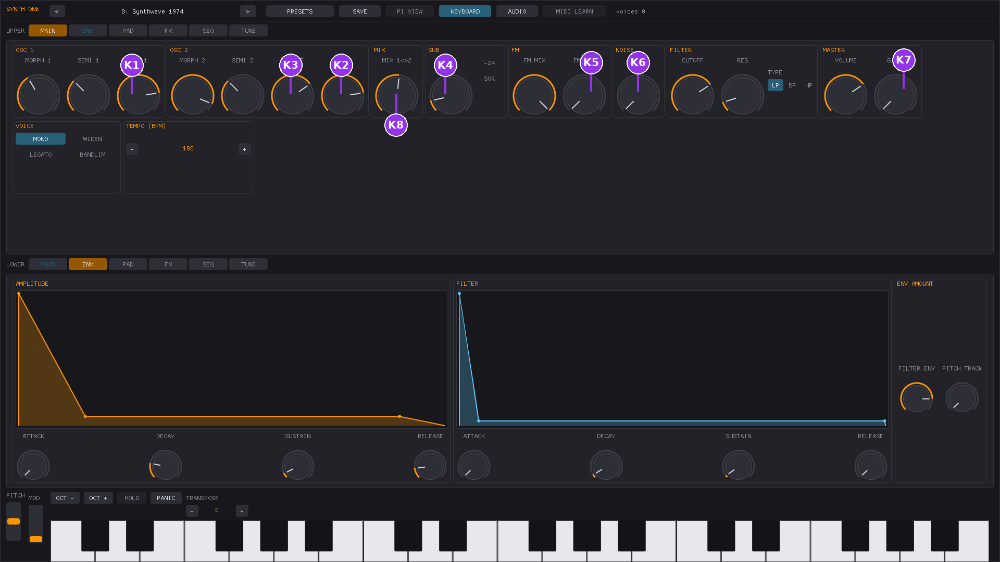
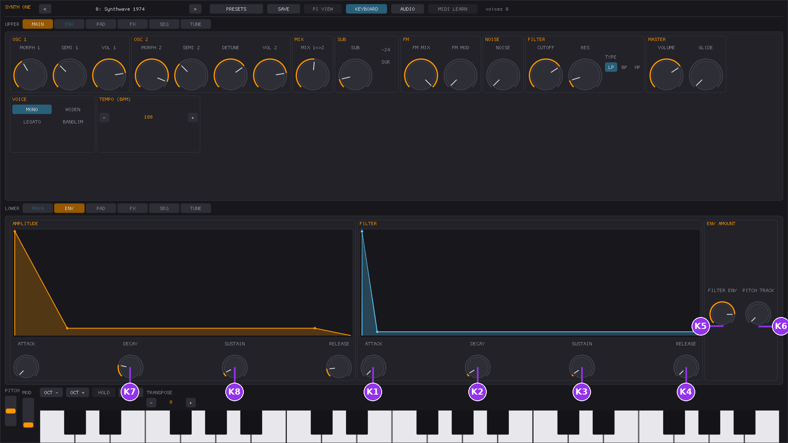
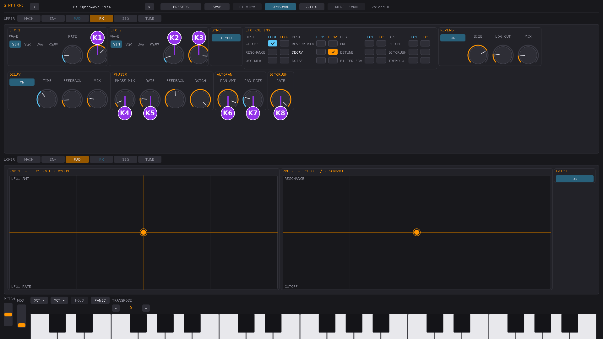

# MIDI controller drivers -- user guide

Synth One's Linux/Windows port can recognise specific MIDI controllers by
name and give them useful defaults automatically: knobs get mapped to synth
parameters, and the connection is verified over MIDI SysEx where the device
supports it. This is a smaller, synth-scoped take on the idea behind
[Zynthian's `ctrldev` drivers](https://wiki.zynthian.org/index.php/Akai_MPK_Series)
-- Synth One has no chains, mixer strips, or pad-launcher grid, so a driver
here only ever does two things: recognise your controller, and give its
knobs sensible starting points.

If you just plug in a MIDI keyboard or controller and play it, none of this
is required reading -- notes work exactly as before, with or without a
driver loaded. This document is for getting more out of a *specific*,
supported controller, and for understanding what to do if it isn't behaving
as expected.

## Supported controllers

| Controller | Driver name | What it does |
| --- | --- | --- |
| Akai MPK Mini mk3 | `akai-mpk-mini-mk3` | Maps the 8 knobs to synth parameters across 4 switchable modes (32 parameters reachable in total -- see [Switching modes](#switching-modes)). The keybed and 8 of the 16 pads play notes normally; the other 8 pads are dedicated transport/panel buttons -- see [Function pads](#function-pads). |
| Akai MIDI Mix | `akai-midimix` | Maps all 24 knobs, 8 channel faders and the master fader to synth parameters, all at once (no modes -- see [Akai MIDI Mix](#akai-midi-mix)). SOLO/BANK L/BANK R are dedicated transport buttons; the 24 per-strip MUTE/SOLO/REC buttons play as plain notes. |
| Akai APC Key 25 (original) | `akai-apc-key25` | Maps the 8 knobs to synth parameters. STOP ALL CLIPS/PLAY/RECORD are dedicated transport buttons; the keybed and the 40-pad clip-launch grid play as plain notes -- see [Akai APC Key 25 / mk2](#akai-apc-key-25--mk2). |
| Akai APC Key 25 mk2 | `akai-apc-key25-mk2` | Same mapping and transport buttons as the original APC Key 25 -- see [Akai APC Key 25 / mk2](#akai-apc-key-25--mk2). |
| Akai APC40 mk2 | `akai-apc40-mk2` | Maps 19 knobs/faders to synth parameters (see [Akai APC40 mk2](#akai-apc40-mk2)); STOP ALL CLIPS/PLAY/RECORD are dedicated transport buttons; the clip-launch grid and per-track buttons play as plain notes. |
| Akai MPK249 | `akai-mpk249` | Maps 24 knobs/faders to synth parameters and STOP/PLAY/RECORD to transport actions -- **requires the device's onboard preset 25 ("MPK Generic")**, see [Akai MPK249](#akai-mpk249). The keybed and pads play as plain notes. |
| Arturia KeyLab mkII 61 | `arturia-keylab-61-mk2` | Automatically switches the device into "DAW mode" on startup so STOP/PLAY-PAUSE/RECORD/METRONOME work as dedicated transport buttons -- see [Arturia KeyLab mkII 61](#arturia-keylab-mkii-61). No knobs/faders mapped (none are documented); the keybed and pad grid play as plain notes. |
| Novation Launchkey Mini mk3 | `novation-launchkey-mini-mk3` | Maps the 8 knobs and Play/Record to synth parameters/transport actions -- see [Novation Launchkey family](#novation-launchkey-family). The keybed and pads play as plain notes. |
| Novation Launchkey MK3 88 | `novation-launchkey-mk3-88` | Maps the 8 knobs, 8 faders, master fader and Play/Record to synth parameters/transport actions -- see [Novation Launchkey family](#novation-launchkey-family). |
| Novation Launchkey MK4 37 | `novation-launchkey-mk4-37` | Maps the 8 knobs and Play/Record to synth parameters/transport actions -- see [Novation Launchkey family](#novation-launchkey-family). |
| Novation Launchkey Mini MK4 37 | `novation-launchkey-mini-mk4-37` | No knobs mapped -- this unit's knobs are confirmed relative-encoder output, which can't be mapped safely. Play/Record ARE mapped to transport actions -- see [Novation Launchkey family](#novation-launchkey-family). |
| Novation Launchpad Mini (mk1) | `novation-launchpad-mini` | No knobs, faders, or function pads exist on this device -- see [Novation Launchpad family](#novation-launchpad-family). Device recognition only; the grid plays as plain notes. |
| Novation Launchpad X | `novation-launchpad-x` | Same as Launchpad Mini -- device recognition only, grid plays as plain notes -- see [Novation Launchpad family](#novation-launchpad-family). |
| Novation Launchpad Mini mk3 | `novation-launchpad-mini-mk3` | Same as Launchpad Mini -- see [Novation Launchpad family](#novation-launchpad-family). |
| Novation Launchpad Pro mk2 | `novation-launchpad-pro-mk2` | Switches into DAW mode on startup so STOP/PLAY/RECORD work as dedicated transport buttons -- see [Novation Launchpad family](#novation-launchpad-family). The grid plays as plain notes. |
| Novation Launchpad Pro mk3 | `novation-launchpad-pro-mk3` | Same as Launchpad Mini -- see [Novation Launchpad family](#novation-launchpad-family). |
| Korg nanoKONTROL2 | `korg-nanokontrol2` | Maps 7 of the 8 faders, all 8 knobs, and Play/Stop/Record to synth parameters/transport actions -- see [Korg nanoKONTROL2](#korg-nanokontrol2). This device has no keybed or pads. |
| Behringer MOTÖR61 / MOTÖR49 | `behringer-motor` | Maps 25 faders/encoders to synth parameters and 4 pads to transport functions -- see [Behringer MOTOR61/49](#behringer-motor61-motor49). |
| WORLDE MINI | `worlde-mini` | Maps 4 of 8 pads to transport functions -- see [WORLDE MINI](#worlde-mini). No knobs mapped (none are documented); the keybed and other pads play as plain notes. |
| Teenage Engineering OP-1 | `teenage-engineering-op1` | Maps PLAY/REC to transport actions -- see [Teenage Engineering OP-1](#teenage-engineering-op-1). Its knobs report relative turns and aren't mapped; every other button has no Synth One equivalent. |

Don't see your controller? It still works as a plain MIDI keyboard/controller
-- see [Using it with an unsupported controller](#using-it-with-an-unsupported-controller)
below, and consider asking for a driver (see the developer guide for what
that takes to add).

## Quick start

```sh
# See what's compiled into this build
./build/synthone --list-controller-drivers

# Just run normally -- a supported controller is picked up automatically
./build/synthone --midi all

# Same on the GUI
./build/synthone-gui
```

That's it for the common case: with the default `--controller-driver auto`,
if a supported controller is connected, its driver loads by itself and you
should see a status line like:

```
  [ctrl]    akai-mpk-mini-mk3 <- MPK mini 3 / MIDI 1
```

If you don't want this at all, turn it off:

```sh
./build/synthone --controller-driver off
```

Or force a specific driver to load regardless of what name-matching would
have picked (mostly useful for testing):

```sh
./build/synthone --controller-driver akai-mpk-mini-mk3
```

## What the Akai MPK Mini mk3 driver actually does


1. **On startup**, if the device is connected on both MIDI in and out, the
   driver asks it (over SysEx) what its 8 knobs are currently set to send.
2. **Once it gets an answer**, each knob is bound to a fixed synth parameter
   -- whatever CC the knob happens to be sending, mapped to cutoff,
   resonance, attack, release, LFO 1 rate, reverb mix, delay mix, or master
   volume respectively. You don't need to touch anything on the device
   itself; whatever program/CC assignment it's already using is read and
   used as-is.
3. **The keybed and 8 of the 16 pads play notes**, exactly like any other
   MIDI keyboard. The other 8 pads are claimed as dedicated buttons instead
   -- see [Function pads](#function-pads) below.
4. **If the query never completes** -- no output port could be paired with
   the input, or the device doesn't reply -- the knobs simply do nothing
   until you bind them yourself with MIDI Learn (see below). Nothing guesses
   at a mapping; a wrong guess risks reassigning a knob to something that
   collides with a universal MIDI convention (e.g. the mod wheel is always
   CC 1), so the driver would rather do nothing than do something wrong.
   (Function pads are unaffected by this -- pad discovery is a separate part
   of the same query and doesn't depend on the knobs resolving.)
5. **Switching the device's onboard program re-runs the same discovery** for
   a different set of 8 knob targets -- see [Switching modes](#switching-modes)
   -- and re-confirms the function pads too, on every program slot, not just
   the ones with a designed knob mode.

## Function pads


8 of the 16 pads stop playing notes and become dedicated buttons instead:
pressing one of these never sounds a note, on any mode or program slot.

**Top row (PAD5-8): transport.** The closest things Synth One has to
transport controls, since it has no play/stop/record:

| Pad | Function |
| --- | --- |
| PAD5 | Panic -- immediately silences every voice |
| PAD6 | All notes off |
| PAD7 | Arp/Seq on/off |
| PAD8 | Switch between Arp mode and Sequencer mode |

**Bottom row (PAD1-4): panel switching.** GUI only (`synthone-gui`) --
jumps straight to a panel instead of swiping through them:

| Pad | Panel |
| --- | --- |
| PAD1 | MAIN (Generators) |
| PAD2 | ENV (Envelopes) |
| PAD3 | FX (Effects) |
| PAD4 | SEQ (Sequencer) |

On the headless `synthone` host (no GUI, no panels), the bottom row still
stops those 4 pads from playing notes, it just has nothing to switch --
there's no panel to jump to.

These 8 pads are rediscovered every time you switch the device's onboard
program with PROG SELECT (see [Switching modes](#switching-modes)), so they
keep working the same way across every mode, including the 5 undesigned
slots (4-8) where the knobs go unbound.

The remaining 8 pads (PAD9-16, or however your unit numbers them) are
unclaimed and continue to play notes normally.

**Which physical pad is which is an assumption, not a confirmed fact** --
this project doesn't have a physical MPK Mini mk3 to test the pad table's
byte order against the silkscreen. If the two rows turn out to be swapped
on your unit, the functions above still work, just on the opposite row --
nothing will misbehave or leak a note through. If you notice this, it's
useful to report.

## Switching modes

The 8 knobs can reach more than 8 parameters: the MPK Mini mk3's **PROG
SELECT** button (in the PAD CONTROLS row, alongside BANK A/B, CC and PROG
CHANGE) switches between the device's onboard program slots without any
reprogramming, and the driver treats each slot as a different knob mapping,
re-running the same SysEx discovery for that slot's actual CC assignments.


| Program slot | Mode | Knobs 1-8 |
| --- | --- | --- |
| 0 (RAM/default) | Sound | Cutoff, Resonance, Attack, Release, LFO 1 rate, Reverb mix, Delay mix, Master volume |
| 1 | Oscillators/voice | OSC1 volume, OSC2 volume, OSC2 detune, Sub volume, FM amount, Noise volume, Glide, OSC1/2 balance |
| 2 | Envelope depth | Filter attack, Filter decay, Filter sustain, Filter release, Filter/amp env mix, Envelope pitch tracking, Amp decay, Amp sustain |
| 3 | Modulation/FX | LFO 1 amount, LFO 2 rate, LFO 2 amount, Phaser mix, Phaser rate, Autopan amount, Autopan rate, Bitcrush rate |

Consult your MPK Mini mk3's manual for exactly how to reach PROG SELECT +
a program number on your unit (this varies slightly by firmware). Slots 4-8
have no assigned mode -- switching to one just leaves the knobs unbound
until you switch back or MIDI-Learn them yourself.

**Two ways to see which mode you're in.** Every time you switch programs,
`synthone-gui` shows a brief status message ("Mode 0: Sound", etc., or
"Program 5: knobs unbound (no designed mode)" for an undesigned slot) in the
same place "loaded \<preset\>" and "all notes off" already appear; the
headless `synthone` host prints an equivalent `[ctrl]` line to the console.
Separately, if you run `synthone`/`synthone-gui` **once** with
`--controller-driver-configure`, this driver renames each of the 8 knobs on
program slots 0-3 to match what Synth One actually binds them to in that
mode ("Cutoff", "Filt Attack", etc.) -- the device's own screen shows a
knob's name while you're turning it, so this gives you a second, on-device
way to see what a knob does without needing Synth One's own status message.
This does rewrite your unit's stored programs 0-3 (only the knob mode/CC/name
fields -- pads, MIDI channel, arp settings and the program's own name are
left exactly as they were), so it's opt-in and only happens when you pass
the flag, never automatically.

Mode switching depends on the device actually sending a MIDI Program Change
when you use PROG SELECT -- this is the standard, documented mechanism (the
same one Zynthian's own MPK driver relies on). Everything downstream of a
Program Change arriving (re-binding the knobs, the status message above) is
confirmed working against real hardware; whether PROG SELECT itself reliably
sends one is the one link in this chain that's still unconfirmed, since
that specifically requires pressing the physical button by hand. If
switching modes doesn't do anything -- including no status message --
see [Troubleshooting](#troubleshooting).

### Where each knob shows up in the app (Mode 0)

K1/K2/K8 land on the **MAIN** panel (cutoff, resonance, master volume), K3/K4
on the **ENV** panel (amplitude attack/release):


K5/K6/K7 land on the **FX** panel (LFO 1 rate, reverb mix, delay mix):


If you ever forget which physical knob drives which on-screen control in
Mode 0, this is the reference to come back to.

### Where each knob shows up in the app (Mode 1: oscillators/voice)

All 8 land on the **MAIN** panel -- OSC1/OSC2 volume and detune, sub/FM/noise
levels, glide, and the OSC1/OSC2 balance:



### Where each knob shows up in the app (Mode 2: envelope depth)

All 8 land on the **ENV** panel -- the filter envelope's full ADSR, how much
it affects cutoff, how much the envelope tracks pitch, and the amplitude
envelope's decay/sustain (the two stages Mode 0 doesn't reach):



### Where each knob shows up in the app (Mode 3: modulation/FX)

All 8 land on the **FX** panel -- LFO 1/LFO 2 depth and LFO 2 rate, phaser
mix/rate, autopan amount/rate, and bitcrush rate:



## Akai MIDI Mix

This one has no SysEx and no modes -- all of it is mapped at once, the
moment the driver loads:

| Control | Maps to |
| --- | --- |
| Knob row 1 (top knob, all 8 strips) | OSC1/OSC2 volume, OSC2 detune, sub volume, FM amount, noise volume, glide, OSC1/2 balance |
| Knob row 2 (middle knob, all 8 strips) | Filter attack/decay/sustain/release, filter/amp env mix, envelope pitch tracking, amp decay, amp sustain |
| Knob row 3 (bottom knob, all 8 strips) | LFO 1 amount, LFO 2 rate/amount, phaser mix/rate, autopan amount/rate, bitcrush rate |
| The 8 channel faders | Cutoff, resonance, attack, release, LFO 1 rate, reverb mix, delay mix, arp rate |
| Master fader | Master volume |
| SOLO button | Panic |
| BANK LEFT button | Arp/Seq on-off |
| BANK RIGHT button | Switch between Arp mode and Sequencer mode |

The 24 per-strip MUTE/SOLO/REC buttons play as plain (very low) notes --
this device has no keybed, and Synth One has no per-channel mixer concept
for those buttons to control, so they're left alone rather than repurposed.

## Akai APC Key 25 / mk2

Both the original APC Key 25 and the mk2 use the same driver design (and, per
Akai/Zynthian's own protocol reference, the identical fixed knob CCs and
transport button notes) -- everything below applies to both.

| Control | Maps to |
| --- | --- |
| The 8 knobs above the keybed | Cutoff, resonance, attack, release, LFO 1 rate, reverb mix, delay mix, master volume |
| STOP ALL CLIPS | Panic |
| PLAY | Arp/Seq on-off |
| RECORD | Switch between Arp mode and Sequencer mode |

The keybed and the 40-pad clip-launch grid below it play as plain notes --
Synth One has no clip-launch concept for those pads to control. The 5 soft
keys under the grid, the 8 track-select buttons above the knobs, and SHIFT
are likewise left alone.

## Akai APC40 mk2

| Control | Maps to |
| --- | --- |
| The 8 "Device Control" knobs | Filter attack/decay/sustain/release, filter/amp env mix, envelope pitch tracking, amp decay, amp sustain |
| The 8 "Track Control" knobs | OSC1/OSC2 volume, OSC2 detune, sub volume, FM amount, noise volume, glide, OSC1/2 balance |
| Master fader | Master volume |
| Crossfader | Stereo widen |
| The 8 channel faders | Reverb mix -- **all 8 faders drive the same parameter.** This device sends the same CC number for every channel fader (only the MIDI channel says which one moved), and Synth One's controller-driver framework doesn't distinguish MIDI channel for this purpose, so it can only bind one target, not 8. |
| STOP ALL CLIPS | Panic |
| PLAY | Arp/Seq on-off |
| RECORD | Switch between Arp mode and Sequencer mode |

The Tempo knob and Cue Level knob are **not** mapped -- both report relative
turns (or, for Cue Level, an ambiguous mix of relative and absolute
depending on the source), which this driver framework can't translate into a
parameter position safely, so they're left for MIDI Learn if you want them
bound to something. The 40-pad clip-launch grid, the 5 per-track buttons
(Record Arm/Solo/Activator/Track Selection/Track Stop), and everything else
not listed above play as plain notes.

## Akai MPK249

**This driver requires your MPK249 to be set to its onboard preset 25
("MPK Generic")** -- consult your unit's manual for how to select a program
slot. There's no way for this driver to select or confirm that preset for
you over MIDI, so if you're on a different preset (including the factory
default), the knobs below will simply do nothing until you switch, or until
you bind them yourself with MIDI Learn.

The device's front-panel BANK A/B/C switch changes which CC numbers the same
physical knobs send. Bank A and Bank B are both mapped (whichever bank is
selected on the device is the only one that's actually sending anything, so
having both mapped ahead of time is harmless); Bank C has no separate knob
mapping in this driver.

| Control | Maps to |
| --- | --- |
| The 8 knobs, Bank A | Cutoff, resonance, attack, release, LFO 1 rate, reverb mix, delay mix, master volume |
| The 8 knobs, Bank B | Filter attack/decay/sustain/release, filter/amp env mix, envelope pitch tracking, amp decay, amp sustain |
| The 8 faders | OSC1/OSC2 volume, OSC2 detune, sub volume, FM amount, noise volume, glide, OSC1/2 balance |
| STOP | Panic |
| PLAY | Arp/Seq on-off |
| RECORD | Switch between Arp mode and Sequencer mode |

Not mapped: the BANK A/B/C switches themselves (solo/mute/record-arm per
channel strip on Zynthian's reference design -- Synth One has no per-channel
mixer for them to control) and the Rewind/Fast-Forward/Loop transport
buttons (no Synth One equivalent action). The keybed and pads play as plain
notes.

## Arturia KeyLab mkII 61

On startup, this driver switches the device into "DAW mode" (a two-message
handshake) so its transport/track/global buttons report the note numbers it
expects -- you don't need to do anything for this yourself, it happens
automatically whenever the device's output port is connected.

| Control | Maps to |
| --- | --- |
| STOP | Panic |
| PLAY/PAUSE | Arp/Seq on-off |
| RECORD | Switch between Arp mode and Sequencer mode |
| METRONOME | All notes off |

Not mapped: the 8 knobs, 8 faders and 8 toggle buttons in the device's
mixing strip -- there's no confirmed protocol reference for what CCs they
send, so bind them yourself with MIDI Learn if you want to use them. Also
not mapped: the 8 SELECT buttons, the track SOLO/MUTE/RECORD ARM/READ/WRITE
buttons, SAVE/PUNCH IN/PUNCH OUT/UNDO/NEXT/PREVIOUS/BANK, and the preset
+/- buttons -- none has a Synth One equivalent. The keybed and the 4x4 pad
grid play as plain notes.

## Novation Launchkey family

All four Launchkey drivers automatically put the device into "session mode"
on startup (an ordinary MIDI Note, not something you'd notice) so the knobs
send the CCs each driver expects.

| Controller | The 8 knobs | Sliders/master |
| --- | --- | --- |
| Launchkey Mini mk3 | Cutoff, resonance, attack, release, LFO 1 rate, reverb mix, delay mix, master volume | -- (no physical sliders) |
| Launchkey MK3 88 | OSC1/OSC2 volume, OSC2 detune, sub volume, FM amount, noise volume, glide, OSC1/2 balance | 8 faders: cutoff, resonance, attack, release, LFO 1 rate, reverb mix, delay mix, arp rate. Master fader: master volume. |
| Launchkey MK4 37 | Filter attack/decay/sustain/release, filter/amp env mix, envelope pitch tracking, amp decay, amp sustain | -- (no physical sliders) |
| Launchkey Mini MK4 37 | **Not mapped** -- this unit's knobs report relative turns, not a position, which can't be translated into a parameter value safely. Bind them yourself with MIDI Learn if you want to use them. | -- |

All four also map Play and Record:

| Control | Maps to |
| --- | --- |
| PLAY | Arp/Seq on-off |
| RECORD | Switch between Arp mode and Sequencer mode |

Not mapped on any of the four: navigation (track left/right, up/down) and
per-channel chain buttons (select/mute/solo) -- no Synth One equivalent
action for either. The keybed and pads play as plain notes on all four.

## Novation Launchpad family

Five Launchpad devices are recognised. Four of them -- Launchpad Mini (the
original), Launchpad X, Launchpad Mini mk3, and Launchpad Pro mk3 -- do
**nothing beyond recognising the device**: no knobs exist on any of them to
map, and their only dedicated buttons are arrow keys, which have no
Synth One transport-style action to map to (unlike the Play/Record buttons
the Akai/Novation/Korg drivers claim elsewhere). The 8x8 clip-launch grid
plays as plain, ordinary notes on all of them, same as any unclaimed pad on
any other supported controller.

**Launchpad Pro mk2** is the exception: on startup, this driver switches it
into DAW mode (an automatic SysEx handshake, nothing you need to do) so 3
dedicated buttons work as transport controls:

| Control | Maps to |
| --- | --- |
| STOP | Panic |
| PLAY | Arp/Seq on-off |
| RECORD | Switch between Arp mode and Sequencer mode |

The clip-launch grid plays as plain notes here too, same as the rest of the
family.

## Korg nanoKONTROL2

This device has no keybed, no pads, and no startup handshake required --
everything is mapped the moment the driver loads.

| Control | Maps to |
| --- | --- |
| Fader 1 | Cutoff |
| Fader 2 | **Not mapped** -- this fader happens to share CC1 with the universal MIDI mod wheel convention. Binding it would mean a mod wheel on a different, simultaneously-connected keyboard could unexpectedly move whatever this fader controlled, so it's left free. |
| Faders 3-8 | Attack, release, LFO 1 rate, reverb mix, delay mix, master volume |
| Knobs 1-8 | OSC1/OSC2 volume, OSC2 detune, sub volume, FM amount, noise volume, glide, OSC1/2 balance |
| PLAY | Arp/Seq on-off |
| STOP | Panic |
| RECORD | Switch between Arp mode and Sequencer mode |

Not mapped: the SOLO/MUTE/REC button rows and track/marker navigation
buttons -- these are per-mixer-channel controls on Zynthian's reference
design, with no Synth One equivalent for them to control.

## Behringer MOTOR61/49

No startup handshake needed -- everything is mapped the moment the driver
loads.

| Control | Maps to |
| --- | --- |
| Upper-bank faders (8) | Cutoff, resonance, attack, release, LFO 1 rate, reverb mix, delay mix, master volume |
| Lower-bank faders (8) | OSC1/OSC2 volume, OSC2 detune, sub volume, FM amount, noise volume, glide, OSC1/2 balance |
| Pedal-bank faders (8) | Filter attack/decay/sustain/release, filter/amp env mix, envelope pitch tracking, amp decay, amp sustain |
| Master fader | Master volume |
| Upper-bank encoders 1-4 + "Pianoteq" encoders 5-8 (8 total) | LFO 1/LFO 2 depth and LFO 2 rate, phaser mix/rate, autopan amount/rate, bitcrush rate |
| Lower-bank encoder 1 | Arp rate |
| Pedal-bank encoder 1 | Stereo widen |
| First pad of Bank A | Panic |
| Second pad of Bank A | All notes off |
| Third pad of Bank A | Arp/Seq on-off |
| Fourth pad of Bank A | Switch between Arp mode and Sequencer mode |

The other 28 pads (the rest of Bank A plus Banks B/C/D) play as plain notes
-- this driver only claims the first 4. The motorized faders' "touch"
sensing plays as plain (very low, inaudible-range) notes too; this driver
has no use for it.

## WORLDE MINI

This is a budget clone of the Akai MPK Mini's layout. 4 of its 8 mode-select
pads (channel 10) are claimed as transport buttons:

| Pad | Function |
| --- | --- |
| 1st | Panic |
| 2nd | All notes off |
| 3rd | Arp/Seq on-off |
| 4th | Switch between Arp mode and Sequencer mode |

The other 4 pads, the keybed, and the second CC-based pad bank play/pass
through normally -- no knobs are mapped (none are documented for this
device).

## Teenage Engineering OP-1

Set the OP-1 to MIDI Mode first (Shift+COM, then choose CTRL).

| Control | Maps to |
| --- | --- |
| PLAY | Arp/Seq on-off |
| REC | Switch between Arp mode and Sequencer mode |

Nothing else is mapped: the 4 encoders report relative turns rather than a
position (the same limitation as the Novation Launchkey Mini MK4 37's
knobs), and every other button (HELP, METRONOME, the 4 MODE buttons,
T1-T4, arrows, SCISSOR, the 8 SS buttons, SEQ, SHIFT, MICRO, COM) has no
Synth One equivalent action worth mapping. There's no confirmed dedicated
STOP button on this device either. The keys/pads play as plain notes; bind
anything else yourself with MIDI Learn.

## How this interacts with MIDI Learn

A driver's knob mapping is a *default*, not a lock:

- **Your own MIDI Learn always wins.** If you MIDI-Learn a knob to a
  different parameter, that binding is used from then on, overriding
  whatever the driver had set.
- **Clearing MIDI Learn doesn't remove a driver's defaults.** "Clear All"
  only clears what *you've* explicitly learned; the driver's own mapping
  for the knobs you never touched keeps working.
- **The two never fight.** A CC checked against your explicit learn table
  first; only if that CC has nothing bound to it does the driver's default
  apply.

In short: use the controller as-is if the defaults suit you, or MIDI-Learn
over the top of any knob you want to reassign -- either way there's nothing
to reset or reconfigure first.

## Using it with an unsupported controller

Any MIDI controller works as a plain input with no driver loaded -- notes,
CC, pitch bend, and MIDI Learn all work exactly as they always have. A
driver is purely additive convenience for the specific devices listed above.
If your knobs don't do anything by default, that's expected for any
controller without a driver: bind them yourself via MIDI Learn (in the GUI,
or via the DSP parameter list -- see the main [README](../README.md) for
how MIDI Learn works).

## Troubleshooting

**`--list-controller-drivers` doesn't show anything, or my driver won't
load.**
Check `--controller-driver` isn't set to `off`. Check the device actually
shows up in `--list-midi` -- a driver can only match a device that's
connected and named the way the driver expects. If it's connected but not
matching, the device's reported name may differ from what the driver looks
for (this varies by OS and driver version) -- see the developer guide for
how to extend the name list.

**The status line shows `(SysEx TX unavailable)`.**
Only relevant to the Akai MPK Mini mk3 -- the other five drivers (MIDI Mix,
APC Key 25, APC Key 25 mk2, APC40 mk2, MPK249) send no SysEx at all, so this
never appears for them and never affects whether their knobs work. For the
MPK Mini mk3: the driver found your controller's input port but couldn't
find a matching output port to talk back to it -- so it can identify the
device by name but can't run the SysEx query that discovers the knob CCs.
The knobs will need manual MIDI Learn in this case. This can happen if only
the input side of the device is connected (e.g. via `--midi` naming just one
port) or if the in/out pairing heuristic doesn't recognise your specific
device -- see the developer guide.

**Knobs don't respond even though the status line looks fine.**
For the MPK Mini mk3: the query may not have gotten a reply in time, or the
device's SysEx program dump didn't parse as expected (this is a defensive
check, not a bug report waiting to happen -- see the developer guide for
why). For the MPK249 specifically: check the device is set to onboard preset
25 ("MPK Generic") -- see [Akai MPK249](#akai-mpk249), this driver's CCs only
apply to that preset and there's no way for it to select or confirm the
preset for you. For the Arturia KeyLab mkII 61: the 8 knobs/8 faders/8
toggles aren't mapped at all (see [Arturia KeyLab mkII 61](#arturia-keylab-mkii-61))
-- this isn't a fault, there's simply no confirmed mapping to seed. For any
of the fixed-CC drivers, a firmware or unit revision that reports different
CCs than the confirmed reference this driver was built from would also
produce this symptom. Either way, MIDI-Learn the knob yourself as a reliable
fallback.

**The Arturia KeyLab mkII 61's STOP/PLAY/RECORD/METRONOME buttons don't do
anything.** The DAW-mode-entry handshake this driver sends on startup is
unverified against real hardware -- if the device doesn't actually switch
into DAW mode from those two messages, the buttons won't send the note
numbers this driver expects. Check the status line doesn't show `(SysEx TX
unavailable)` first (see above); if it doesn't, and the buttons still don't
respond, that's a hardware/firmware mismatch worth reporting.

**My Novation Launchkey's knobs don't respond.** If it's a Launchkey Mini
MK4 37, this is expected -- see [Novation Launchkey family](#novation-launchkey-family),
its knobs are never mapped. For the other three Launchkey models, check
`(SysEx TX unavailable)` isn't shown (the session-mode handshake needs an
output port the same way SysEx does, even though it's sent as a plain MIDI
Note rather than SysEx) -- otherwise this is a firmware/unit mismatch with
the confirmed CC reference this driver was built from.

**My Novation Launchpad doesn't do anything beyond playing notes on the
grid.** For four of the five supported Launchpads (everything except Pro
mk2), that's correct, expected behavior, not a bug -- see
[Novation Launchpad family](#novation-launchpad-family), none of them has
knobs or a safely-mappable button. Only the Launchpad Pro mk2's STOP/PLAY/
RECORD buttons are supposed to do something; if those don't work, check
`(SysEx TX unavailable)` first, then see the Arturia entry just above for
the same "unverified handshake" caveat.

**My Korg nanoKONTROL2's fader 2 doesn't do anything.** That's expected --
see [Korg nanoKONTROL2](#korg-nanokontrol2), it deliberately isn't mapped to
avoid colliding with the mod wheel convention. Bind it yourself with MIDI
Learn if you want to use it for something. Its SOLO/MUTE/REC and navigation
buttons don't do anything either (no Synth One equivalent for them) -- but
PLAY/STOP/RECORD should work; see the next entry if they don't.

**PLAY/STOP/RECORD (or similar transport buttons) don't do anything on my
Akai MPK249, Novation Launchkey, Korg nanoKONTROL2, or Teenage Engineering
OP-1.** These report as MIDI CC presses rather than Notes, and this driver
framework only recently gained a way to react to that (see the developer
guide's "CC transport" section if you're curious) -- on the MPK249 and the
Launchkey Mini mk3/MK3 88, they're additionally gated to one confirmed MIDI
channel, so a device reporting on a different channel than expected would
show this symptom too. As always, none of this affects the knobs/faders,
which are a separate, independently-working path.

**Switching modes with PROG SELECT doesn't change what the knobs control,
or shows no status message at all.** The knobs should go briefly
unresponsive and then pick up the new mode's mapping, and a status message
("Mode N: ...") should appear either way. If neither happens, the device
isn't sending a Program Change on PROG SELECT the way this driver expects
-- the one link in this feature that's still unconfirmed against real
hardware even though everything downstream of it now is (see the developer
guide). If the status message appears but the knobs don't respond, you're
probably on a slot without a designed mode (only 0-3 have one) -- the
message itself will say so ("Program N: knobs unbound (no designed mode)").
Try slot 0 first to confirm the driver itself is working, then try 1-3. As
always, MIDI Learn works regardless of mode switching.

**A pad plays a note instead of doing its function, or the wrong pad does
the wrong thing.** On the Akai MPK Mini mk3, function pads are only claimed
once the driver's startup SysEx query completes -- if that never happens
(see the "SysEx TX unavailable" and "Knobs don't respond" entries above;
pad discovery shares the same query as the knobs), all 16 pads fall back to
playing notes normally, since nothing claims them. On the other four drivers
with function pads (MIDI Mix, APC Key 25, APC Key 25 mk2, APC40 mk2), the
claim happens unconditionally in `init()` with no query to fail, so this
symptom would instead mean the device sent a note number this driver didn't
expect -- see that driver's entry in the developer guide. If a pad *is*
claimed but does the wrong thing, that's a documented, unverified-against-
hardware assumption about note-to-function mapping, not a bug to work
around -- MIDI Learn doesn't apply here since these pads never reach the
note path at all.

**No hotplug.** Controllers are matched once at startup against whatever's
already connected when `synthone`/`synthone-gui` starts. Plugging a
controller in after that won't be picked up without restarting -- this is a
limitation of MIDI port handling generally in this port, not specific to
controller drivers.

**Windows.** The controller-driver feature is compiled and shipped in the
Windows build, but has not been validated against real Windows hardware in
this project's own testing (the port is cross-compiled from Linux). If
something doesn't work as described here on Windows specifically, that's
useful to know -- see the developer guide's testing section.

## See also

- [linux/README.md](../README.md) -- the main port documentation, including
  general MIDI setup (`--midi`, `--midi-out`) and MIDI Learn.
- [Developer guide](midi-controller-developer-guide.md) -- architecture, how
  to add a driver for a new controller, and the MPK Mini mk3 protocol
  reference.
- [Controller manuals](manuals/README.md) -- an illustrated, per-device
  manual for each of the 20 controllers above, with a product photo, the
  full mapping table, and where each mapped control shows up in
  `synthone-gui`'s panels.
