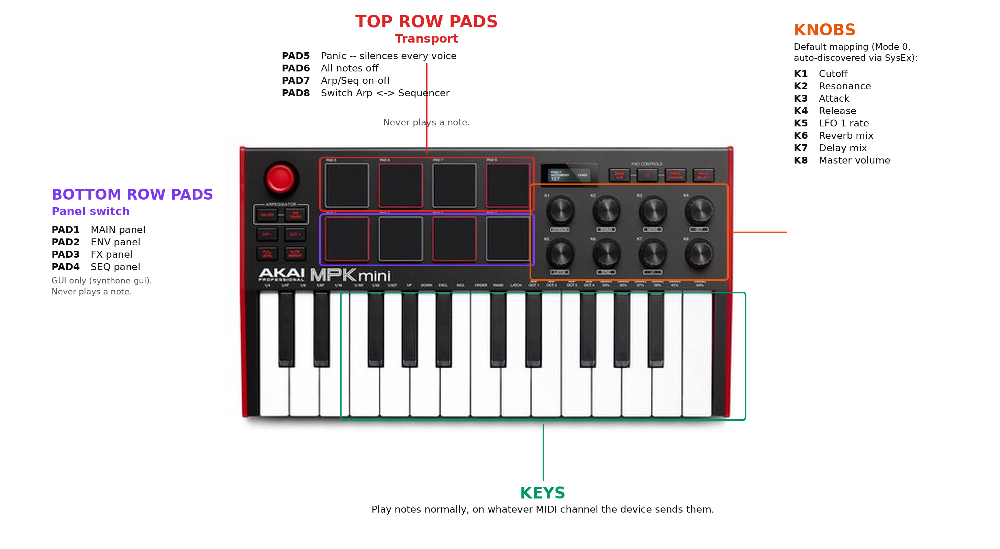
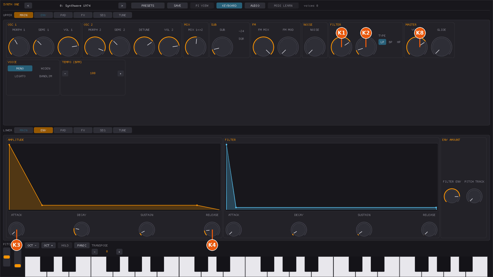
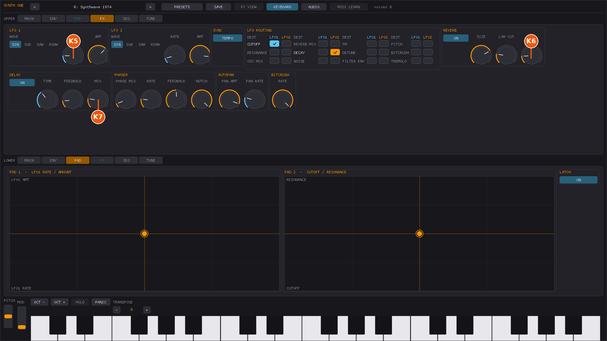

# MIDI controller drivers -- user guide

Synth One's Linux/Windows port can recognise specific MIDI controllers by
name and give them useful defaults automatically: knobs get mapped to synth
parameters, and the connection is verified over MIDI SysEx where the device
supports it. This is a smaller, synth-scoped take on the idea behind
[Zynthian's `ctrldev` drivers](https://wiki.zynthian.org/index.php/Akai_MPK_Series)
-- Synth One has no chains, mixer strips, or pad-launcher grid, so a driver
here only ever does two things: recognise your controller, and give its
knobs sensible starting points.

If you just plug in a MIDI keyboard or controller and play it, none of this
is required reading -- notes work exactly as before, with or without a
driver loaded. This document is for getting more out of a *specific*,
supported controller, and for understanding what to do if it isn't behaving
as expected.

## Supported controllers

| Controller | Driver name | What it does |
| --- | --- | --- |
| Akai MPK Mini mk3 | `akai-mpk-mini-mk3` | Maps the 8 knobs to synth parameters across 4 switchable modes (32 parameters reachable in total -- see [Switching modes](#switching-modes)). Pads and keys play notes normally, no special handling. |

Don't see your controller? It still works as a plain MIDI keyboard/controller
-- see [Using it with an unsupported controller](#using-it-with-an-unsupported-controller)
below, and consider asking for a driver (see the developer guide for what
that takes to add).

## Quick start

```sh
# See what's compiled into this build
./build/synthone --list-controller-drivers

# Just run normally -- a supported controller is picked up automatically
./build/synthone --midi all

# Same on the GUI
./build/synthone-gui
```

That's it for the common case: with the default `--controller-driver auto`,
if a supported controller is connected, its driver loads by itself and you
should see a status line like:

```
  [ctrl]    akai-mpk-mini-mk3 <- MPK mini 3 / MIDI 1
```

If you don't want this at all, turn it off:

```sh
./build/synthone --controller-driver off
```

Or force a specific driver to load regardless of what name-matching would
have picked (mostly useful for testing):

```sh
./build/synthone --controller-driver akai-mpk-mini-mk3
```

## What the Akai MPK Mini mk3 driver actually does



1. **On startup**, if the device is connected on both MIDI in and out, the
   driver asks it (over SysEx) what its 8 knobs are currently set to send.
2. **Once it gets an answer**, each knob is bound to a fixed synth parameter
   -- whatever CC the knob happens to be sending, mapped to cutoff,
   resonance, attack, release, LFO 1 rate, reverb mix, delay mix, or master
   volume respectively. You don't need to touch anything on the device
   itself; whatever program/CC assignment it's already using is read and
   used as-is.
3. **The 16 pads and the keybed play notes**, exactly like any other MIDI
   keyboard. There's nothing pad-specific to configure.
4. **If the query never completes** -- no output port could be paired with
   the input, or the device doesn't reply -- the knobs simply do nothing
   until you bind them yourself with MIDI Learn (see below). Nothing guesses
   at a mapping; a wrong guess risks reassigning a knob to something that
   collides with a universal MIDI convention (e.g. the mod wheel is always
   CC 1), so the driver would rather do nothing than do something wrong.
5. **Switching the device's onboard program re-runs the same discovery** for
   a different set of 8 targets -- see [Switching modes](#switching-modes).

## Switching modes

The 8 knobs can reach more than 8 parameters: the MPK Mini mk3's **PROG
SELECT** button (in the PAD CONTROLS row, alongside BANK A/B, CC and PROG
CHANGE) switches between the device's onboard program slots without any
reprogramming, and the driver treats each slot as a different knob mapping,
re-running the same SysEx discovery for that slot's actual CC assignments.

| Program slot | Mode | Knobs 1-8 |
| --- | --- | --- |
| 0 (RAM/default) | Sound | Cutoff, Resonance, Attack, Release, LFO 1 rate, Reverb mix, Delay mix, Master volume |
| 1 | Oscillators/voice | OSC1 volume, OSC2 volume, OSC2 detune, Sub volume, FM amount, Noise volume, Glide, OSC1/2 balance |
| 2 | Filter envelope | Filter attack, Filter decay, Filter sustain, Filter release, Filter/amp env mix, Cutoff LFO amount, Resonance LFO amount, Envelope pitch tracking |
| 3 | Modulation/FX | LFO 1 amount, LFO 2 rate, LFO 2 amount, Phaser mix, Phaser rate, Autopan amount, Autopan rate, Bitcrush rate |

Consult your MPK Mini mk3's manual for exactly how to reach PROG SELECT +
a program number on your unit (this varies slightly by firmware). Slots 4-8
have no assigned mode -- switching to one just leaves the knobs unbound
until you switch back or MIDI-Learn them yourself.

Mode switching depends on the device actually sending a MIDI Program Change
when you use PROG SELECT -- this is the standard, documented mechanism (the
same one Zynthian's own MPK driver relies on), but hasn't been confirmed
against physical hardware in this project's own testing. If switching
modes doesn't do anything, see [Troubleshooting](#troubleshooting).

### Where each knob shows up in the app (Mode 0)

K1/K2/K8 land on the **MAIN** panel (cutoff, resonance, master volume), K3/K4
on the **ENV** panel (amplitude attack/release):



K5/K6/K7 land on the **FX** panel (LFO 1 rate, reverb mix, delay mix):



If you ever forget which physical knob drives which on-screen control in
Mode 0, this is the reference to come back to. Modes 1-3 aren't
screenshotted here yet -- use the table in
[Switching modes](#switching-modes) as the reference for those; their
targets live on the MAIN panel (oscillators/voice), the ENV panel's FILTER
column (filter envelope), and the FX panel (LFO2/phaser/autopan/bitcrush)
respectively.

## How this interacts with MIDI Learn

A driver's knob mapping is a *default*, not a lock:

- **Your own MIDI Learn always wins.** If you MIDI-Learn a knob to a
  different parameter, that binding is used from then on, overriding
  whatever the driver had set.
- **Clearing MIDI Learn doesn't remove a driver's defaults.** "Clear All"
  only clears what *you've* explicitly learned; the driver's own mapping
  for the knobs you never touched keeps working.
- **The two never fight.** A CC checked against your explicit learn table
  first; only if that CC has nothing bound to it does the driver's default
  apply.

In short: use the controller as-is if the defaults suit you, or MIDI-Learn
over the top of any knob you want to reassign -- either way there's nothing
to reset or reconfigure first.

## Using it with an unsupported controller

Any MIDI controller works as a plain input with no driver loaded -- notes,
CC, pitch bend, and MIDI Learn all work exactly as they always have. A
driver is purely additive convenience for the specific devices listed above.
If your knobs don't do anything by default, that's expected for any
controller without a driver: bind them yourself via MIDI Learn (in the GUI,
or via the DSP parameter list -- see the main [README](../README.md) for
how MIDI Learn works).

## Troubleshooting

**`--list-controller-drivers` doesn't show anything, or my driver won't
load.**
Check `--controller-driver` isn't set to `off`. Check the device actually
shows up in `--list-midi` -- a driver can only match a device that's
connected and named the way the driver expects. If it's connected but not
matching, the device's reported name may differ from what the driver looks
for (this varies by OS and driver version) -- see the developer guide for
how to extend the name list.

**The status line shows `(SysEx TX unavailable)`.**
The driver found your controller's input port but couldn't find a matching
output port to talk back to it -- so it can identify the device by name but
can't run the SysEx query that discovers the knob CCs. The knobs will need
manual MIDI Learn in this case. This can happen if only the input side of
the device is connected (e.g. via `--midi` naming just one port) or if the
in/out pairing heuristic doesn't recognise your specific device -- see the
developer guide.

**Knobs don't respond even though the status line looks fine.**
The query may not have gotten a reply in time, or the device's SysEx
program dump didn't parse as expected (this is a defensive check, not a
bug report waiting to happen -- see the developer guide for why). Either
way, MIDI-Learn the knob yourself as a reliable fallback.

**Switching modes with PROG SELECT doesn't change what the knobs control.**
The knobs should go briefly unresponsive and then pick up the new mode's
mapping; if nothing changes at all, either the device isn't sending a
Program Change on PROG SELECT the way this driver expects (unverified
against real hardware -- see the developer guide), or you're on a slot
without a designed mode (only 0-3 have one). Try slot 0 first to confirm
the driver itself is working, then try 1-3. As always, MIDI Learn works
regardless of mode switching.

**No hotplug.** Controllers are matched once at startup against whatever's
already connected when `synthone`/`synthone-gui` starts. Plugging a
controller in after that won't be picked up without restarting -- this is a
limitation of MIDI port handling generally in this port, not specific to
controller drivers.

**Windows.** The controller-driver feature is compiled and shipped in the
Windows build, but has not been validated against real Windows hardware in
this project's own testing (the port is cross-compiled from Linux). If
something doesn't work as described here on Windows specifically, that's
useful to know -- see the developer guide's testing section.

## See also

- [linux/README.md](../README.md) -- the main port documentation, including
  general MIDI setup (`--midi`, `--midi-out`) and MIDI Learn.
- [Developer guide](midi-controller-developer-guide.md) -- architecture, how
  to add a driver for a new controller, and the MPK Mini mk3 protocol
  reference.
